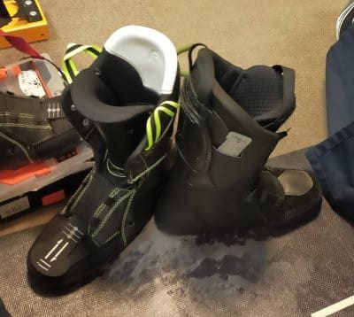

# HEAD Raptor WCR3のHEAD純正フォーミングインナーを作ってみた，ラスト…おまけ・余った標準インナーはどうしたか？

📅 投稿日時: 2024-01-17 03:05:59

🏷️ カテゴリ: [スキー雑談](c1f9d2cb7478308da16419928ea3945e9.md)

えー．

本日16日（火）の志賀高原．

すごかったみたいです…

何がすごかったかって，積雪が半端なかった

みたいで．

焼額の毎日の積雪を映してくれている，

このライブカメラ．

昨日15日は積雪30㎝ほどだったけど．

（[焼額山スキー場，ライブカメラページ](https://www.princehotels.co.jp/ski/shiga/livecamera/)より，以下同）

16日のライブカメラを見ると．

なんと，一晩で1m近く積もりました…！！

…ただ，朝からすごい猛吹雪で，

奥志賀は全面ストップ．

焼額もゴンドラが2本とも止まり，

2高，3高，4ロマのみの営業

だったみたいです…

2ゴンは強風で運休だったけど，

1ゴンは視界不良で運休だったみたいで．

うーん…

視界不良で運休って，これまで一度も聞いたことが

ない気がする…

まぁ，普段なら目の前に見える木々の景色も…

全く見えなくなるほどのすごい降りだった

みたいで．

道路も完全ホワイトアウト状態で前が見えず，

高天ヶ原付近は車が全く動けずすごい

渋滞だったとか，

スタックしかけている車も多数あった

ようで…

今日は出かけたもののスキー場に着く前に

滑るのを諦めた特派員や，そもそも滑りに

行くのをあきらめた特派員も多く，

いろんな意味で修行の一日だったみたい

です．

でも．

明日は晴れそうなので，新雪がたっぷり

積もった後の晴天といういいコンディションに

なりそう…！！

…で．

明日からしばらく晴れそうだけど．

今週末は南岸低気圧が近づき，

ゴーグルにつくとびしょ濡れになるような

雪が降りそうな感じ…（泣）

うーん．まだ雨にならないだけマシかな…

また明日，詳細天気予想やります～！！

…ってなことで，本題へ．

新しいブーツのフォーミングインナーを

作った話，[前回](eb06c3766961d8c507d7ddd857263dac3.md)の続きです！！

ーーー

ということで．

前回，インナーブーツのフォーミングが終わった

ところまで書きましたが…

今回，新しいこのブーツは，

アキレス腱部分のビスを標準の1本から

2本打ちに増やして，

フレックス150

にしました…

このブーツは，標準のビス1本打ちだと

フレックス140，1本増して2本打ちにすると

フレックス150になり．

これまでの古いブーツは標準の140で履いて

いたけど…

古いブーツシェルもまだ使えるので，

古いブーツを140のままで，

新しいブーツは150として，

シェルを使い分ければいいかな，と．

で．

今回は，新しいシェルをシェル単体で

購入できず，標準インナー付きで

購入したので，余ってしまうこの

標準インナー．

今回，古いブーツのインナーは

まだ80日ほどしか履いてないけど，

もうインナーがかなりヘタってつぶれて

きているし，

くるぶし当たりの内装の布がインナー本体の

クッション材からはがれて，シワになって

いるということもあり．

「この古いインナーはもう寿命だね…」

という宣言もあったので．

この余ったの右側の新品の標準インナーを，

古いシェルに入れて使うことにしました～！

ってなことで．

足首の細い私のために，いつものように

タングにカーペットを貼ってもらって…

さらにこのインナーブーツは，

足首回りにグリス状の液体を

注入してフィット感を高めることが

できるLiquid Fit対応なので．

Liquidも注入してもらいました～！

まず，液体（Liquid）注入用の口に

ホースを突っ込んで．

ホースを入れたインナーをシェルに

セットして…

Liquidを注入して，くるぶし周りの

フィット感を高めてもらいます．

…ただ，フィット感が高まるのはくるぶし

の周りのみ．

足首の前部分のフィット感が高まる

わけではないので…

フィット感が上がるとはいえ，やっぱり

フォーミングのほうがずっと上．

とはいえ．

古くてヘタったインナーに比べれば，

フィット感も高いし．

Liquid注入でくるぶし周りのフィットも

よくなっているし…

古いブーツも，新品インナーで

生まれ変わったようにフィット感が

上がりました！

（手前側のブーツが古いシェル＋標準インナー，

　向こう側のブーツが新しいシェル+フォーミング)

ってなことで．

今回，新しいブーツをフォーミングしてもらう

だけのつもりだったのが．

古いブーツと同じシェルを買ったことで，

新しい標準インナー＆Liquid注入＆カント

再調整で生まれ変わった，フレックス140の

旧シェル

と，

フォーミングインナーでフィット感抜群の，

フレックス150の新シェル

の二つのHEAD Raptor WCR3がそろってしまいました…！

今後，フレックス140の旧シェルと，

フレックス150の新シェルを使い分けて

いこうと思います～！！

このブーツの滑走レポートは，また後日！

## 💬 コメント一覧

### 💬 コメント by (副院長)
**タイトル**: Unknown
**投稿日**: 2024-01-17 09:20:23

S様、おはようございます。14日は、午後から、初滑りでした。荒れた雪面も、影響して、かっ飛ばす身内と、接触し、肩をいためて、早々に、退散しましたので、お会いすることかないませんでした。今回は、下に宿泊してましたので、とりあえず、山の駅に行きましたが、チケットカウンターの人が、表示は、運行してますが、全て運休予定ですと。一晩1メートルの志賀の本気を僕がいる時に見せてもらいました。そそくさと、営業してる。ロマンスの神様スキー場にいってきました。そこそこメジャースキー場から、逃走した人たちが、かなりいた感じ。リフトは飛び乗りですが。

ガンガン降ってくるので、慣れてない人は、車運転たいへんでしたね(私経験からスノーブレード装着してますので)。電鉄のバスも山の駅入り口で、スタックしたとか。

日曜日午後いきます。

### 💬 コメント by (Skier_S)
**タイトル**: ＞副院長さま
**投稿日**: 2024-01-18 00:17:49

あら…肩をぶつけちゃいましたか．大事になってなければいいのですが…

15日は，焼額は第2，第3高速と第4ロマンスは動いていたようですが，志賀への上り坂が

すごいことになっていたので，逃走して正解だったかも．

また今週日曜お会いしましょう~！

