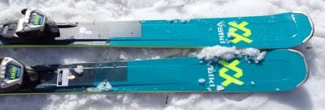
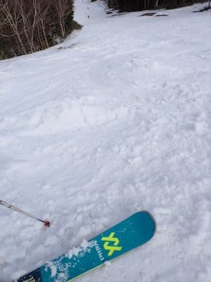
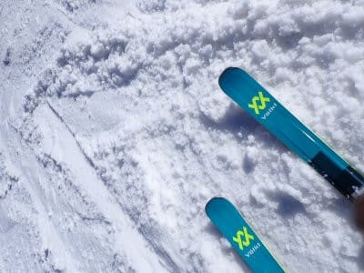
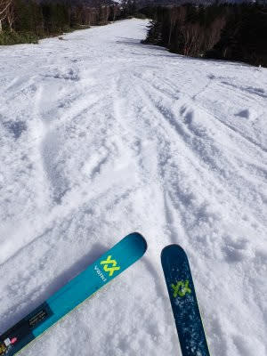

# 物欲選手権で敗れたVolkl Deacon84を春の雪で履いてみた

📅 投稿日時: 2023-11-29 04:03:20

🏷️ カテゴリ: [スキー雑談](c1f9d2cb7478308da16419928ea3945e9.md)

ということで．

まだまだクリティカルな状況が続いており．

現在朝4時だけど，まだ今日は寝れない

状態です…（泣）

今日はほぼ徹夜だな…（涙）

でも．

今日は書き溜めておいた記事を投稿！

こんな状況でもちゃんと記事を投稿して，

2日連続でダメダメ記事にならないように

するなんて，えらい！！←いつもだけど，自分で自分を

ほめるんじゃないよ…

…というか，一瞬間違えてこの記事の

下書きを数10分間公開してしまって

いたので．

もしかすると，

「あれ？見たことあるぞ？」

という人がいるかもしれませんが，

そういう人は，見なかったふりをして

もう一度読んでやってください…

ってなことで，物欲選手権の後日談．

物欲選手権でGetした，Volkl Deacon84の

インプレッションです…！！！

ということで．

志賀高原のシーズンも残り少ない4月に

板を借りて，そのまま購入した

Volkl Deacon84．

4月のかなりざぶざぶの雪で，昼に向かい

滑りが悪くなっていき，そしてゲレンデも

荒れていくという悪コンディションで

履いてみました…

えー．

まず．

最初の印象は…

むっちゃ滑る

です．

いや，これは板の性能というより，エキップさん

チューンによるところだと思うんですが…

やっぱり，滑走面の仕上げとワックス

フューチャーが効いているのか，

エキップさん仕上げの板，他の人の

板の滑りが悪くなってくる中でも，

めっちゃ滑ります．

そんなめちゃくちゃ滑る板で，

まずはあさイチの比較的フラットな

状況を滑ってみると…

うん．

長さが177㎝ってのもあるけど．

しっかりした張りもあり，GS板

みたいな強烈グリップでハイスピードで

滑っていけます…

かなり軽い板なのに，このグリップ感と

安定感は衝撃…！

圧雪では，まったくセミファットと思えない，

普通の板と同じ感覚でがっつりグリップ

カービングを気持ちよくかまして

行けます．

それでいて，複合ラディウスのサイドカーブが

効いているのか…

177㎝の長さのくせに，角付けを深めて

ターンをしっかり仕上げていくと…

カービングしたまま，「小回り板か？」

というほどのキレキレ深回りができます！

これも驚きの旋回性能！

ってな感じで，フラットバーンでも

セミファットと思えぬ，かなりの万能性を

発揮するこの板．

でも，この板が本領を発揮するのは．

春のザクザク雪が午後になって荒れてきて，

かなりの凸凹になってからなのだ！

春の重い雪が凸凹に荒れていき，

多くの人が凸凹に飛ばされててこずって

いるのに．

この板を履いた私だけ，まるで整地を滑る

ようにがっつりカービングで曲がって

行けるのだ．

…春先の重い雪の凸凹をまったく気に

せずに滑っていけるのだ！

いや．

まだ，そんなに雪が荒れてないよね…

と思って，一緒に滑っていた焼額常連

メンバーと板を取り換えて滑ってみたら．

「…めっちゃゲレンデ荒れてる…！！

　飛ばされるし，重い雪に突っ込んで

　つんのめる…！」

という感じの荒れ荒れ具合だったのに

驚きを感じ．

そして，そのあとにDeacon84に履き替えて

滑ると…

「…まだ荒れてないよね．

　ガンガンカービングでグリップして

　行けるよね」

という感じで，めちゃくちゃ快適に滑って

いけました…！！！

いや．

春先の荒れ荒れ雪をものともせず蹴散らして

気持ちよく滑っていけるこの板．

春先の雪では，最高の無敵板では？？？

と思い．

「買ってよかった…」

と，物欲選手権に負けた自分を正当化

したのでした…

…ちなみに．

この感想が単なる私一人の思いでない

ことは，この時に私と板を取り換えて

Deacon84を履いてもらったヤケビ

常連の2人が，その直後Volkl Deaconを

買ってしまった

ことで証明されるかと…

とりあえず．

この板．

春先に履いてもらった全員が口をそろえて

「この板欲しい！！」

と言わせたほどの名機です…

買ってよかった！

## 💬 コメント一覧

### 💬 コメント by (Goku)
**タイトル**: Unknown
**投稿日**: 2023-11-29 18:41:57

ヤケビ常連のふたりの内のひとりですｗｗｗ

こいつはマジで参りました。

春雪でこれにかなう板はないですね。

今から春のザブザブ雪で滑りたくてしょうがないです(^^♪

それよりもう一人は誰だ？

### 💬 コメント by (Skier_S)
**タイトル**: Unknown
**投稿日**: 2023-11-30 09:50:36

>Gokuさま

さて。もうひとりは誰かは、焼額に行ってのお楽しみということで…(笑)

