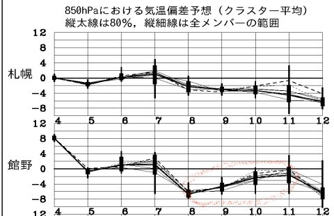
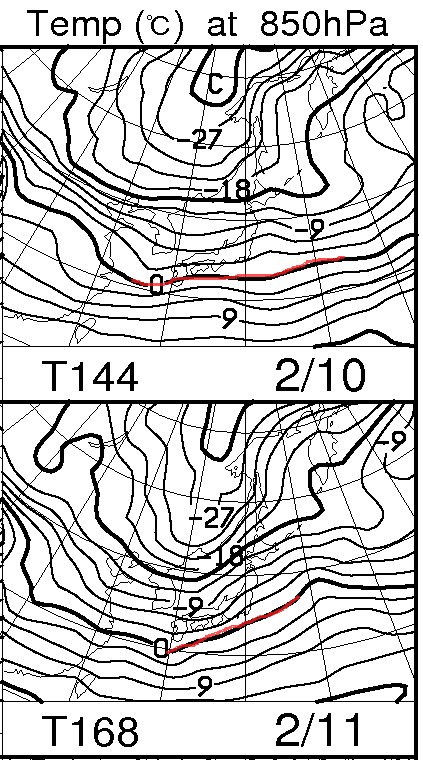
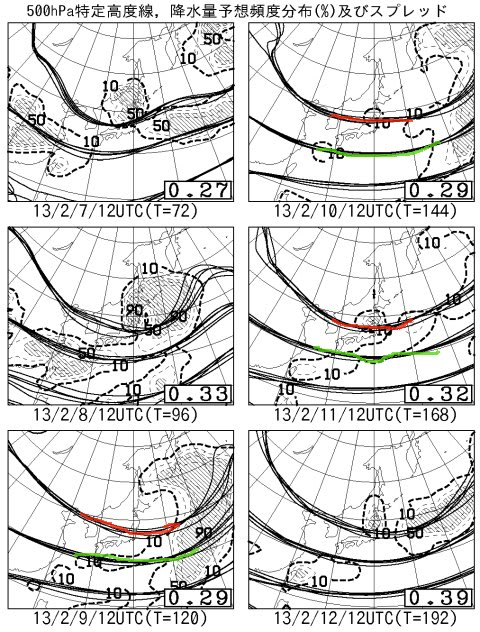
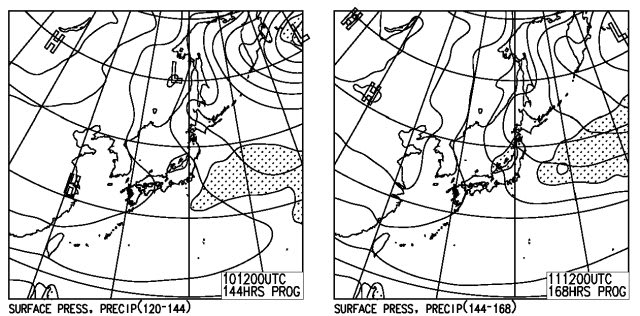

# 今週末，3連休の志賀高原の天気は？？

📅 投稿日時: 2013-02-06 01:49:22

えーーー．

どうやら，首都圏は雪が降るという予想のようですが．

この週末，3連休の志賀高原の天気を占ってみましょう～．

ふーーむ…

基本的に，3日間とも冷えますね～．

特に，3連休の前の日の8日は，平年比-6度程度まで冷え込み，そこそこの積雪がありそうなので．

雪の状態はよくなりそうですね～．

850hpaの気温も…

0度線が日本より南まで降りているので．

全国的にしっかり冷えそうです．

しっかり防寒対策を！

で．普段あんまり載せないFZCX50の特定高度線ですが…

右下のスプレッドの値が9日，10日とも0.3以下なので，数値予想は大きく外れないですね．

特定高度線のばらつきが少なく，現時点での予想はかなり正確と信じていいです．

んで，赤く印した5400mの線が日本にかかっているので，これは結構冷え込む目安．

ちなみに，緑で示した5700mの線が日本にかかるようになると，スキー場でも雨の心配を

しなくちゃならなくなります…

という感じで．

3連休は3日とも冷えそうですが．

雪はつもるのかいな？？？

と，気になるところ．

地上予想図を見ると…

10，11日はよわーーーーい冬型．

志賀高原では，ほとんど積雪は期待できませんね．

…っつーより，むしろ晴れます．

9日も雪は降りません．

ってことで．

3連休は3日とも冷えて，晴れ～曇り．

＃日本海側は曇り～雪かな．

信州では，ぱふぱふパウダーになる降雪はまったく期待できません．

初日の9日は，前日に降った雪が圧雪された，やわらかい気持ちよいバーン．

10，11日は朝のうちは圧雪が入って気持ちいいけど，

積雪がないと昼ごろから急斜面では下地の硬い雪が出てくるかも…．

って感じですね．

まぁ，先週に比べれば，10万倍くらいましな週末を過ごせそうですね～

＃先週に比べれば，どんなコンディションでも好コンディションと言えるけど…

## 💬 コメント一覧

### 💬 コメント by (ひろりん)
**タイトル**: Unknown
**投稿日**: 2013-02-06 17:39:55

ようやく今週末は行けます♪

妙高と野沢ですが・・・

X-Kartだけ持っていきます。オガは封印ｗ

### 💬 コメント by (Skier_S)
**タイトル**: ひろりんさま
**投稿日**: 2013-02-06 23:27:21

妙高と野沢をはしごですか…

で，X-Kartデビューですね．

楽しんできてください～

