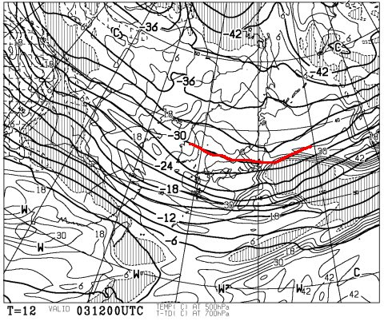
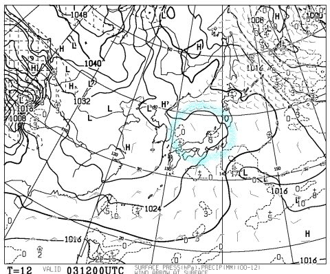
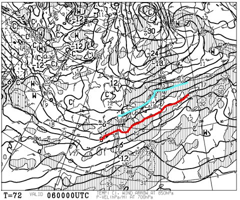
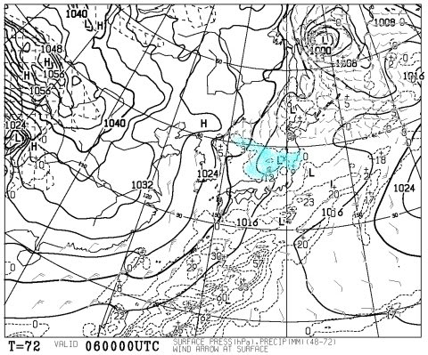
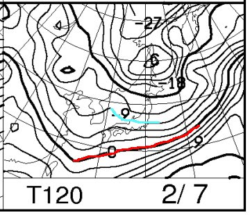
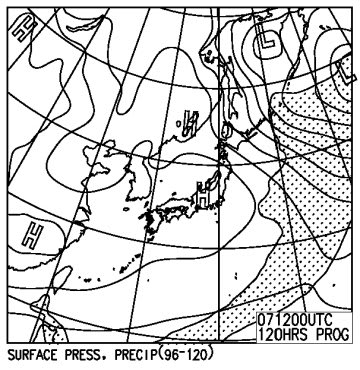
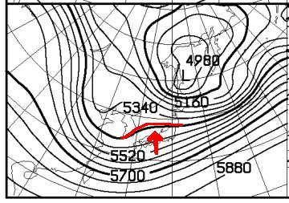
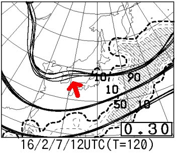

# 定例！今週末の志賀高原の天気は…冷え冷えなんだけど，あんまり積雪が増えなさそう…

📅 投稿日時: 2016-02-04 00:53:38

🏷️ カテゴリ: [スキー天気予想](c6554f5c3c106093b511a8daae23757e8.md)

先週末．

ゲレンデで会った何人かの信心深い方から．

「冷え冷え踊り，踊りましたよ～」

という．大変ありがたいお言葉をいただいたわけですが．

…しかし誰一人，私がこのBlogで書いた

「気温が冷える踊り」

という正式名称を使うことなく．

全員，一人残らず，

「冷え冷え踊り」

という呼び方をしていた今日この頃．

皆様いかがお過ごしでしょうか．

ってことで．

今後，この踊りの正式名称を．

皆様の呼ぶ通り，

「冷え冷え踊り」

という名称にしますので，以後よろしくお願いします←だから，どんな踊りだ

というわけで．

水曜夜恒例の，この週末の志賀高原の天気予想に

行くわけですが…

その前に

今晩の500hpa天気図を見てみると…

をを！

そこそこの雪が降る目安，-30度の線が

志賀高原より南に下がってます！

…で．

普通なら．

今晩．結構な雪が積もるはずなんですが…

が．

…地上天気図を見ると，こんな感じで．

なぜか．水色で囲ったように，日本海側に

高気圧が発生しており…

そのため，雪雲が発生せず．

志賀高原では全く雪が降ってません…（涙）

普通なら．-30℃の寒気が下りてくれば雪になるのに…

おかしい．

今年は，おかしいよ…

ってことで．

これから週末まで．

意外と気温が低い日々が続くのに．

志賀高原では，毎日5cm程度の積雪しかなさそうです…（残念）．

うーむ．

もう少し，雪が積もってほしいんですけど…

んで．

ここからが本題の，週末の天気．

えーーっと．

6日土曜の朝9時の850hpa気温図を見ると，だ．

…うむ．

赤く印した0℃線は日本のはるか南．

それどころか，志賀高原は水色の-6℃線がかかってるので．

志賀高原の朝は-10℃近く．そこそこ冷えた朝になりそうです．

そして，地上天気図を見ると…

うーむ．

水色で示す，寒気の吹き出しの雲が見えますが…

でも，弱い！

ちょいと，弱いのだ…

だもんで，金曜夜からの積雪はそんなになさそう．

…でも，天気図自体は冬型なので．

まぁ，土曜は一日，雪が降りそうかな…

そして．

7日，日曜の850hpa気温図を見ると…

をををっ！

0℃線はかなり南にあり，水色の-9℃線も

志賀高原より南に下がります！

7日の朝は，-15度近くまで冷え込む，

激烈に冷え冷えの朝です…！

が．

地上天気図を見ると…

…なんてこった．

この日も，高気圧が日本を覆い．

すごい冷え冷えというのに，積雪は全くなさそう…（涙）．

なぜ？なぜ？？？

…と，500hpa特定高度線の形を見てみると．

赤線で書いた部分が，北側に凹んだ形になってます…

特定高度線が北側に凹んだようになるところ…

専門的に言えば，リッジですが．

このリッジ部には，高気圧が発生します．

…なぜ，なぜ，日本上空のこの部分だけ，

リッジ場になるかな～（涙）．

ここが北に凹まなければ，きれいな冬型に

なって，かなりの冷え冷えパウダーデーに

なるのに…っ！！

もしかしたら，パウダーの可能性が残ってないか？？

…と，この日の予想ばらつきを見てみると．

こんな感じで…

複数の予想パターンを示す，複数の線．

このどれもが，北側へのへこみを予想しているので．

…残念ながら．

この日はほぼ間違いなく，高気圧が発生します．

残念ですが，降りません．パウダーは望み薄です（涙）．

…まぁ．

逆に言えば晴れた一日になりそうなので．

そういう意味ではいいスキー日和になるのかも…

ってことで．

まとめると．

土曜：前日からの積雪はそれほどでもないけど…

　朝から降り始めた雪で，朝イチはうっすら積雪．

　ゲレンデは柔らかい圧雪！

　天気は一日雪がちらつく．時折強く降る．

　昼間だけで，10cm以上積雪があるかも？？

　なので，ゲレンデは，午後に向かって

　もさもさしたこぶ斜面になるかな～．

　気温は，朝より午後が冷えていく．

　午後は-10℃近くまで冷える，冷え冷えの一日．

　

日曜：朝イチは-15度クラス．かなり冷えるよ！

　朝イチは，志賀高原のトップシーズンらしい，

　柔らかいフカフカ圧雪．

　おそらく，朝イチは最高！

　天気は…現時点では，朝は多少雲が出るものの，

　基本的に晴れそう．

　晴れなのに気温が低く，雪質は最高！

　昼間も気温は-10℃前後と冷えそうだけど…

　太陽が出ているので，それほど寒く感じず

　かなりいいスキー日和になりそう！

　でも，雪が柔らかいので，午後はちょっと

　凸凹したバーンになるかな…

って感じかな～．

まだ，完全に雪不足が解消したわけでないので，

もう少し積雪が欲しいところだけど…

まぁ，その点を除けば，気温も冷えて，

数cmのわずかな積雪とはいえ，これから積雪が

数日続きそうなので．

この週末は，結構いいコンディションなんじゃないかな～．

…しかし．

今シーズン．

このまま腰パフとかの深いパウダーに出くわすことなく

終わってしまうのかな～？？

…そういうことが無いように，

強烈に祈っておきたいところ…
