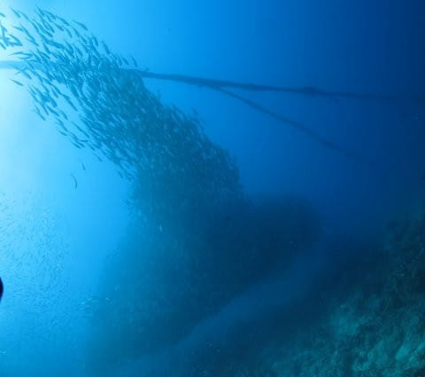
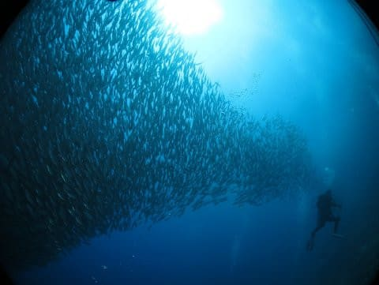
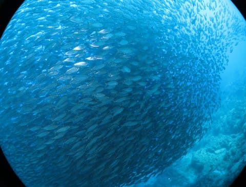

# 2019年8月，4度目のモアルボアル・小6の娘Cカード取得1周年！その15…本日3本目，午後のダイビングは1日1回イワシポイント

📅 投稿日時: 2020-08-17 03:06:27

🏷️ カテゴリ: [ダイビング日記](ce3a7a8d424d112fce83ee85c81a0e344.md)

どうやら．

世間一般では「お盆休みが終わった」

ということになっているようですが…

お盆休みってなに？

それ，おいしいの？

という状態の9日間を過ごした

Skier_Sです（涙）

9連休で6日間沖縄にいき，ゆっくり

くつろぐはずだったのに…

金曜も緊急出社となったあと，

土日も朝から晩までひたすら

書き物してました（涙）

ってなことで．

夏休み無しとなった今年．

昨年の夏休みを振り返り，

自分を慰めるダイビング旅行記です…

ーーーー

ということで．

午前2本ダイビング，お昼にプールの後，

さらに海に潜りに行くという，この午後

なわけですが．

午後のポイントは…

はい．

そうです．

一日一度はここを潜らないといけないという，←義務じゃないから

ショップ目の前のイワシポイント．

正式名称，「ハウスリーフ」です．

ポイントがまさに目の前なので，

器材が載っているボートに一旦乗りますが…

ボートの移動時間は数十秒．

わずかに沖，流れの上側に

移動するだけなので，

乗ったらすぐに準備を開始して…

そして，ボートからバックロール！

水面でボートスタッフから

カメラを渡してもらったら…

いざ，潜行！

今日はガイドはずっと店長の

小見山さんが担当してくれてます．

で．

潜行した直後から，

目の前に群れが登場するのが

このポイントのすごいところ…

このダイナミックなイワシの

群れに混ざって…

今日も下の方に，アジの群れが

混ざってますね．

この群れが…

ダイナミックに動くっ！

これだけの数の魚が，自分たちの

目の前で激しく動き，

キラキラ光っているのは…

見てて飽きない！

何度潜っても面白いポイントだと

おもう…

そして．

この写真，上の方にダイバーが写ってますが．

このダイバー達を避けるよう，

こっちにだんだん下がってきた

アジの群れが…

我々一家の方に追い込まれてきて．

上のダイバーとわが一家に挟まれ

行先を失ったこの群れ．

海面のボートに向かってザーッと

上がっていったかと思うと…

そのまま一団となって

ボート付近から海底に向かって

下りていき…

また，ちょっと離れた海底付近で，

別の塊になって…

ひとつのボールみたいな

群れになってました．

…これは，ダイナミック…！

って感じで，目の前で躍動を

見せてくれるこの群れ．

ダイバーはここまで近づけます．

ただ，ダイバーが近づくと，

当然ダイバーを避けるように

動いていき…

頭上が群れに覆われた！！

と，思ったら，今度は反対側に

移動して…

また別の場所でかたまり始めます．

全体的に，群れが向こうに移動したよう

なので，わが一家もそちらに向かうと…

向こう側のイワシの群れの下に，

今度はアジ玉が黒い塊になってます…

なので，しつこくこのアジ玉を攻略！

ギンガメアジの群れよりはそれぞれの

個体の魚は小さいけど，群れのボリュームは

見応えたっぷり…

誰が何と言おうと，大きな群れを

見ているのは楽しいのだ！

…ってなことで．

しばしアジ玉と格闘していたけど．

アジの群れを見送った後は，

いつもの巨大イワシ群れを眺める

ダイビングに…

透視度の向こうまで続く

イワシの群れは，これもなかなか

見応えがあり…

近づいていくと，ダイバーと

ダイバーが吐く泡を嫌って…

だんだん群れの形が変わって

いくのを見てるだけでも面白いです…

娘も，アジとイワシの群れを

堪能できたかな？

ってなことで．

エントリー直後からひたすら

群れと戯れ続けていた

このダイビングも，そろそろ

終了時間．

浅瀬の棚の上に向かって

深度を上げていきます…

そして，水面へ向かって浮上．

本日の3本目，終了！

いやー．

3本目も満足の1本でした…

## 💬 コメント一覧

### 💬 コメント by (西舘)
**タイトル**: Unknown
**投稿日**: 2020-08-17 06:52:59

遊んできた報告なのでコメントし辛く控えておりましたが、7月中旬、無事AOW取得して限定解除できまして、行けるうちに行かねばと、7月中にも一度行けました。

我が家は20m以深の青い色やドロップオフが好きなようなので、身体を慣らさねば。特に私が。

沖縄も、ウェルカムでした。

離島は大きい病院が無いから困るということだと思います。

ダイビングショップも経営が苦しそうでした。

本島からのダイビングであれば金曜日夜発して土曜日潜って日曜日帰りで3ダイブできますので、まだチャンスが残っていると思います。

真栄田とか万座とか、慶良間諸島辺りよりは劣るかも知れませんが、結構綺麗ですよ。

### 💬 コメント by (Skier_S)
**タイトル**: ＞西館さま
**投稿日**: 2020-08-18 01:57:49

アドバンス取得おめでとうございます！

沖縄も，7月中だったらまだ大丈夫だったようですが，

8月はかなりアウトな感じです（涙）

あぁ…この夏，沖縄にもモアルボアルにも行けないとは思わなかったです…

モアルボアルで娘にジュニアアドバンス取らせるつもり

だったんですが…

まぁ，どちらにしろお盆前に殺人タスクが突っ込まれて

夏休みどころではなかったですけど(笑)．

### 💬 コメント by (AK)
**タイトル**: Unknown
**投稿日**: 2020-08-18 06:29:39

お久しぶりです。

沖縄断念されたのですね。

あの綺麗な海に潜ったら最高でしょうね。

S様のダイビング写真見てると私も潜水機能欲しくなります。

### 💬 コメント by (Skier_S)
**タイトル**: ＞AKさま
**投稿日**: 2020-08-18 23:40:08

沖縄断念しました…（涙）

ぜひ，潜水機能を追加してみてください．

ダイビングは面白いし癒されますよ～！

