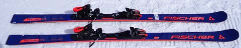
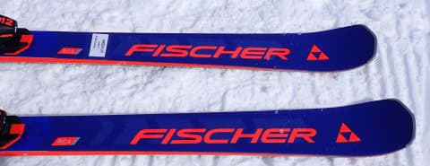
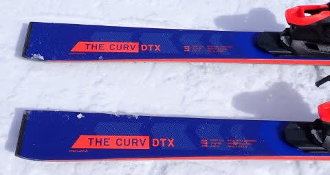
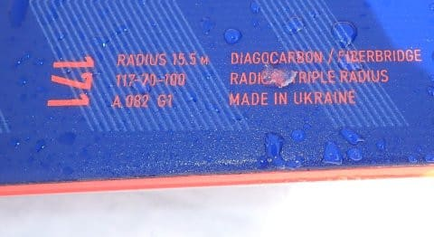
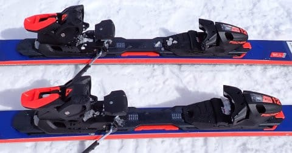

# 2024シーズンモデルのスキー板，試乗レポートその12…FISCHER THE CURV DTX

📅 投稿日時: 2023-06-07 04:24:32

🏷️ カテゴリ: [スキー板試乗](c0bd8048615710cee890e403a36cc9a2b.md)

えー．

ホントは月山の詳細レポートを書きたいところ

なんですが…

今日もかなりクリティカル（涙）

昨日も睡眠時間が全然取れておらず，

今日の仕事もまだいつ終わるのかわからない

状態です（泣）

なんとか…朝5時までには終わらせて寝たい．

明日…というか，今朝から出張なんだけどな…

大丈夫かな…

ってなことで．

更新している時間もないんだけど…

とりあえず，書き溜めておいた試乗レポートが

あったので，今日は2024モデルのスキー板，

試乗レポートです！

今回もフィッシャー編．

では，どうぞ～！！

〇FISCHER THE CURV DTX 171cm

オールラウンド

THE CURVシリーズの上から2番目のモデルに

なる，このDTX．

トップモデルは強めのMプレートですが，

このモデルは優しめのM-Trackとなります．

DTXはサイドカーブがきつめで小回りの

イメージがありましたが，

171㎝だと，117－70－100のサイドカーブ

15.5mと，THE CURVと全く同じサイドカーブ

みたいです．

サイドカーブが同じだけど，板の構造は

THE CURVと変えてあり，板自体のつくりも

THE CURVよりは優しめになっているようです…

実際に滑ってみると…

THE CURVより優しくなっているという思い込みで

履いてみると…

いや，これ，思ったよりしっかりグリップ系の板だ！

結構しっかりグリップして，それでいてフレックスが

柔らかめなのでグググっとたわんで…

同じサイドカーブのはずのThe CURVよりも

小さめの半径で回っていきます．

同じサイドカーブのはずなのに，The CURVより

小さめのサイドカーブの板に感じます！

よくたわむくせに結構なグリップがあるので…

かなり深い回転弧でグイングイン回って，

R=15.5の171㎝なのに，ミドルからショート目で

かなり鋭く回っていけます．

たわみが大きく出るのに，トップとテールの

エッジががっつり食らいついて，深い鋭い

カービングができます．

さすがにThe CURVという名前なだけあって，

カービングを得意とする板っぽい感じ…

板のラディウスはオールラウンドなので，

そこまで体重やスピードのない人なら，

ちょうどいいミドルターンから大回りまで

気持ちよくキレキレカービングで

滑れるんじゃないですかね．

体重，脚力がある人なら，ショート板か？

と思うほどのがっつりカービング小回りまで

持っていけます．

大回りから小回りまで，まさにオールラウンド．

どの回転弧でもキレキレなカービングで

滑っていける，ゲレンデ用としてはかなり

快感度の高いカービングマシン．

基本的にグリップは強めだけど，

楽にたわませて小回りまで持っていけるし，

グリップは強めながらもエッジを外して

動かそうと思えば動かせなくもないし．

長さ164㎝で小回りベース，

171㎝でオールラウンド目のゲレンデ履きと

考えれば，かなりレベルが高い人まで

十分楽しめる普段履きの板として

使えるんじゃないかな…？
