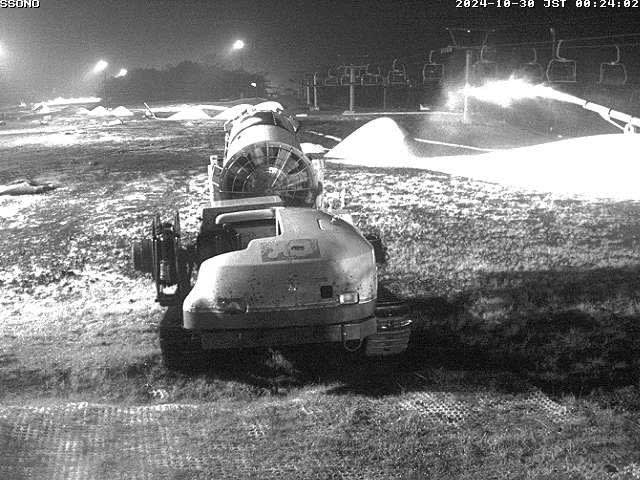
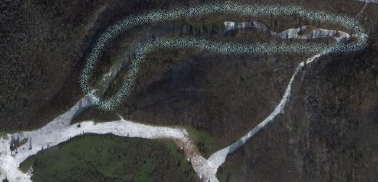

# え？志賀高原の焼額山スキー場，2025シーズンも新コースができるの？また条件付きオープンのパウダーコースらしいけど…

📅 投稿日時: 2024-10-30 02:39:12

🏷️ カテゴリ: [スキー雑談](c1f9d2cb7478308da16419928ea3945e9.md)

えー．

月曜から一旦営業休止になっている

イエティですが．

ライブカメラを見ると，雪山部分以外の

雪が全部溶けてしまったみたいで．

コースの名残が全く消え去りましたね…

([WNIライブカメラ](http://webcam.wni.co.jp/KAC24326/loop.html)より)

そのせいもあり．やはり予想通り，

明日30日（水）も営業中止となりました（涙）

（[イエティFacebook](https://www.facebook.com/YetiSnowtown/)より）

とりあえず，イエティでは必死に造雪して

いるようですが…かなりの雨が降っている中

なので，造った雪がかなり溶けているようで…

残念ながら，ライブカメラを見ても1日前から

そこまで雪が増えていませんね（涙）

ただ，明日30日(水)は，朝まで雨が降り

続けるけど，朝のうちに雨が上がってくれ

そうなので…そのあとは，少しは雪山作成の

スピードが上がるかも？？

ただ，31日(木)に営業再開できたとしても，

31日は気温が上がるし，日も射しそうだし…

イエティスタッフの努力と，イエティの恐ろしい

造雪能力をもってしても，31日のバーン

コンディションはかなり厳しいでしょうね…

さらに．

11月2日の地上天気図を見たところ…

3連休初日のこの日に台風崩れの低気圧が直撃し，

11/1(金)の夜から雨になり，台風が運ぶ

暖かい空気の中，2日はまるまる一日

土砂降りになりそうなので…

11/2にまたゲレンデが高温＋雨のせいで

壊滅的にやられそう（激泣）

ってか，台風崩れの低気圧の大雨の中，

11/2に営業できるのか??

そして，2日に雪がまたすべて消えてしまい，

3日，4日と営業休止になる可能性も…

3連休全滅シナリオがあり得るので，

かなりヤバい…

うがーーー！！

なんで3連休初日に，台風崩れ低気圧が

狙ったように直撃するかな…（激泣）

ただ，3連休が終わった後．

11月5，6日の2日間は冷えるので…

志賀高原あたりは雪が降ってくれそう．

横手や熊の湯は，人工降雪機が動かせる

気温まで下がりますよ～！！

…6日あたり，イエティでもアイスクラッシュ

じゃなく，人工雪が打てるかも…？？

…だた，その後はまた気温が上がりそう

ですが（泣）

ってなよくないニュースのあとは，本題へ．

今度はいいニュースです！！

本日，けんけんさんからコメントいただきましたが．

なんと．

焼額山スキー場に2025シーズンに新コースが

できるようです…！！！

驚きつつも焼額山のホームページの

コース紹介ページを見ると…

（[焼額山スキー場ホームページ　ゲレンデ・コースページ](https://www.princehotels.co.jp/ski/shiga/winter/coursemap/)より，以下同じ）

確かにここに，見慣れないコース名が…！！

この，YAKEBI COASTというのが今シーズン

誕生の新コースのようです…！

うーん．

斜度31度はそこそこ急だし．

長さが893mって…かなり長いよ！？？

果たして，焼額山でこんな距離，パウダーが

滑れそうなところって，どこだろう…？？

と，スキーマップを眺めますが．

ヤケビバレーより300mも長いコースって

どこに取れるかな？？

と．

いろいろ考えたけど…

私が思いつく，唯一の場所がここ．

15年ほど前に廃止になった，旧第3ロマンス

Bコース．

Google Mapだとこのあたりですね…

拡大すると，ここならかつてコースだったので，

大きな立木はないし．

長さ的にも900m，標高差215mありそうだし．

比較的直線的なラインで，斜度の変化があるし…

うーん．

コース説明の条件に当てはまるところって，

ここしか思いつかん．

…でも．

もしここが新コースだとすると，

このコースを滑ると，焼額に戻ってくる

リフトはなく．

奥志賀に滑り込んで奥志賀経由で戻って

くるしかなく，大変なんだけど…

焼額から人が奥志賀に流出するような

ところにあえてコースを作るかな？？

とりあえず．

場所がどこかは，これからの発表を楽しみに

待ちましょう…！

（追記…コメントいくつかもらってますが、

正解は第一高速リフト跡地みたいです…！）

ってなことで．

昨シーズンもYAKEBI VALLEYの新コース

オープン，

今シーズンも人工降雪エリアの拡大に

YAKEBI COASTの新コースオープン

と.

焼額山は，2年連続で，良いニュースで期待させて

くれますね～！！

今シーズンも，焼額山に期待っ！！

## 💬 コメント一覧

### 💬 コメント by (タカ)
**タイトル**: Unknown
**投稿日**: 2024-10-30 02:54:04

いつもブログ楽しませてもらってます。

ヤケビ新コースですが、C４というナンバリングと起点標高からして第１高速のあったところに一票です。

### 💬 コメント by (b-talk)
**タイトル**: Unknown
**投稿日**: 2024-10-30 06:59:20

突然のコメント失礼いたします。

奥志賀の第六ベースから、ヤケビの三尾根の上までのリフト復活して欲しいなぁと。

### 💬 コメント by (毎日読者K)
**タイトル**: 新コース場所
**投稿日**: 2024-10-30 08:37:11

第1高速クワッド跡地ですよ。

すでに雑誌などでは公表されています。

### 💬 コメント by (Skier_S)
**タイトル**: 第1高速跡地か…
**投稿日**: 2024-10-31 03:32:44

＞タカさま

予想があたりのようですね…！

C4というコース番号を見落としてました…

＞b-talkさま

コメントありがとうございます～！！

そうですよね…3ロマ復活してほしいですよね…

三尾根の上まで要らないから，GSコースに戻れるギリギリの長さのリフトで

復活してほしいです…

3ロマ，乗車時間10分近くあり長すぎたので．

＞毎日読者Kさま

ああああ！！

そうか．

第1高速跡地ですか…

いや，ちょっとだけ，第1高速跡地の可能性を考えたのですが．

コース幅も狭いし，放棄されて時間がたつので立木がいっぱいあって

もう滑れないだろうなぁ…

と，候補から外してました．

1高跡地もいいけど，コース幅があまり広くないので，旧3ロマBコース復活した方が面白いのに…

と，ちょっと思っちゃいました．

