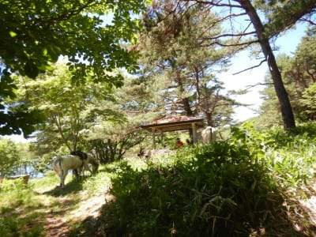
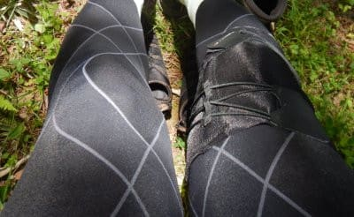

# 2021年7月，編笠山リベンジ＆権現岳へ！…最終回

📅 投稿日時: 2021-09-04 01:36:53

まだ，8月が終わったばかりというのに．

涼しいどころか「ちょっと寒い」と

思ってしまうような気温になり．

とても9月頭と思えない，今日この頃

ですが．

気象庁の発表を見ても，

異常な冷夏というほどではないにしろ，

やはりこの8月は平年より気温が低めだった

ようで…

（[気象庁ホームページ](https://www.jma.go.jp/jma/press/2109/01a/tenko2108.html)より）

冷夏の年の次の冬は暖冬小雪

という恐ろしい言い伝えを思い出し，

「そんなのは迷信だ！！」

と思いたいところなのですが．

スキーヤーにとって，

暖冬

という言葉ほど心臓に悪いものはないですから…

スキーヤーを殺すには刃物はいらず．

異常な暖冬になれば全員即死なので．

…だれか，スキーヤーに恨みがある人が．

この夏に，季節外れの冷え冷え踊りを

踊っているんじゃないか？？

もしかしたら，

計画的スキーヤー殺人事件

なのではないか…？？

とか勘ぐっている今日この頃．←そんなわきゃない

皆様いかがお過ごしでしょうか．

とりあえず，スキーヤーの皆さんは．

早くもこれから冬に向けて．

冬にスキー場にちゃんと雪が降れ降れ踊り

を全力で踊りつづけてくださいますよう，

よろしくお願い申し上げます…

ってなことで．

今日も山登りレポート．

編笠山＆権現岳の復活編，ラストです．

では，どうぞ～！

ーーー

という感じで，

見晴らしのいい三ツ頭を後にしたら…

次のポイントは，木戸口公園．

ただ，三ツ頭を過ぎてしばらくすると，

木立の中に入り，残念ながら見晴らしは

無くなりました…

こうなると，あとはひたすら下り坂を

歩くのみ！

幸い，全く膝が痛くなる気配はなく，

快適に良いペースで下って行けます．

三ツ頭から35分ほど歩くと，

木戸口公園へやってきましたが…

ここは何も見晴らしが無ければ，

座るところもない場所なので．

あっさり通過しましょう．

木戸口公園から10分も歩くと，

次のポイント，ヘリポートへ到着！

ここは，見晴らしがいいうえにベンチも

あるので，ここで休憩することを

おススメ！

あまりにもベンチからの景色が良かったので，

ベンチに座ってしばし景色を眺めてしまい

ました…

さぁ．

ここまでくれば，下山も残り半分！

ひたすらこういう木立の中を下って

行きます…

木陰で適度に涼しく快適だけど，

単調で歩くのに飽きるなぁ…

あまりにも単調なので．

ひたすらAmazfit PACE君の

高度計をひたすら見続けて．

「あと標高差何m下りれば…」

と唱えながら歩きます．

幸い，膝は全く痛くなる気配はなく．

ここも快適なペースで下って行けます！

すばらしい…

下りで膝が痛くならないって，

素晴らしい…！！

そして，山頂から下ること，標高差1100mほど．

登山道はここで「八ヶ岳横断歩道」とかいう，

周遊道路と交わって…

ここからは，木道的な階段で整備されたような

道になりました．

ただ，ここからも意外とアップダウンがあって…

地味に最後が登りなのが効いた…

ってなことで．

無事観音平まで戻ってきて．

12時過ぎに，駐車場へ到着～！

全く膝が痛くなることなく，無事下山

出来ました…！！！

…すばらしい！

山頂からここまで，

コースタイム3時間25分のところ．

途中休憩を含め，2時間40分．

登りはコースタイムの半分だったのが，

下りはコースタイムの8割ほど

かかっちゃったものの．

でも，コースタイム9時間ほどの全行程を

歩ききっても膝は全く痛くならず．

西岳からの下り標準コースタイム

3時間20分のところ5時間20分かかった

という悲しい思い出に対し．

無事リベンジを果たせたのでした…！！

とりあえず．

膝サポーターの効果，素晴らしい…

膝の痛みで，もう本格的な山はダメなのか…

と諦めていたところから，

無事復活です！！！

## 💬 コメント一覧

### 💬 コメント by (AK)
**タイトル**: Unknown
**投稿日**: 2021-09-04 06:46:30

昨シーズンのようにしっかり降ってもらいたいですね。

長野県民としては街は降らず山だけ降れと毎年贅沢な願掛けをしていますが…中南信方面のスキー場では温暖化を見据えて降雪機の増設や更新をする意欲的なスキー場も見られますよ。

ひとつリクエストお願いしたいのですが来シーズンへ向けて準備が進む頃ですがS様のスキーメンテナンス用品紹介や普段のやり方など知りたいです。

もし記事に空きがありましたらお願いします。

(以前紹介がありましたらスミマセン…)

オフシーズンでも毎朝朝刊代わりに楽しみに拝見しております。

### 💬 コメント by (Skier_S)
**タイトル**: ＞AKさま
**投稿日**: 2021-09-05 02:53:15

いや．

ホントに昨シーズンの1-2月くらいにしっかり降ってほしいですね．

…昨シーズンは私が復活した3月からは悲惨な高温が続きましたが(涙)

あと，スキーメンテナンスのやり方ですか…

一回記事を書きかけたのですが，あまり面白くなくてやめたんですよね．

どう考えても，TOKOやHolmencolなんかのページの方が参考になるので…

もし，面白い記事になりそうならまたチャレンジしてみます～！！

