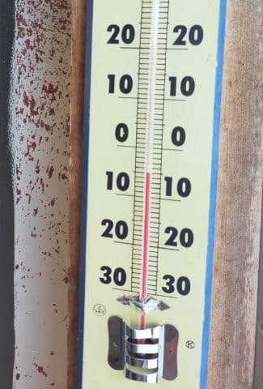

# 今週末，1月23，24日の週末の志賀高原スキー場の天気は？…土曜は降らずに済みそう．日曜もギリギリ志賀は雪か？

📅 投稿日時: 2021-01-22 02:38:39

🏷️ カテゴリ: [スキー天気予想](c6554f5c3c106093b511a8daae23757e8.md)

えー．

また，昨晩このBlogが更新されておらず．

かなり多くの読者の方が

「あぁ…やっぱりSkier_Sはスキーに行けなくて死んだか…」

と思ったんじゃないかと思いますが…

そうです．

死んでました．

…いや．

スキーに行けなくてというより．

昨晩は仕事が終わらず，

いろいろご無体で死んでました

いやー．

この状況で良く普段は毎週スキーに行ってる

もんだ…←自分で言うか

で．

昨日はなぜか特派員が全員休み(？)で，

誰も志賀高原に行ってなかったよう

だったので．

Blogを休むには，ちょうどいいタイミング

でしたね！！←なんか違う

ってなことで．

今日はちゃんと特派員から写真が送られてきたので，

今日の志賀高原がどんなだったか，見てみましょう…！

まず，朝から予想通りのすっきり晴天だったみたいで．

あさイチの山頂は，放射冷却で冷えて

-5℃！

…昼間はプラス気温まで行ったはずですが，

朝は冷えたようです…

ってなことで．

あさイチは……

……

ぐおおおお！

目の毒だ…っ！！

なんと．

何と気持ちよさそうなシマシマ…

晴天，無人のシマシマフラットバーン！！

うぎゃーー！

滑りたい！

終日すっきり晴天で．一の瀬方面も

ガラガラ．

ほとんど人が滑っておらず，結構

遅めの時間までシマシマが残っていた

みたいです．

ただ，ダイヤモンドは経費削減のためか

圧雪が入ってなかったようですが…

でも，景色も良く，ホントに気持ちいい

晴れだったようです…！

奥志賀方面も雪がよく．

昼間もそれほど雪が緩まなかったようで．

あぁ…こんな日にスキーができた人が

うらやましい…

ってなことで．

週末までこの天気が続けばいいのですが…

残念ながら，

この週末は気温が上がり，液体やミサイルが降る

可能性が高い…

と，予告してあったところ．

果たして，この週末．

ホントに液体や槍が降るのか？？

詳細天気図を見てみましょう…！←なんか一部変なものが混ざってないか？

まず，22日の金曜日の850hpa図を見ると．

う――む．

赤い0℃線はギリギリ志賀高原にかかって

いるので…これだと降ってもギリギリ雪かな？

そして，地上天気図も．

ギリギリ志賀に降水域がかかるか

どうかということろ．

うーん．

これだったら，新潟方面は雨っぽいけど．

志賀はときどき，わずかにパラパラと

雪が舞う程度かな？？

そして，23日土曜の850hpa図は…

おっと！

この日もなんとかギリギリ赤い0℃線は

志賀高原のそばに留まってくれてますよ！

そして，降水域も…

この日もギリギリ志賀高原に

かかってる程度なので．

これなら，標高の高い志賀高原．

ギリギリ夕方に，ちょっと湿った

雪がちらつく程度でおさまって

くれそう…！

で．24日日曜は…

すばらしい．

ちょうど志賀高原を囲うように赤い0℃線が

曲がってくれていて．

志賀高原は見事に0℃以下の領域に

入ってます！

そして，地上天気図は…

この日はちょっと降水域がかかってますが．

おそらく降り始めは午後から夕方．

ウェアに着くと濡れるような雪か

もしれないけど…

でも，雨にはならずに済みそうです！！

ってなことで．

まとめると．

22日(金)：朝から曇り空．朝の気温は-3℃程度．

　あさイチは硬めに締まった圧雪バーン．

　昼間は気温がプラスにふれるが，日が　

　射さないのでそんなに雪は緩まない．

　夕方近く，時折パラパラと雪の粒が

　落ちてくるか…

23日(土)：終日曇り．

　あさイチの気温はこの日も-3℃程度．

　この日も朝は締まったシマシマバーン．

　意外とあさイチのコンディションは

　悪くなさそう．

　この日も昼間はプラス2℃くらいまで

　上がりそうだけど，日が射さないので

　雪はそれほど緩まず．締まり気味の

　エッジが効くいいフラットバーンが

　続きそう．

　午後，時折湿った雪がパラパラ舞う．

24日(日)：この日も曇り空でスタート．

　あさイチの’気温は-2~3℃．

　この日も朝イチはいい感じの締まった

　シマシマで，コンディションは意外と

　いいよ！

　昼間の気温も，0℃をわずかに上回る

　程度で，終日比較的締まったいいバーンを

　キープ．

　午後になると，ちょっと湿り気味の

　雪がぱらつくときも．

　…標高が低い新潟方面のスキー場は雨

　だろうけど，志賀は雪．

　ただ，リフト営業時間は本格的な

　降りにはならないんじゃないかな…

　

ということで．

なんと．

液体が空から落ちてくる危機だった

22日からの3日間，志賀は雨にならずに

済みそうです…！！

そして，日が射さないので，

気温は高めながら雪が緩まず．

ガスさえ出なければ，意外といい

コンデションで滑れそう…！！！

これは，私の

どうせスキーに行けないから

液体でも槍でもミサイルでも何が

降ってもいいという呪い

雨でゲレンデの雪が悪くならないように

という必死の願い

が通じたんですね！

そうです．

そうに違いない…！！←いや．ちがう

ってことで．

高温危機の24日の週末は無事

乗り越えられて．

さらに26日までは，高温期間が続きそうだけど．

26日までに，壊滅的な雨になることは

なさそうです…！

で．

この高温期間，26日に終わったら．

そのあとは，平年比+2℃くらいの

気温が続くものの…

異常に気温が高くなることは無さそうで．

平年+2℃くらいなら，2月の志賀では

雨になることは無い気温なので，

2月前半は無事平穏に過ごせそうです…

…しかし，平年比マイナスまで冷える

こともなさそうなので．2月前半に

ドカ雪パウダーになる可能性は

低い感じです…

とりあえず．

予想よりコンディションが良くなりそうなこの週末．

槍やミサイルが降るような呪いをかけることなく←ホントか！？？

私は遠く志賀の地へ思いを馳せてます…

## 💬 コメント一覧

### 💬 コメント by (ほっぽ)
**タイトル**: 週末
**投稿日**: 2021-01-22 07:54:21

Ｓさん

一応今日から週末なんでしょうか。

これからの３日間、雨は降らない予報、ありがとうございます。

でも、日曜日野沢は冒険でしょうね。

やはり安定の志賀高原が無難でしょうか。

昨日の滑走レポートをアップしておきました。

http://hoppo.officialblog.jp/

### 💬 コメント by (レインボー73)
**タイトル**: Unknown
**投稿日**: 2021-01-22 08:11:11

昨日、75歳の友人が、奥志賀からサンバレーまでのタイムにトライアル。奥志賀３本乗って白樺滑って、タンネを横切って、高天からの橋を上って、西館滑って、丸池短いリフトで近道して、ごーーーーる！

１時間15分だそうな。

彼がひとこと、『滑るとこ、ちっともあらへん』

### 💬 コメント by (副院長)
**タイトル**: Unknown
**投稿日**: 2021-01-22 10:21:00

昨年はシーズン2日目に硬膜下出血と、右母指の骨折でコロナとは関係なく終わってしまいました。

今シーズンは1月2日の五竜より開始して、先週から志賀に出撃しています。

おおぴらにできませんが、志賀高原が存続できるように毎週貢献したいと存じます。

S様の代わりに貢献しておきます。

### 💬 コメント by (かず)
**タイトル**: Unknown
**投稿日**: 2021-01-22 11:36:01

水曜リベンジしてきました！晴天  リフト激込み… オーバーヘッドは良かったです！

以前ヤケビでSさんにご挨拶させてもらった志賀で知り合った彼と嫁に同行してもらったのですが 1人で行ってたら1/10も滑れなかったと思います…

ついていくのに精一杯…パウダーの止まり方 横移動  経験不足です…

奥志賀で装備して経験を積まないと…

### 💬 コメント by (Goku)
**タイトル**: Unknown
**投稿日**: 2021-01-22 11:38:46

レインボーさん、サンバレーから奥志賀の最速タイムは51分43秒なので、ぜひともチャレンジを！

### 💬 コメント by (レインボー73)
**タイトル**: Unknown
**投稿日**: 2021-01-22 16:06:04

Goku様、スーパースターがやってのタイムを、どうして私なんぞが抜けましょうや。漕ぐのはイヤです。

金曜日の志賀高原情報

朝から曇り空。上林も蓮池もマイナス1℃。なんかすっきりしない天気だけれど、スキーは快調。

パノラマ、カラマツはシマシマ絶品。ＧＳもオリンピックも快適そのもの。奥志賀ダウンヒルは普通だったけど（実は48本滑ってからはダウンヒルには飽きちゃった）、エキスパートがガラ空き食い込みバーンで粘っちゃった。私としては凄く上手く滑れた時には、リフトに誰も乗っていなくて見てもらえませんでした。ちょっとがっかり。またあんなに上手くいくときがくるのか不安。

林道をノンストップで漕いで、ヤケビを滑ったところで、本日の任務完了。

このところずっと外食が続いたので、冷凍庫のご飯を減らしたくて、自宅昼食。地域貢献できませんでした。

帰る頃にはゴーグルに液体が付くようになってきました。帰路は小雨。その後も湯田中は小雨です。

### 💬 コメント by (レインボー73)
**タイトル**: Unknown
**投稿日**: 2021-01-22 17:53:39

Goku様、スーパースターがやってのタイムを、どうして私なんぞが抜けましょうや。漕ぐのはイヤです。

金曜日の志賀高原情報

朝から曇り空。上林も蓮池もマイナス1℃。なんかすっきりしない天気だけれど、スキーは快調。

パノラマ、カラマツはシマシマ絶品。ＧＳもオリンピックも快適そのもの。奥志賀ダウンヒルは普通だったけど（実は48本滑ってからはダウンヒルには飽きちゃった）、エキスパートがガラ空き食い込みバーンで粘っちゃった。私としては凄く上手く滑れた時には、リフトに誰も乗っていなくて見てもらえませんでした。ちょっとがっかり。またあんなに上手くいくときがくるのか不安。

林道をノンストップで漕いで、ヤケビを滑ったところで、本日の任務完了。

このところずっと外食が続いたので、冷凍庫のご飯を減らしたくて、自宅昼食。地域貢献できませんでした。

帰る頃にはゴーグルに液体が付くようになってきました。帰路は小雨。その後も湯田中は小雨です。

### 💬 コメント by (レインボー73)
**タイトル**: Unknown
**投稿日**: 2021-01-22 18:01:07

昼過ぎに湯田中に来たら、消防車や救急車が、ピーポピーポ！

2時半頃ジャイアントの1号トンネルで待たされた友人によると、トンネルのカーブする所で2台の事故。一台は大破らしい。

私達のすぐ後ろの車だから、2時間以上通行止めだったはず。それでもあんまり並ばなかったらしい。

皆様、くれぐれもご注意ください。トンネルが最も危ないです。あとは、最後の支柱の日陰。

### 💬 コメント by (ほっぽ)
**タイトル**: 1/22　志賀高原
**投稿日**: 2021-01-22 20:55:08

Ｓさん

朝から小雪、そのうち限りなく雨みたいな湿った雪でウェアがシットリしてしまった本日でした。

滑走レポートをアップしておきました。

明日も志賀高原ですが、日曜日は大雪で交通障害が、

と長野県のニュースで言ってるので、

どこで滑ろうか、明日の夜まで思案してみます。

はまると大変なので、帰宅方向に移動して八千穂かふじぱらで滑るかもしれません。

### 💬 コメント by (レインボー73)
**タイトル**: Unknown
**投稿日**: 2021-01-23 13:19:39

土曜日の志賀高原情報

ガスが出たり消えたり、昨日の高温で、さらさらとは真逆の雪だけど、滑るに支障なし。朝一のニゴンには珍しく外まで列が。なんか嬉しく感じてしまいました。

カラマツのファーストをゲット。あとは未就学児に遊んでもらってました。スキーを滑りながら年長組の子が『唐揚げ食べたい』を連発していたので、ニゴン下の居酒屋へ。

ここもgo　to  eat 対応で嬉しい。唐揚げ700円、ポテト500円、ポタージュ300円、鶏きのこそば800円などなど。

美味しゅうございました。

まもなくレインボーが迫ってきています。雪も悪くなってきたし、撤退したいけど、子供たちの気分次第です。

### 💬 コメント by (Skier_S)
**タイトル**: 昼間で寝てた
**投稿日**: 2021-01-23 13:35:54

＞ほっぽさま

日曜，野沢は勧めません…

金曜から気温が高めなので，雪が重い可能性が高いです．

可能な限り標高が高いところに逃げることをおススメしておきます．

＞レインボー73さま

引き続きレポート＆写真ありがとうございます～！！

今日は時々ガスが出てるんですね…

でも，バーンコンディションは締まっていい感じみたいですね．

またレポートお願いします～！！

＞副院長さま

おっと！ゲレンデに復活されたんですね！

おめでとうございます．

お体にはお気をつけて，スキーを楽しんでください…

お会いできず残念ですが，また緊急事態宣言解除になったら志賀でお会いしましょう！

＞Gokuさま

サンバレー⇒奥志賀の逆ルートの最短記録チャレンジはしないんですか？（笑）

＞かずさま

ええ？

リフト激込み！？？

この時期でそんなことがあるんですね…！

…しかし，かずさんがついていくのが精いっぱいとは，

なかなかすごい…

