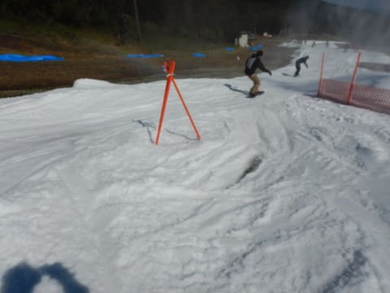
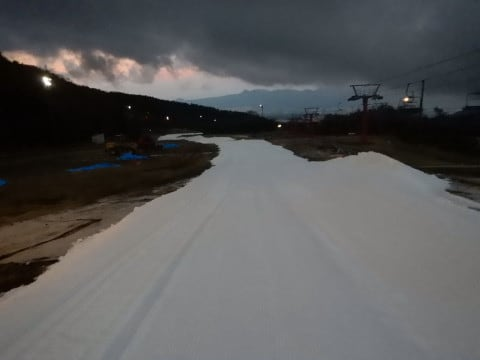

# 2021/10/23(土)のイエティ滑走レポート，詳細モード！…オープン翌日のイエティは予想以上に空いてたけど，いつもの幅5m廊下です

📅 投稿日時: 2021-10-25 00:55:04

🏷️ カテゴリ: [2022スキー滑走日記](cc9cb73e4320f6a97af6fccc37587a61a.md)

ということで．

昨日速報レポートした，2021/2022シーズン

オープン翌日のイエティ．

今日は詳細レポートです！

まず．

昨シーズンから9時営業開始と，

1時間遅いスタートになったYeti．

8:45くらいに駐車場に到着しますが…

道路向かいの駐車場は閉鎖されていて，

第1，第2駐車場側のみ開いてますが…

それでも，駐車場の車は全然少ない！

…今日は混まなさそうですね…

そして．

昨年までは，オープン時間までゲートの

前で待たされたのですが．

今シーズンは，営業開始前に入場できる

ようになり，ゲレンデ前でオープン時間まで

待つスタイルに変わったようです…

ちなみに今シーズンも，初滑りの

割引料金は無く，トップシーズンと

同じ土日祝一日券4000円(涙)

でも，メルマガ会員登録すれば，

初日は1000円引きの3000円になり，

その後も400円割引です！

ってなことで．

今シーズン初のゲレンデに出ますが…

うおおおお！！

雪だ！

雪だっ！！！←アイスクラッシュの氷だけど…

月山の6月13日以来，

4か月と10日ぶりの雪です！←繰り返して言うけど，アイスクラッシュの氷だってば…

気温は予想より高めの+5℃以上

ありますが．

日がちょっと陰っていたのもあり，

それほど緩んでいないよ！

ってなことで．

今シーズン1本目のゲレンデへ突撃っ！！！

あさイチは硫安が効いていてゲレンデの

雪も締まってるし．

何にしろ空いていたので…

いつも，シーズン突入の1本目は大事に

ゆっくり行こう…と思うんだけど．

すいてるうちに行ってしまわないと！！

と．

シーズン1本目，いきなりフルスピードで

滑ってしまっていたのでした…

で．

朝のうちはリフトは飛び乗りだし…

オープン1時間近く経っても，

リフト乗り場には人が全く並んでません！

それどころか，空き搬器があるほど…！

だもんで．

シーズン1日目と思えないくらい，

朝のうちは気持ちよく滑り続けられ

ましたが…

日が射してくると，強い日差しで

雪が緩み始め．

ちょっとゲレンデが荒れ始めて

来ました…

でも，人が少ないので，例年に比べれば

荒れはそれほどひどくないし．

降り場の雪もたっぷりついてるし．

昼近くでもこんな感じの雪で，

それほどザブザブになってないし

このくらいの荒れなら十分許容

範囲だな！！

何よりも．

今日は人が少ないのがいい！

午前11時ごろにはちょっと人が増えたものの…

昼休みの頃にはまた人が減って．

コースは無人のクリアラップが

取れるほど！！

なんで今日は天気もいいのに，

こんなに空いてるのかな？？

昼休みタイムが終わった午後1時過ぎには，

また人が出てきて，コース上の人口密度は

上がったけど．

でも，いつもよりは空いていて…

そして，リフト待ちは最大でもこの程度．

とはいえ．

さすがに午後2時ごろになると．

コースのごく一部，2-3か所には

雪が薄くなってきたところも

あったものの…

スタッフが急ぎ雪を入れて穴を

埋めていたので．

それほど気になることなく滑れます！

ただ，リフト乗り場付近だけ，ちょっと

雪が解けて穴が開いちゃってましたが．

まぁ，ゲレンデの途中と違って，

ここは避けて歩けるので問題なし！

そして…

午後4時から5時はコース整備で

一旦コースクローズになりますが．

その直前になると，さすがにコースも

結構荒れてきて．

さらにそこかしこにアイスクラッシュの

雪山ができていて，狭いコースがさらに

狭くなり．

ちと滑りにくくなってきたかな…

でも．

この時期に，ほぼ待ちなくリフト

グルグルで滑れたし．

コースもこんな感じで人が少な

かったので．

9時のオープンから16時のコース整備の

クローズまで，お昼休みもとらず

ひたすら滑り続けちゃいました～！！

（16時にロープでクローズされたコーズ)

…そして．

これだけガラガラで楽しいとなると．

ここで帰るわけにはいきません．

ええ．

帰れるはずがありません…！！

当然のごとく，17時のコース整備

終了をゲレンデ前で待って…

オープンと同時に，整備したての

シマシマバーンに飛び込みます！！

うおお！

前に誰もいない！

硫安が効いて締まった，圧雪かけたて

シマシマバーンだぁ！！！

いや…最高！！

シーズン初日から，前に誰もいない

シマシマバーンを滑れるとは…！！

…と，数本は気持ちよく滑って

いたけど．

…なぜか，昼間よりナイターの方が

人が多いのですが？

リフト待ちも昼間より長いし…

(でも，最大この程度なのでいつもよりマシ)

そのせいで，1時間も滑ると．

硫安が効いているところとそうでない

ところで凸凹になってきたりして，

バーンは荒れ始めてきて…

コース上の人も多くて，ちょっと

滑りにくくなってきましたが．

でも，昼間より板が滑るし．

例年のこの時期の，リフト待ち5分以上

というのに比べればガラガラなので．

ついつい，

「もう1本…あと1本…」

と，なかなか帰れなかったSkier_Sだったの

でした…

いやー．

でも．

今シーズンのYeti，オープン直後の週末

としては，空いていたし．

気温も低めで雪もひどく緩まず，かなり

楽しめました！！

ということで．

無事，2022シーズンスタートです！！！

## 💬 コメント一覧

### 💬 コメント by (アリス)
**タイトル**: 初滑り
**投稿日**: 2021-10-25 16:15:30

Ｓ様

今シーズン初滑りおめでとうございます♪

オフが4ケ月って、まるで雪国育ちみたいですね・・・

昨年の動画を拝見した時の人の密度とは大違い♪

さぞ満足されたことでしょう。

この調子で志賀高原・焼額山も早期オープンを期待したいです♪

### 💬 コメント by (Skier_S)
**タイトル**: ＞アリスさま
**投稿日**: 2021-10-26 00:11:51

月山にもう少し雪があれば，オフシーズンが4か月切ってくれるんですが…

ここ数年，月山のリフトが7月までもたなくなってきたので

シーズンオフが長くなってきてます(涙)

でも，土曜のYetiは空いててよかったですよ～！

