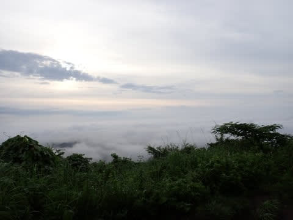
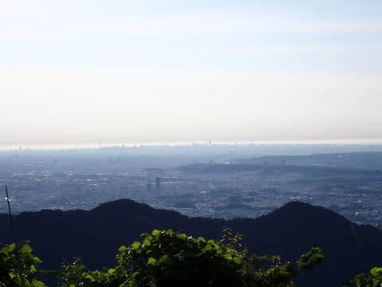
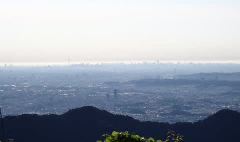
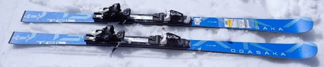
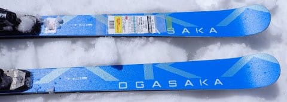
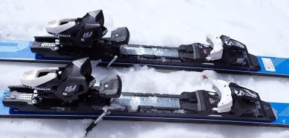
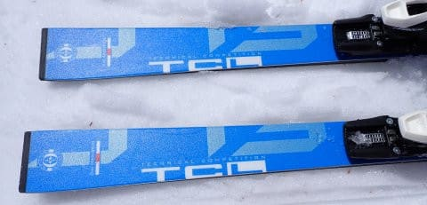
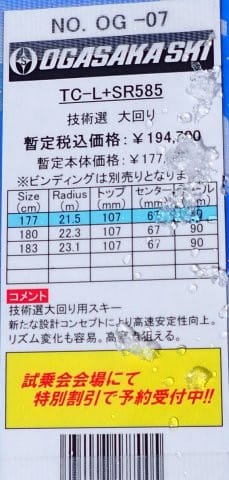
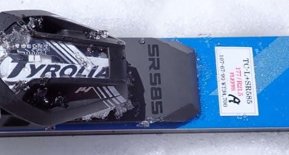

# 2025シーズンモデルのスキー板，試乗レポートその23…OGASAKA TC-L+SR585

📅 投稿日時: 2024-07-03 04:00:36

🏷️ カテゴリ: [スキー板試乗](c0bd8048615710cee890e403a36cc9a2b.md)

そういえば．

先週末も，日曜に景信・陣馬山方面に

走りに行ってきたのですが…

日曜は混むから，朝5時前にスタートしたい！

と，睡眠時間1時間半で朝早起きして

走りに行ってしまい…

帰宅後，用事やら仕事やらやっつけなければ

いけないことをこなしていると，

昼寝の時間も取れず．

せっかく睡眠時間を稼げる週末に

何をやっているんだ

という感じの週末を過ごしてしまいました…←そこまでして山に走りに行くなよ

だもんで，月曜死ぬほど眠かった…（涙）

それなのに，今日もこんな時間まで

何やってるんだ．

早く寝たい…

でも．

日曜は景信山の山頂から見事な雲海が

見えたので，よかったかな～…

ちなみに，1週間前の6月22日の土曜の

景信山頂の同じ場所からは，

こんなにくっきり都内が見えました…！

真ん中左の方に，スカイツリーが見えて

ますね…

空気が汚れていない，朝5時半ごろの早い

時間だったというのもあるけど．

何度も景信山に登って，ここまできれいに

都内が見えたのは初めてでした～！

いやーー．

睡眠時間を削ってまで行った甲斐が

あるというもの！！←良い子は睡眠不足で山に行ってはいけません

でも．家を4時に出て，

朝5時登山スタートだと，

山を3時間，16㎞ほどひとっ走りしてきて．

それから車で1時間ほどかけて帰宅しても，

朝9時ごろに家に戻ってこれて．

それから1日が始まるので…

一日の長いこと．

人間，寝る時間を削ればやっぱり

一日をかなり有効に使える

ということが分かりました←睡眠時間じゃなく，命削ってるから

ってなことで，本題へ．

今日も2025シーズンモデルのスキー板

試乗レポート，オガサカ編です！

〇OGASAKA TC-L+SR585 177cm

基礎大回り用

技術選向けTCシリーズの大回りモデルで，

こちらもTC-S同様，最後のアルファベット

がなくなってTC-Lという名前になりましたね…

この板は，基本的にはFMプレートとの

組合せはカタログ記載はなく．

SRプレートとの組み合わせになるようです．

長さは177，180，183と選べますが．

試乗したのは一番短い177cmでした．

長さが177cmにしてはR=21mとRは大きめ．

比較的まっすぐ走るのかと思ったら…

意外と回転性が高い！

TC-Sがかなりフレックスが強めだったので，

こいつも強めの板かな…と覚悟して乗ったら，

比較的良くたわみます！

たわみに乗って，R=21というよりは

小さめに回れる感じ．

フレックスはしなやかなのにグリップは

しっかり強く，角付けを強めれば

勝手にたわんで，かなり強い横Gまで

グリップを失わずガッツリ板が食い込んで

くれます．

強い横Gに耐えていけば，小回り板か？

と思うほどカービングのまま小さい半径で

回っていけます．

今回試乗したのは，4月のザブザブの

コンディションで，ロングの板を履くのは

手ごわいかな…と思ったけど，かなり

取り回しやすく．

それでいてグリップはしっかりしていて，

かつ荒れた斜面での安定度が高くて，

177cmでも185cmくらいの安定度がある…

という，取り回しやすさと安定感が

両立している，優れた板です！

角付けをそれほどしなければR=21らしく

かなり半径が大きい大回りまでできるし，

角付けを強めていけばかなり旋回性が

高まり，小回りに近いターンにまで

もっていけるし…

回転弧の自由度はかなり高い！

トップからテールまでの長いエッジが

しっかり効いてグリップしてくれて，

高速安定性も高いし．

それでいてこんな長い板と思えないほど

小さくも曲がれるし…

春のザブ雪でも，結構気持ちよく滑れ

ますね～…

板はしっかり重みがあるのに，履いた感じは

むしろ軽さを感じるくらいで．

春のザブ雪では，ショートのTC-Sの

SRプレート付きより，TC-Lの方が

手ごわくなくて滑りやすかったかも？？

とりあえず．良く食いついて良く回って

くれて．

安定感も高く雪面に張り付くような感じで

滑っていけるので．

177cmくらいを選べば，回転弧も小回りに

近いところまでもっていけるし．

オールラウンドベースのゲレンデ板と

すればかなりいい感じ．

大回り特化の板が欲しいなら，183cmの方が

いいかな～…．

結構スピードを出す人で，

大回りベースの板が欲しいけど，

大回り特化ではないある程度のオールラウンド

性がある板が欲しい人にはお勧め！

## 💬 コメント一覧

### 💬 コメント by (油漏＠あちこち)
**タイトル**: Unknown
**投稿日**: 2024-07-04 21:07:32

山走り（歩き）いいですね。

睡眠不足の運動、、、慣れていらっしゃる？とは思いますが、気をつけてください。

明日から志賀高原に行きます。前泊してトレールランに参加します。近所の山などで練習したデータを見ると、今回はぎりぎり時間内完走できるか微妙です。

### 💬 コメント by (Skier_S)
**タイトル**: ＞油漏れ＠あちこちさま
**投稿日**: 2024-07-05 02:52:55

え？また志賀高原の40kmコースですか…！！

あんなコース走れるなんて人間じゃないです（笑）．

頑張ってきてください…！！

