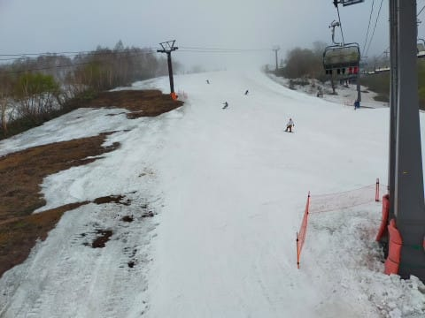

# 2022/5/22(日)かぐらスキー場ファイナル！…2022シーズン営業終了日は曇り．それほど混まなかったけど，夕方は雪が薄くなってた…

📅 投稿日時: 2022-05-23 01:46:58

ということで．

今日は，今シーズン営業最終日のかぐら

スキー場で滑ってきたわけですが．

いつも通りラストまで滑って，帰宅が

遅かったので．

帰宅日定番の速報モードにて，

本日のかぐらファイナルデーのレポートです！！

えー．

まず．

朝7:30のロープウェースタート時はまだ

雨が降ってました…(涙)

7:30頃のロープウェーの待ちはこの程度で，

ここからロープウェーまでは15分待ちで

乗れました．

で．

ロープウェー→リフト→ゴンドラと，

はるばる長い旅路を乗り継ぎ，

8:30ごろにようやっとゲレンデ到達ですが…

ちょっとガスっていたものの，

このころには雨が止んでいて．

このあとは曇り，時折一瞬晴れ間も出る

程度の天気で，雨は降らずに済みました！！

しかし，思ったより雪は多いですね～！

ファイナルデーとしてはかなりマシな

雪の量じゃないでしょうか！？？？

パークのアイテムも巨大キッカーが

しっかり残ってます！！

…でも．

10時ごろのゲレンデは，かなりの混雑(泣)

ちょっと快適とは言えない人口密度

だったのが残念…

とはいえ．

リフト待ちは10:00～11:00のピークで

この程度．

最大2-3分待ち…ってところで．

それほどひどく待たなかったのが良かったな！

昼を過ぎると，飛び乗りになるタイミングも！

…午後になると，搬器数台待ち程度の

待ちで済みました！！

…ただ．

昼になると，ちょっとバーンが荒れてきて…

そして．

雪が薄くなってきたところも…（涙）

ラストの頃には全面コブっぽくなって

来るのですが．

一部エリアで，ほとんど幅いっぱい

コブ溝部分，雪が薄くなっちゃった

ところもありました…（泣）

バーンのそこかしこ，地面が見え始めて

いるのが分かります…（涙）

とはいえ．

メインバーンの上半分は営業終了時間でも

こんな感じで，画面右のコブラインは

底が全く抜けて無くかったし．

ファイナルデーでこれはかなり良い

コンディションですよ！！

ってな感じで．

本日をもって，かぐらスキー場の今シーズンの

営業が終わっちゃいましたが．

今日の営業終了時もこんな感じだったので…

雪が薄くなってきたとはいえ，

頑張って雪寄せすれば，まだあと1週間

くらいは営業できるのでは…？？

…と思った，Skier_Sだったのでした…

ってなことで．

明日，仕事がご無体じゃなければ

詳細レポートやります～！

## 💬 コメント一覧

### 💬 コメント by (ぽんちゃん)
**タイトル**: 月山レポート
**投稿日**: 2022-05-24 06:32:15

かぐらの次は月山ですね。

月山山頂からのレポートをお待ちしています。。

### 💬 コメント by (Skier_S)
**タイトル**: ＞ぽんちゃんさま
**投稿日**: 2022-05-25 01:31:55

いや…大斜面が滑れない月山に行こうかどうしようか，悩み中です…

まぁ，行っちゃう可能性が高いですが（笑）

