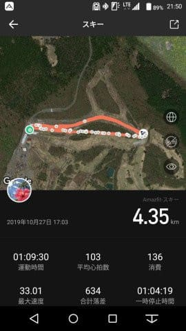
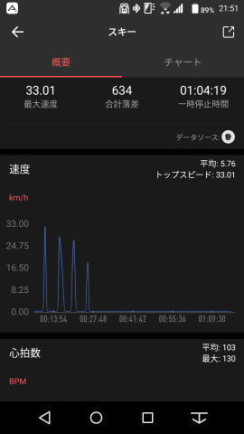
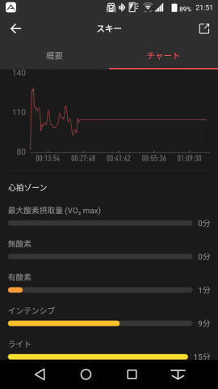
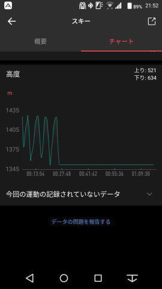
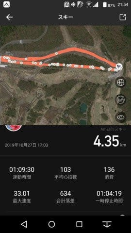
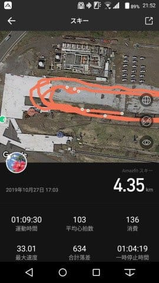
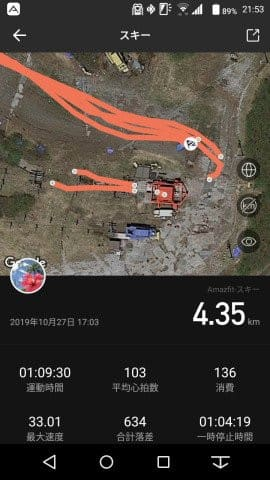
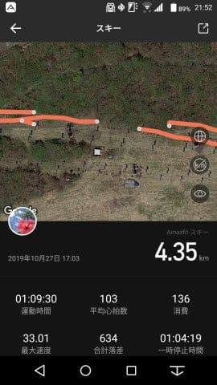

# Amazfit GTRスマートウォッチを買ってみた，その9…スキーモードを使ってみた！続き…スマホアプリでログを見る

📅 投稿日時: 2019-10-31 08:18:18

🏷️ カテゴリ: [PC,カメラ&小物](c0d8caed13e597efe97b661a8ae56bed0.md)

（11/1に，ちょっと記事を書き換えました）

これまでのAmazfit GTRのレポート

その1．[購入レポート，](e07b216ec3b426f7a5a1462a3b6fd1c02.md)

その2．[開封＆試してみた感じ，](edd1205f6bd9cd6dadb50e4fc6316b747.md)

その3．[アクティビティーログ](ecd7317c7980728b41dae1a21fe835803.md)

その4．[スマホアプリのインストール＆設定](eb88e9293dae421d12f27fe8b5b363344.md)

その5．[スマホアプリを使ってみた](e031a6cc94592b655560de20fc58cacf1.md)

番外．[常時点灯機能追加！](ec221351f854b20de445e565d66acdf55.md)

その6．[GPS精度が低いのが欠点](eef49f5206ed798087941af71eebf0dee.md)

その7．[GPS精度，ちょっと改善したかも](e9f927972612f60570f5a704fb48030f8.md)

その8．[スキーモードを使ってみた](e29f3f0e50c4f1facc44bbff6d4859de6.md)

今回は，前回使ってみたスキーモードですが．

このログを，Amazfitスマホアプリで見ると

どんな感じか…

ってのをレポートします！

ってなことで．

前回記事で書いた，Amazfit GTRで

取得したスキーモードのログ．

このログは，Amazfit GTRと同期している

スマホアプリでも確認できるので．

スマホでどんなふうに見えるのか，

ちょっとスマホアプリを見てみましょう…

まずは，滑った軌跡と，

滑走時間（一応，一時停止時間を抜いた

運動時間となってます…）

平均心拍数，消費カロリー，

最大速度，総滑走標高差，

一時停止時間が表示されてます…

画面を下にスクロールさせると．

スピードのグラフが出てますが…

あれ？ナイターは10本滑った

はずなのに，4本しか表示されて

ませんよ？？？

そして，さらにスクロールさせると．

心拍数グラフと心拍ゾーンの棒グラフが

出てきますが…

…心拍数グラフも，前半の1/3程しか

正しく表示されてませんね（涙）

さらにスクロールさせると…

高度は標高差グラフが出ます．

が．

これも，4本分しか表示されず，

後半はグラフがフラットなまま…

で．

スマホアプリでの表示できる情報はこれだけ．

滑走本数や平均速度，最大傾斜など，

時計本体で確認できる情報のいくつかが

見れません…

ちょいと残念…

…ということで．

このスマホアプリ．

記録した情報をすべて見ることが

できないうえ．

スキーモードのグラフ表示に，

バグがあり，グラフが最後まで

正しく表示されません…（涙）

ちなみに，この1回だけの現象じゃなく．

昼間滑ったログも，同様に

グラフの後半1/3が全く表示

されてない状況で，

ちょっと残念な感じです…（涙）

うーむ．

これは，Auto pauseをOnにしていたので，

Pauseが途中であまりにも頻繁に入って

なにかおかしくなっているのか．

あるいは，Auto pauseは関係ない

バグなのか…

とりあえず，

次のアップデートで直ることを

期待しましょう．

でも．

懸念していたGPS精度は，

どうやら良くなった感じですね！

GPS軌跡を見てみても．

ちゃんとリフトに沿って移動して，

コース沿いを滑った軌跡が

ほぼ正しく残ってます．

ただ…

リフト降り場付近の軌跡を見ると．

実際より内回りしたような記録に

なっていますね…

…このあたりだと，誤差20mって

ところでしょうか．

そして，今度は乗り場近辺を

拡大してみますが．

ここはおおむね正しくコースを

滑ってきた軌跡が残ってます．

…でも，Auto pauseがONだったので．

滑り終わって立ち止まると，

一時停止されて，軌跡が消える

のが分かります．

リフトに乗ると，リフトの移動速度が

微妙らしく．

ログがスタートしたり止まったり

しているのが分かるかと…

うーむ．

スキーモードでのAuto pauseはoffで

使うべきですね．

ってな感じで．

スマホアプリで記録を見てみると．

GPSの精度はどうやらそこそこ良くなった

ようで．

軌跡はコースからはみ出たりしてないし，

スマホのGPSと比べても，十分な精度が

出てるかな～，って感じですが．

スマホアプリでは，

記録がすべて見られないバグがあり．

さらに滑った本数もスマホアプリでは

読み取れないという…

うーむ．

ちょっと残念な感じ…

とりあえず，バグは次回の改修で

直してほしいところ…
