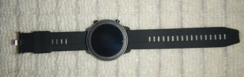
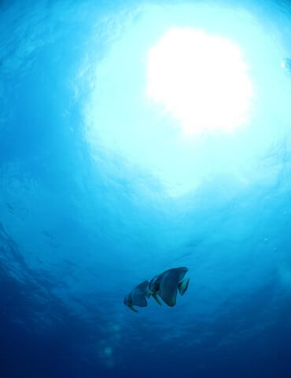

# 2010年7月，2歳の子連れで座間味でダイビング…プロローグその3

📅 投稿日時: 2021-09-16 04:49:56

🏷️ カテゴリ: [ダイビング日記](ce3a7a8d424d112fce83ee85c81a0e344.md)

えー．

私が愛用している，

[スマートウォッチのAmazfit GTR](eeb684c478255cfab52c0b4bc023f3d47.md)．

ちょうど2年ほど使ってきたのですが．

最近，こいつのバンドの金属ピン部分が

ちぎれてきてしまいました…（泣）

…さらに．

革を模した表皮も剝がれてきちゃったし．

２年でこれって，ちょっと耐久性が

弱いかな…(涙)

うーん．

これは，替えバンドを買わないとなぁ…

…と，いろいろ探していたら．

なぬ？？？

440円？？

それも，送料無料！？？

普通にヨドバシとかで一番安いヤツ探しても

1200円くらいするのに…

これは安い！

でも…時計バンドで送料込み440円って…

いくらなんでも安すぎる．

大丈夫かな？

…と，心配になりながらも．

無駄になっても440円だ…と，アマゾンで

注文してみたところ．

注文から8日ほどで，中国の深センから

怪しげな国際郵便が届き…

中にはちゃんと注文したバンドが

入ってました～！

到着予定は注文後2週間くらいのところ．

予想より早く着きましたね～…

ってなことで．

早速Amazfit GTR君に着けてみましたが．

元からついていたバンドに比べると，

ちょっと柔軟性に欠けるけど．

でも，ヨドバシで買った1200円のウレタン

バンドに比べれば，このシリコンバンドの

方が着け心地が良いなぁ…

ちゃんとワンタッチ取り付けだし．

…当然，バンド幅が同じAmazfit Pace君にも

着けられました！

うむ．

ちょっと心配した，440円バンドだけど．

このお値段なら上出来です！！

ってなことで．

余談の方が本題より長くなっちゃいましたが．

今日も10年以上前の座間味ダイビングの

レポートの続きです．

では，どうぞ～！

ーー

ということで．

新しいカメラは準備したわけだけど．

…今度悩むのは，次のダイビング旅行の

行き先，だ．

今回，超広角のドームレンズを買ったわけ

ですから，

…条件としては当然…

　フィッシュアイの画角が活かせる写真が撮れる海！！！！

なわけで．

…

伊豆は…ないよな．

三浦半島も，無理だよな…

ある日突然，三浦半島の透明度が20mを越して，

アオリ上げのアングルできれいなブルーが

撮影できる海になったら，三浦半島でも

いいのですが．．．．．

…可能性としては，日本がW杯優勝するのと

どっちが先か，って次元の話だよな．

となると．

ある程度の遠征が必要だ．

…

…

かといって，海外まで出かける休みは取れない．

第一，娘はもう2歳9ヶ月．国際線は

お金取られちゃう．

…子供が生まれて，早くも2年以上が過ぎ．

昨年，沖縄本島に初めて子連れで連れていき．

その次にいきなり子連れ海外でタヒチという

無謀なツアーをやったけど．

さて，次はどこへ行こうか…

所詮はまだ2歳児．

まだ，オムツなので，親のどちらかが

ぴったりついてなくてはならず．

当然，危ないのでダイビングボートに

乗せるのは無理．

そして，父親と母親で交代で潜りに

行きたいので．

1日ボートが沖に出っぱなしじゃなくて，

1本ごとにボートが港に戻ってきて，

父親と母親が交代できるような場所じゃ

ないといけないし．

かつ，宿とショップが近くて，子供の面倒を

見る親が宿で休むことができて．

それでいて，沖縄本島よりも

サンゴがきれいな所…

…そんな都合のいい条件の場所，あるか？？？

…

と，一瞬絶望したものの．

過去に潜りに行った場所を思い返し…

ある．

あるぞ．

慶良間諸島だ．

座間味や阿嘉島の街のそばのショップなら，

この条件を満たしそう…！

ということで探したところ．

座間味なら，ショップと宿が一緒になっていて．

かつ，ボートが出る港まで歩いて行けて

そして，すぐそばにそこそこのお店もある…！

ということで．

子連れダイビング2年目，

トータルで3回目の子連れダイビングの

行先として，座間味を選んだのでした…

（この時，こんなに毎年のように座間味に行くように

　なるとは思ってなかったなぁ…）

　

