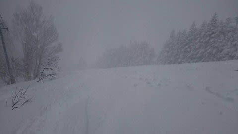

# 2021/3/13(土)の志賀高原は…ミゾレ＆雨＆強風，リフトは軒並み運休の朝．午後は雪~みぞれでリフトは徐々に復活したけど…

📅 投稿日時: 2021-03-14 01:28:26

🏷️ カテゴリ: [日記](cc4b5682fb7b8b144980957a978653fb0.md)

えー．

ほとんどの読者の皆様におかれましては．

Skier_Sは今日もスキーに行った

夢を見たんだろうなぁ…

と，お思いでしょうが．

…今日はスキーの夢を見れませんでした(涙)

いや．

ご無体オーバーフロー状態なので，家で必死に

仕事と戦ってました…

…が．

今日，志賀高原に行った特派員は，

風＆雨という自然現象と戦った結果．

優秀な特派員が次々戦死，戦線離脱

していく…

という，かなり過酷な

戦場だったようです．

…今日のこの悪天候．

志賀高原の夢を見れなかった，

私の呪いではありませんので．

…呪いではないはず…

…もしかすると，呪いだったかも…

ってなことで．

金曜夜から降り出した雨は．

早朝になると，スキー場近辺では

ギリギリ雪か？

…という感じになっていたらしく．

朝の駐車場は，ちょっと雪が積もって

いたようで．

朝は，駐車場にもちょっと積もっていた

ようですが．

でも．

あさイチは雪が真横に吹き付ける強風のため．

焼額，奥志賀，一の瀬方面，ほぼ運休！

どうやら，一の瀬ファミリーペアのみ

動いていたようですが…

動いたのがこの1本だけだったので，

リフトは激込み！

そして，朝10時ごろには焼額も，

第4ロマンスのみ動き始めたようですが…

1本しかリフトが動いてないので，

混んでますね．

で．

午前中は風が強く．

一の瀬は麓は雨．

焼額も完全に横殴りに降り

つける雨で．

どこを滑っても，ウェアがびしょ濡れ

になる天気だったようです．

ただ，昼ごろから，徐々に風が弱まって

いったようで．

10時半ごろには一の瀬ファミリークワッド，

タンネ，高天ヶ原が動き出したようで．

12時にはダイヤモンドも運転開始！

そして，13時過ぎには焼額も第1ゴンドラのみ

動き出したようです…

（[焼額山スキー場FaceBook](https://ja-jp.facebook.com/yakebitaiyama/)より）

…しかし．

結局この日，奥志賀・焼額方面で動いたのは

焼額第4ロマンス・第1ゴンドラと

奥志賀第1ペアのみということだったので．

かなり過酷な天気だったことが

分かりますね…

（[志賀高原索道協会ホームページ](https://www.shigakogen-ski.com/live-lift-status)より）

一見雪が降っているように見えますが．

今日は午後になっても，一の瀬・ヤケビの

麓付近は雨っぽい感じで，

滑っているとびしょ濡れになり．

山頂付近は重い湿った雪が

降って寒く，かなり厳しい

状況だったようで．

志賀高原の歴戦の特派員から

次々撤退の報告が続く，激しい

状況だったようです…

午後になると，山頂はかなり

重い雪が積もって行っていたらしく．

そして，夕方ごろには風も落ち着き，

雪や雨も弱まり，空もうっすら

明るくなってきたようですが…

今日は一日，優秀な特派員をもってしても

「なんでこんな日に滑ってるんだろう？」

と自問自答しないとすべれない，激しい天気

が続いた，過酷な日だったようです．

とりあえず．これから明日にかけて，

10~15cmほど積もってくれそうだし．

麓付近も夕方から雪に変わって，

このくらいは積もってくれたようだし．

明日はちょっとはゲレンデ状態回復

してくれるかな…

明日の朝イチは，ガリガリの下地の上に乗った

重めの雪が乗った圧雪で．

あさイチの雪はそれほど悪くなさそう．

午後に向かって，雪はちょっと荒れて行き．

急斜面は下地の硬いのが出てきそう．

うーん．

あと，気になるのは視界かな…

終日曇り~雪なので，バーン状況が

見にくそうですね…

昼間も0℃からマイナス程度で，

気温もそんなに上がらなさそう．

…ただ，気になるのは．

焼額第2高速リフト，ぶっ壊れたようです．

いつ直るか見通し不明ということで．

直るまでの間，一の瀬から焼額方面へは，

車かバスで移動する必要がありますので，

ご注意を…！

（[焼額山公式Facebook](https://ja-jp.facebook.com/yakebitaiyama/”)より）

…そして，白樺・ブナ・唐松コースは

滑れませんので，あきらめましょう（涙）

うーん．

焼額の第2高速リフトも．

もうできてから30年以上経つもんなぁ…

壊れても不思議じゃないけど．

致命傷じゃないことを祈りたい…

そして．

第1高速が生き残っていれば，

第2高速が壊れても，

一の瀬との往復も出来たし，

白樺コースも滑れたのに…

惜しいリフトを亡くしたものだ…←人じゃないから．「無くした」が正解だから

## 💬 コメント一覧

### 💬 コメント by (新米パパ)
**タイトル**: Unknown
**投稿日**: 2021-03-14 06:48:49

昨日は1時前から中央エリア4時間チケを買いしぶしぶ参戦しましたが、びしょ濡れになりながら、"これもスキーだ、楽しもう！"と自らを奮い立たせていましたが、妻子から撤退要求が出て断念しました。

午前はフェニックスのプールという、、

グローブとウェアを乾かすのが大変です。

雨ガッパが必要でしたね。

で、昨晩、奥志賀は雨でしたね、今も白樺が強風でなびいておりどうなることか、、、

修学旅行生もまだいらっしゃったし、西側コースがダメとなると、本日ヤケビは恐ろしいな、、、

### 💬 コメント by (レインボー73)
**タイトル**: Unknown
**投稿日**: 2021-03-14 18:55:40

日曜日の志賀高原情報

朝の上林３℃　蓮池ー３℃。新雪は5cmくらい。だけど何かに期待してか、全員太板。

2ゴンスタートでパノラマ、サウス。いいぞ、快適です。二高故障が障害となって、コースの選択が狭まります。

ＧＳもオリンピックも超快適。その後、ゴンドラの混雑を避けるため、三高回し。

寺子屋に着くと、そこは風の国。柔らかい雪が飛ばされてしまって、ゴリゴリが残るだけ。リフト下のコースは、私にはターンが難しい。けど楽しい。

ラーメン1000円のあと、東舘経由で西館へ。さすがに雪は緩くなっている。

高天のリフト下は、カリカリで横滑りが難しいけど、太板のおかげで、躊躇なく飛び込める。新規購入のヘッドcore99 180cmは、アイスバーンから深雪までのオールラウンダー。様々なバーンが予想される日には、欠かせない一品となりました。

ダイヤモンドの非圧雪では、カリカリの間に白いパウダーが。ワンターン目に飛ばされたけど、あとは白い所を狙ったら、なんと快適なことか。

今日も楽しかった！明日が待ち遠しいです。

### 💬 コメント by (Skier_S)
**タイトル**: 今日はいい夢を見た…
**投稿日**: 2021-03-15 00:29:42

＞新米パパさま

あら．あの天気の中滑ったんですね…！

お疲れ様でした．

日曜のヤケビは良かったですね…ゴンドラちょっと混みましたが．

＞レインボー73さま

今日はいい一日でしたね！

まさかこんな晴天になるとは…

夕方までいいコンディションキープしましたよ！

焼額は終日Goodな雪でした…．

ダイヤ，新雪が楽しめたんですね．

ちょっと驚き．

