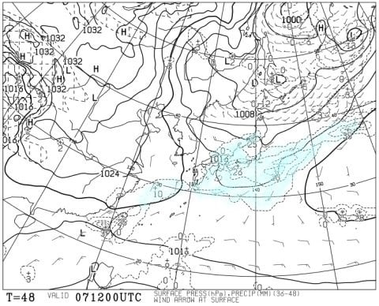
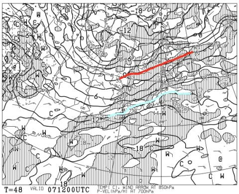
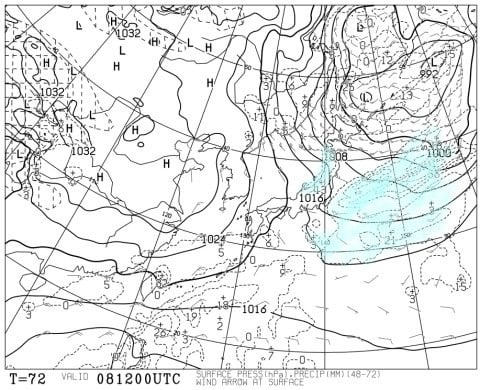
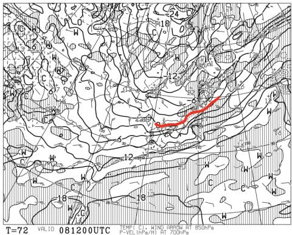
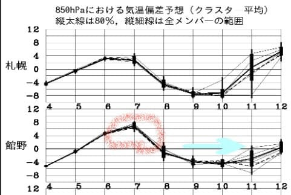
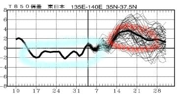
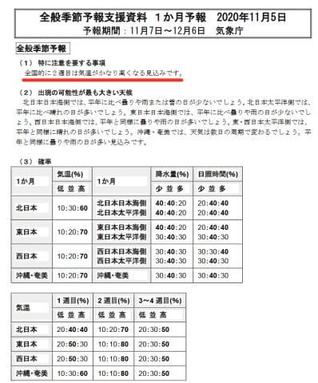
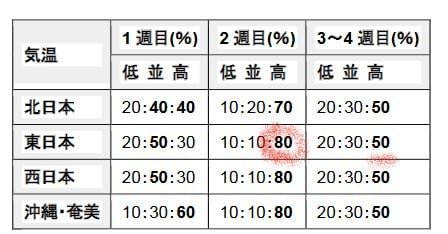

# 11月7，8日の週末の軽井沢スキー場＆イエティの天気は…そして，志賀オープンの14日までに冷えるのか？

📅 投稿日時: 2020-11-06 02:27:36

🏷️ カテゴリ: [スキー天気予想](c6554f5c3c106093b511a8daae23757e8.md)

11月3日に軽井沢スキー場がオープンし．

そして，11月14日に志賀高原の熊の湯＆

横手山のオープンが控えている

今日この頃．

そろそろ，スキーヤーの皆様におかれましては，

これから冷えるのかどうかが心配で

夜しか寝られない日々を過ごしている

ことかと思います．←だから夜寝るのは普通だから

ってことで．

まずは今週末のイエティと軽井沢，

どんな天気になりそうかを予想してみましょう…

えー．

まずは7日土曜の地上天気図を見ると…

うーむ．

太平洋側と長野の西側，日本海側に

降水域がかかっているので…

微妙な感じですが．

軽井沢は夜まで雨は降らないかな…

イエティは，夕方~夜にかけて，雨が

ぱらつきそう…

あー．土曜の850℃0℃線は，この赤線で示すよう

北海道の北まで上がってるし．

水色の+12℃線が長野を横切っている

くらいなので．

降れば絶対雨です．

この日は雪が降る可能性はゼロ．

この日雪が降るとすれば，

ジャンボ宝くじの1等が当たった日に

たまたま出かけたら5億円を拾って，

その帰り道に偶然助けた見知らぬ老人

から10億円の遺産相続を受ける…って

くらいの確率の奇跡が起これば，

雪になるかもしれません．

…まぁ，

期待するだけ無駄

という確率です．

で．翌8日の日曜ですが…

ふむ．

この日は冬型っぽい地上天気図．

冬型なら…軽井沢もイエティも

日曜は晴れですね！

で．日曜夜9時の850hpa気温図は…

をを？？

赤い0℃線が，志賀高原近くまで下がって

来てますよ！！

…これは．

8日夜から9日にかけて，新潟や

志賀高原，白馬なんかのスキー場では，

雪が積もりそう…！

とりあえず，

7日土曜：イエティは曇り，夕方から夜に雨がぱらつく．

　　軽井沢は晴れ~曇り．夜一瞬雨がぱらつくかも？

　　気温は高め

8日日曜：イエティ，軽井沢ともに晴れ．

　朝は気温が高いが，午後はだんだん冷えていく．

　志賀・白馬・かぐらは昼間は雨だけど

　夜から雪になっていく…

という感じかな！

…で．

8日夜からの冷え込みが，そのまま続いて

くれるのか…？

というところが，すごく気になるところ．

とりあえず，今後一週間の850hpa気温

予想を見てみると…

赤く印した7日の土曜は，やっぱり

平年比+6℃と高温だけど．

その後，水色矢印で記した

9，10，11日あたりまで，

平年比-4℃程度と冷えそうです！！

…これはいい傾向じゃないですか！！

さてさて．

11日以降はどうなるのかな…？？

と．

一か月予想図を見てみると…

…

…え？

水色で記した，10月15日~11月11日ごろまで，

平年並みかそれ以下の気温が続いてたけど…

赤く印した12日以降の期間，

平年より2~4℃高い日々が続くんですが！？？

志賀高原オープンの大事な時期に，

天然雪が望めないどころか，

11月下旬まで，人工降雪が打てないほど

ヤバいかも…？？（激涙）

と，慌てて一か月予想支援資料，FCXX92を

見てみると…

ふが？？？

全国的に2週目は気温がかなり高くなる見込みです…だと？？

おーまいがーーー！！！

この資料の下の方にある，気温確率の

表を見ると…

がががーーん．

予想期間2週目（11月14日~20日）は，

平年より気温が高くなる確率，80%…（涙）

予想期間3~4週目（11月21日~12月4日）も，

平年より気温が高くなる確率が50%

なので．

…11月いっぱいは，気温が高くなりそう

ですね（泣）

…どうやらこれまで，いい感じで冷えてましたが．

この冷え冷えボーナス期間も，

11月11日のポッキー＆プリッツの日（？？）までの

ようです…（涙）

なぜ．

スキー場オープンの数日前までは，

一か月間冷えたというのに．

スキー場オープンが続く，ちょうど人工降雪が

必要な14日~20日の期間に，狙ったように異常に

気温が上がるかな…（激泣）

…

…いや．

しかし．

この表を見ると．

第2週に気温が低くなる確率も10％あるのだ！

確率は0じゃないのだ！

…冷える．

みんなの思いがあれば，この10%にあたって，

冷えるはず！！

みなさんお分かりですね．

11月下旬に，無事に志賀高原がオープンできるよう．

そして，かぐらや白馬，鹿沢，丸沼，アサマ2000なども

予定通り11月にオープンできるよう．

1億2000万人のこのBlog読者の皆さんで，

止まらず休まず諦めず．

天に向かって，

熱い願いを込めた冷え冷え踊り

を踊り続けるのです！！！
