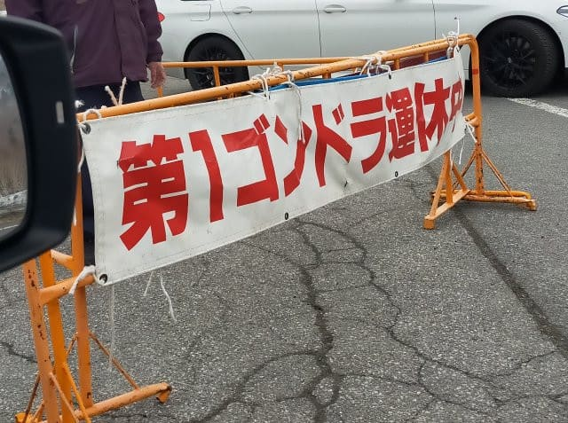
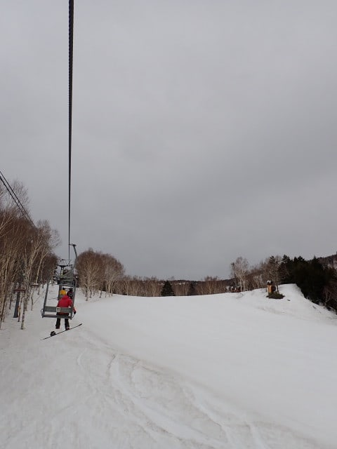
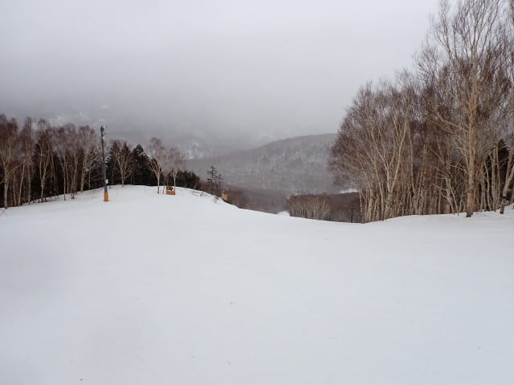
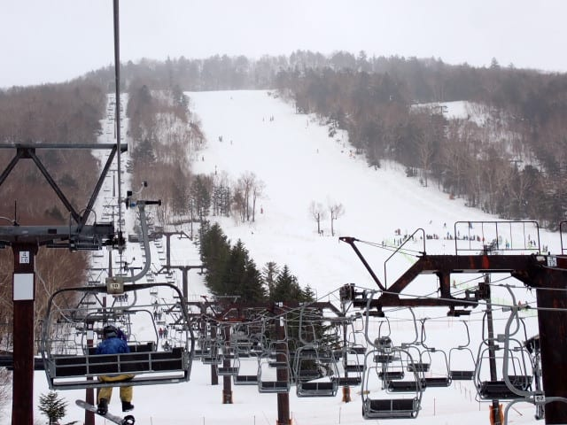
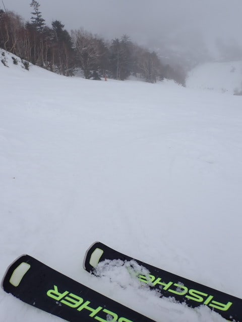
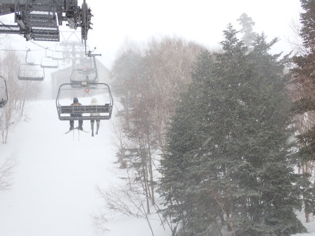
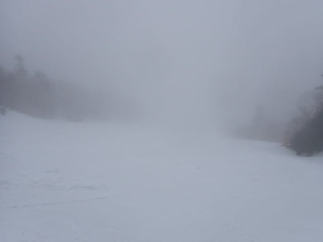
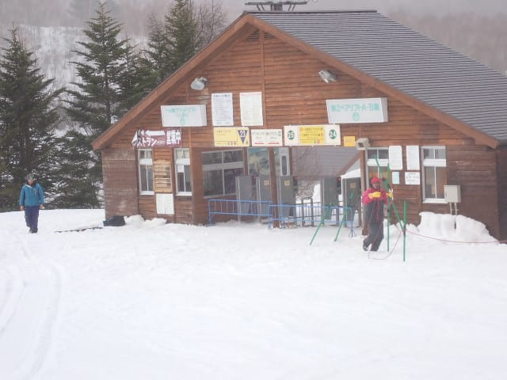

# 2025/4/13(日)の志賀高原スキー場，速報レポート！…強風で終日焼額のゴンドラは動かず．9時ごろから雨，昼間は山頂付近は雪！…でも強風で15時過ぎに全リフト終了

📅 投稿日時: 2025-04-14 02:32:53

🏷️ カテゴリ: [2025スキー滑走日記](cacd3fbf84d4a679ee61a5894c3f95e14.md)

なんだか，15-16日にかけて，志賀高原は

雪になりそうな気配がする今日この頃．

いや，15，16日はかなり寒い荒れた天気で，

雪かみぞれが叩きつける悪天候になりそうな

予感…

ってな感じで，今後の悪天候が予想

されるんですが．

今日も悪天候で，かなり悲惨な一日

でした…（涙）

とりあえず，今日も朝6時から滑っていて，

帰宅してひと仕事してたらもう深夜2時（泣）

活動時間21時間越えてて，死ぬほど眠い…

なので，今日も速報モードにて，

本日の志賀高原レポートです！

まず．

朝6時の焼額の早朝営業開始に間に合うよう，

6時前に志賀高原へ登ってきますが…

気温が高めなため，道路の積雪も凍結もなく

スキー場までやってこれましたが…

まだ雨が降ってる気配もないし，天気も

荒れてないな…

と思っていたんだけど．

朝6時前に焼額に到着すると…

なぬ～！！！！！

強風で第1，第2ゴンドラとも運休？？

ががーーーん！！

昇ってくる途中では，そこまで風が強いと

感じなかったのに…

ショック！！！

山頂付近はかなりの風らしく，今日はゴンドラは

1日動かなさそう…とのことで，

早朝営業から第4ロマンスでの1本のみの

営業となりました…（泣）

まぁ，第4ロマンスリフト沿いの

サウスコースは，朝は結構しっかり締まり

気味で板も走って，いい感じだったん

だけど…

残念ながら朝7時半過ぎに，雨が降りはじめ…

8時ごろにはレインウェアを着ていないと

辛いくらいの雨になっちゃいました（泣）

そして，遅いペアリフトで滑り続けるのも

辛い…と思っていたら．

高天ヶ原と一ノ瀬はクワッドが動くという

ことで，朝9時過ぎに一ノ瀬方面へ移動！

ただ，一ノ瀬も朝から小雨が降ったり

止んだりで，雪も雨に濡れた重い雪で，

そんな楽しい感じではなかったけど…

まぁ高速リフトで滑れるからまだマシかな，

と思っていたところ．

なんだか，昼頃には山頂付近では

雨から雪に変わり…

風もさらに強くなり，吹雪っぽく

なってきたんですが？？

強風のために高天ヶ原クワッドは

12時過ぎには止まり，

ダイヤも同じく2時過ぎに止まってしまう

という，どこまで強風に耐えるかという

かなりサバイバルな状況（涙）

そのうえ，山頂付近は時折視界も悪くなり，

かなり厳しい感じに…（泣）

午後の天気は，山頂付近は雪，リフト乗り場

付近は雨…という微妙な感じのものが

ときおり強く降ったり，ときおり止んだり…

というのを繰り返してましたが．

風がさらに強くなっていったので，一ノ瀬

ファミリーも，ついに午後3時過ぎには

強風のためリフト営業終了となりました（泣）

まぁ，雨と強風で，ときおり視界も悪くなり，

さらに重くて荒れてボコボコのバーン…

という感じなので，16:30まで営業予定

だったのが1時間半ほど早めに終わったけど，

「うがーー！！もっと滑らせろ！！」

ってならない感じだったのが，せめてもの

救い（？）だったかな…

ということで．

すっきり晴天の土曜日と対照的な，

かなり残念な感じの日曜だったのでした…（涙）

また明日，元気が残ってたら詳細レポート

書きます～！←いかに悲惨だったかを詳細に書いたレポートということか？？

今日はもう寝ないと死ぬ…

おやすみなさい…

## 💬 コメント一覧

### 💬 コメント by (ねも)
**タイトル**: Unknown
**投稿日**: 2025-04-14 06:27:46

こんなドツボなコンディションでも滑り続けるとは(ﾟ-ﾟ)　前の記事のコメントで｢雨の日の独占レポ｣なんてからかわれて(ほめられて？、笑)ましたね。

ここまでくると、スキー愛を通り越して、Ｓさんはマゾでは？と思ってしまいます😅

### 💬 コメント by (アツシ)
**タイトル**: Unknown
**投稿日**: 2025-04-14 12:41:10

いやー、今週は参戦できずすみませんでした。私さえいれば、こんな天気にはならなかったのに...(３月以降に志賀高原で計10日滑って、まだ雨や妖怪さんに一度も出くわしていない強運の持ち主です👍)

来週と再来週と、GW後半は志賀高原で滑る予定です。よろしくお願いします。

### 💬 コメント by (Skier_S)
**タイトル**: これから週末まで異常高温
**投稿日**: 2025-04-15 02:41:37

＞ねもさま

雪がある限り滑りますよ~！！

第4ロマンスの早朝は，かなり貸し切り感が高い早朝営業でした～！

…でも，ヤケビの常連メンバーは「雨が降ると人が減って，板の滑りも良くなるから

雨が降ってくれないかな…」

という危険な考えをもっている人が数名います(笑)．

＞アツシさま

今週は参戦できなかったんですね…

でも，日曜は来なくて正解です．

しかし，今シーズンはまだ雨にも妖怪にもつかまってない！？？

大丈夫です．

今週日曜には…

…

不吉な予想はしないでおきます…

