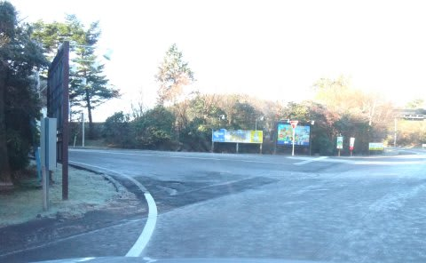

# BRレガシィ君＠凍結路面にて…おまけに定番11月16日のYetiコース状況の動画

📅 投稿日時: 2013-11-18 00:50:11

🏷️ カテゴリ: [車](cba0e8330b3f2ded7c1addfacc75d4547.md)

えー．

昨日の日記に書いたように．

土曜日朝，Yetiへ行く登り道のこと．

Yetiまであと2-3kmというところまでやってきたとき…

コーナーを曲がるステアリングの違和感で，

無意識にスピードダウンしていた私．

「あれ？」

と，違和感を認識したのは，無意識に減速した後．

「このステアリング反力の抜けは…もしかしたら…」

アクセルを踏んでみたところ．

「やっぱり，凍ってるよ…」

日陰の部分．ところどころ，路面が凍りついていたのでした…(恐）．

夏タイヤでもゆっくり走れば問題ないレベルでしたが．

途中で突き刺さっている車1台．

いやー．この時期で晴天の時に．

路面が凍っているとは思わなかったんでしょうね～．

とりあえず，BRレガシィ君．

最近のEPS(電動パワステ)は良くできてるんだなぁ．

わずかなフロントグリップの抜け感，反力の弱まりが

きっちりステアリングに伝わっていたので．

つんつるてん路面に入る前，わずかに滑り始めた段階で

ちゃんと気づくことができて，

危険な目にあわずに済みました…

うーむ．

昔の電動パワステは，アシストの反応遅れやインフォメーションの無さ感が

ひどかったけど．

最近の電動パワステは，凍結路面でも安心して走れるレベルだな！

…ってことで．

おまけに，定番のYetiのコース全状況動画です．

コース幅，混雑状況，リフト待ちの参考にどうぞ．

…なんか，画面の右側にノイズが乗ってますが．

カメラの不具合かな？？

## 💬 コメント一覧

### 💬 コメント by (komu)
**タイトル**: 熊の湯行ってきました
**投稿日**: 2013-11-18 06:33:19

一足先に志賀高原行ってきました。

中間リフトからの滑走でしたが幅も広く良く滑る雪で満足しました。

今週末は上から滑れることを祈るです。

ちなみに既にスタッドレスで無ければ無理です。

### 💬 コメント by (Skier_S)
**タイトル**: 熊の湯，いいですね～
**投稿日**: 2013-11-19 01:57:32

いやー．

熊の湯，良かったみたいですね～．

私も一瞬，この週末熊の湯にしようかな？？

って思ったんですが．

うちの車のスタッドレスが今週末入荷予定で，

まだ夏タイヤなので．

ちょっと無理だろうな～，とあきらめました．

今週も冷えそうなので，この週末も，完全

雪道になりそうな予感です．

