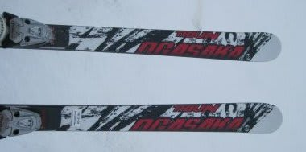
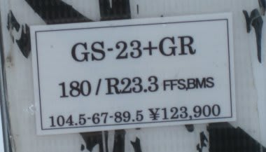
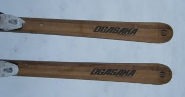
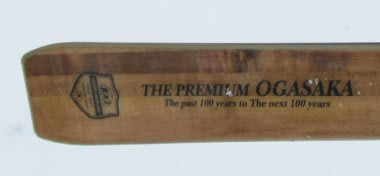

# もう少し続く！2012/2013シーズンモデルのスキー試乗レポート　OGASAKA編3

📅 投稿日時: 2012-05-22 00:17:10

はいはいはい．

飽きてる人もいるかもしれませんが．

もう少し続きますよ．

オガサカキャンプで試乗した，オガサカ試乗レポート．

今度もロングターン編かな…

GS-23とカタログ外のPremium Ogasakaの2種類です．

----

GS-23 + RC-600GR 180cm　

GS競技用．

[以前にも](e25e9e1700b0cabb30dd3d389dade1e55.md)まったく同じ長さ，プレートのモデルを試乗してますが．

うん．

やっぱりこの板，いいな．

TC-LVより，こっちのほうが好きだな．

こっちのほうがほっとする…

この板なら，簡単にサイドカーブに乗ってするする回り始めます．

そこから傾いてたわみを出して曲がっていけます．

180cmなら結構中回りくらいまで行けるかな．

ほんとに大回りをメインにいくなら，185cmくらいまで行っても

いい感じ．

FFSって言ってる，トップロッカーの性格なのか，

角付けすれば簡単にターン始動します．

…でも，TC-LVもFFSついてるなぁ…

コントロール性は，TC-LVよりGS-23の方がいい感じ．

低速でも，自由に板が動かせる感じで，TC-LVみたいに

低速だと何もできない…って感じはないです．

そこそこ荒れた斜面でも，結構軽快に乗り越えていきます．

うーん．

大回り用として履くなら，TC-LVよりGS-23のほうが

ゲレンデでつぶしが利きそう．

The PREMIUM OGASAKA

オールラウンド．

オガサカの100周年で作った板らしく．

オガサカのカタログにも載ってませんね…

プレート内蔵，専用ビンディング込みで17万円位するという，

お金持ち限定の板です．

…私のような人間はお呼びでない感じですが…

試乗板として出ていたので，

絶対買えないけど

試乗してみました．

繰り返しますが．

絶対自分の予算では買えない高級板です．

ウッドの表地ですが，数年前から販売している木目の板

「LONGCRUISE」とはまったく別物です．

印刷じゃなくホントの木目なので．

1本1本が違う木目で．

出荷時は，左右がなるべくそろう木目になるように

選ばれて出荷されるようです…

で．

自分とは無縁の世界のこの板．

基本的に，TC-MVに近いサイドカーブみたいです．

あー．

履いた感じも，TC-MVに近いですね．

もう少しフレックスがやわらかめかな．

柔らか目といっても，しっかり粘る感じのフレックス．

プレート内蔵らしく，しっとりとしたたわみが出ます．

比較的しっかりエッジグリップして滑っていけますが，

ずらそうと思えばずらしでコントロールを入れられます．

少しマイルドにしたTC-MVって感じですか．

その名のとおり，長距離滑っても疲れなさそうなマイルドさです．
