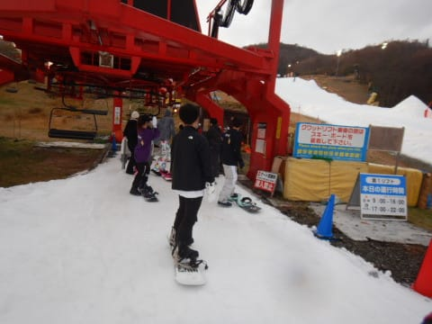

# 2021/11/6(土)のイエティ詳細レポート！…リフト待ち3～7分程度，コース幅5m程度でも厚み十分，ただ一瞬雨が…

📅 投稿日時: 2021-11-08 04:14:26

えー．

明日8日から，9日いっぱいまで．

志賀高原の標高2000mを超えるところ

でも，+5℃くらいまで気温が上がり…

そして．8日の昼間から．

降ります．

降り始めます．

液体が…(涙)

9日はまるまる一日，高温の雨が

時折激しく降り．

…残念ながら，やはり横手山の雪は

跡形もなく消えそうな気配…(泣）

ただ．

この雨が通り過ぎた後．

11日から13日朝くらいまでは

そこそこ冷えてくれて．

横手山は12日に数cmの天然雪も

積もるかな？

…ただ，10日までに雪が全部解けたあと，

11日，12日の2日間だけの人工降雪では

さすがに13日の週末オープンは微妙な

感じですね…

今回は，冷え冷え踊りを踊っても

どうしようもない感じです(涙）

ってな感じの，ちょっと残念なお知らせの

あとは．

昨日速報した，11月6日の土曜のイエティの

詳細レポートをば…

まず．

あさイチは，いつも通りオープン前の

ゲレンデ入り口でスタンバイして…

今日も9時のコースオープンと同時に，

ゲレンデへGo!

朝イチシマシマをいただくのだ！！！

うひょうーーーーーー！

シマシマッ！！

ちょっと柔らかいけど，誰も

滑ってないまっさらのシマシマバーン，

今日もいただきました～！！

あさイチはすっきり晴天だけど，

そこまで気温も高くなく，

雪は柔らかいものの滑りは良くて．

オープン後本格的に雨が降ってないので，

雪がそんなに融けることがなく，

コース幅も広がってきてますね～！

そして，コースも人が少なくて．

天国っ！！

11月上旬からこんなに飛ばせて，

天国っ！！

…だったのは，せいぜい2-3本目まで(涙）

だんだんコース上の人が増えていき…

そして，オープンから1時間も経って

ないのに．

リフト待ちがかなり伸びてきちゃい

ました…(涙)

ただ，並行するペアリフトが10時過ぎに

動き出すと，クワッドリフトの待ちも

3～5分程度にちょっと短くなってくれて．

先週土曜よりすいてるかな？

あ，ゲレンデまで歩かないといけない

ペアリフトは，今日も終日待ち0でした．

ただ，やはりクワッド＋ペアでゲレンデに

人が送り込まれるようになると．

多少幅が広がったとはいえ…

ちょっといろいろ厳しい人口密度に(涙)

このレベルになってくると…

あさイチの楽しさはどこかへ行ってしまい．

人を避ける訓練のようになってきて．

楽しめるというレベルではない

気がしてくるわけですが…

まぁ，いいんです．

この時期のイエティは，本格シーズンに

向けての基礎練習ができればいいん

です！←普段快楽に溺れるだけのあなたが，基礎練習なんてするの！？？

天気も，10時を過ぎてくると富士山が

隠れるように雲がかかり．

直射日光で雪が緩まなくなってくれて，

比較的板も滑るし，ゲレンデも荒れない

いい感じの曇り具合になってきて．

まぁ，人が多いながらも．

板は滑るし．

そんなにゲレンデが荒れず，穴が

開いたりしてないし．

人を安全に回避するための

判断とスキー操作の訓練と思えば，

もしかすると楽しいかな？

と．

白い粉中毒患者ならではの，

一般人とはズレた楽しさに目覚め

始めたころ…

何だか．

2時過ぎごろから時折ぽつ，ぽつと

空から何か液体のしずくが落ちて

来るときもあるなぁ…

と，思ったら．

3時過ぎに，ちょっとウエアがしっとり

濡れる程度のパラパラ雨が降ってきたん

ですが…！？(涙）

だもんで．

午前より午後の方が人が増えるイエティ．

雨が降る直前，2時ごろのリフト待ちは

最大このくらいまで伸びちゃってたところ…

パラパラと降ったのは，せいぜい10分強

くらいの時間だけど，この雨のおかげで，

ゲレンデの人が一気に減ったよ！！

そして，リフト待ちもかなり短くなって

くれましたが…

しかし．

雨が降ったのは16時のコース整備

30分前．

ガラガラで滑れたのはせいぜい2本

程度で，すぐコース整備タイムで

ゲレンデクローズになっちゃいました…

惜しい…

で．

あさイチの快感シマシマが忘れられない

自分としては．

当然，17時のナイターオープンの

シマシマも狙うわけで．

コース整備終了を待って…

17時ちょい前，ゲレンデオープンと同時に

スタート！

うははははは～！！！

シマシマだぁ！！！

今日2度目のシマシマ，いただき！

今回は1番ではないけれども．

でも，ほぼまっさらなシマシマバーン．

あさイチよりも気温が冷えて，

柔らかいながらも板が走る気持ちいい

最高バーンをいただきました～！！

…しかし．

このナイターでも．

気持ちよかったのは2本目まで…

3本目からはゲレンデの人も増えて

来て…

リフト待ちも，昼間より長くなり，

18時前に5分を超える待ち時間に(涙）

今日は珍しいことに，ナイターでも

ペアリフトが動き，クワッドとペアの

2本体制でしたが…

で，ペアは待ち時間0で乗れたものの…

クワッドリフトは5分以上の待ちが

あり．

そして，リフト2本でゲレンデに

人が送りこまれるので．

暗くて見にくい中，この人口密度は

かなり厳しい…(涙)

ってなことで．

コースも荒れ始めてきたし．

クワッドリフト待ちは5分超えてるし．

ゲレンデの人口密度も高くなってきたので．

今日は3時間睡眠で出てきた上，

翌日は朝6時に出かける用事があった

こともあり．

早めの18時過ぎに切り上げて退散

したのでした…

でも．

シマシマバーンも2回滑れたし．

8時間もたっぷり滑れたから，

満足かな！！

…しかし．

今シーズン，すでにイエティの滑走は4日目．

今週末に熊の湯や横手がオープンしてくれると

いいんだけど…

それは望み薄なので，またこの週末も

イエティになるのかな…

そろそろ違うゲレンデを滑りたい…
