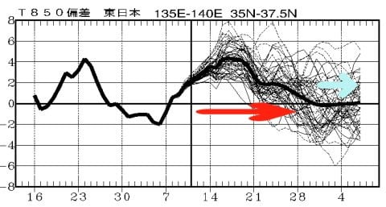

# 志賀高原は14日夜～15日朝にかけて，積雪がありそう！…そして，今もスキー場に雪が降ってるけど，これはそんなに積もらなさそうかな（涙）

📅 投稿日時: 2019-12-13 00:59:20

🏷️ カテゴリ: [日記](cc4b5682fb7b8b144980957a978653fb0.md)

ということで．

この週末のゲレンデコンディションが

良くなるかどうか，気になって仕方が

ないので．

ここしばらく，ひたすら天気予想ネタが

続いてますが…

とりあえず．

昨日の段階で，

　終日曇り～小雪がぱらつく天気なれど，

　積雪なし（涙）

と書いた，12日の予想でしたが．

…どうやらこれは外れたのか．

12日深夜0時過ぎの志賀高原，蓮池では．

「ぱらつく」というよりは多めの

雪が積もっているように見えます…！！

（[北信建設事務所道路気象状況ページ](http://hokushin-camera.org/)より）

…が．

硯川のライブカメラだと…

それほど積もってるように見えませんが…（涙）

（[北信建設事務所道路気象状況ページ](http://hokushin-camera.org/)より）

そして．

この雪は残念ながら，朝までには

止んでしまい．

やはり13日（金）は一日雪が降らなさそうな

感じです…（涙）

でも．

冷えるのだ．

13日は，冷えるのだ！

天然雪は無くても．

がんばれ，人工降雪機！！

…で．

14日から15日は，昨日の記事では積雪全く無しと

予想しましたが．

最新の15日の天気図を見ると…

うむ？？

ちょいと予想より低気圧が南に

ずれたからか．

日本海側に降水域がかかってます！

そして，850hpa気温は水色で示した

-6℃線が志賀高原にかかっているので．

これは冷えますね！！

ってなことなので．

14日夕方から15日の午前中にかけて，

いい感じで冷えて，積雪が

ありそうな予感…！

せめて10cmでも積もってくれれば，

かなりゲレンデ状況は良くなるの

ですが…

とりあえず．

昨日は晴れと予想していた，15日の日曜．

前日夕方から昼前くらいまで

降り続けそうなので．

15日のゲレンデコンディションに期待！

（15日(日)朝の志賀高原の登りは，積雪路に注意してくださいね）

そして．

最新の，来週16～18日の予想図を

見なおしてみましたが．

やはり，昨日の予想と変わらず．

気温はかなり上がりそうです…（涙）

でも，昨日の予想では，18日は志賀に

+9℃線がかかるという，エキサイティングな

予想でしたが．

0℃線がかなり志賀に近づいているので，

昨日の予想よりはマシになってきたかな…

18日の予想が冷える方向に行っているのは．

おそらく，昨日のBlogを見た信心深い

読者の皆さんが．

狂ったように寒いギャグを叫び続けながら，

冷え冷え降れ降れ積もれ積もれ踊りを踊ってくれた

成果に違いありません！←違う．断じて違う

これからも信者の皆さんが，

ひたすら狂ったように踊り続ければ．

もっと冷えて，大雪になる予想に

変わるのですっ！！←なんだか，だんだん危ない宗教みたいになってきてるよ…

で．

本日発表の1か月予想図を見てみたところ．

相変わらず，これから12月28日にかけて．

赤矢印で示すように，平年より気温が

高い日が続きそうですが…

水色矢印で示した，12月29日以降．

平年並みレベルまで冷えてくれそう！！！

…この時期に，平年並みまで冷えてくれれば，

ちゃんと雪になってくれるんじゃないかな～．

ってなことで．

12月はダメダメな感じのスタートで，

クリスマス寒波もなさそうでしたが．

年末寒波はやってきてくれそう…

（って言っても平年並みだけど）

とりあえず．

志賀高原の天気を決めている私が，

これから年末にかけて，ひたすら寒気の歌を

歌い続けるので．

激しい年末寒波が志賀高原に

絶対来るはず！！

信じる者は救われる！←やっぱり，だんだん宗教化してきてる気が…

## 💬 コメント一覧

### 💬 コメント by (大阪のS)
**タイトル**: Unknown
**投稿日**: 2019-12-13 01:14:40

ご無沙汰しております。相変わらず毎日

欠かさずブログ拝見してます！

さて、15日(日)は日帰りになるのですが、

思い切ってヤケビに行こうか、思案中です。

明日明後日のSさまの天気予想で決めます！

しかし、７時間運転して８時間滑って、

７時間運転して帰るなんて、アホですわ。

### 💬 コメント by (若杉勲72)
**タイトル**: Unknown
**投稿日**: 2019-12-13 19:01:45

今日のヤケビはシーズン最高でしたよ。新雪50mm

レインボーまでずっとうはうはでした。なんか、仕事してる人に申し訳ない気もします。

ただ寒さに慣れていないので、寒さ対策が必要です。

明日は皆様、お気をつけてご来ヤケ下さいませ。

今朝は３号トンネルでバスがエンコしてましたよ。

### 💬 コメント by (Skier_S)
**タイトル**: ゴンドラが動くのはいつなのだろう…
**投稿日**: 2019-12-14 00:11:38

＞大阪のSさま

お久しぶりです～！

Blog愛読ありがとうございます．

15日日帰りですか！！！

大阪から志賀に日帰り！！

それはすごい…

15日は午前中は雪降りになりそうです…

ドサドサ積もらないまでも，そこそこの

新雪が載ってくれればゲレンデ状況は

結構いいかも？？

＞若杉さま

50cmかと思いましたが，50mmですか…

もう一降りほしいところ．

でも，コンディションは結構良かったのですね！

明日，焼額でお会いしましょう！

