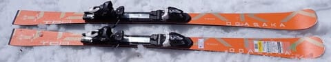
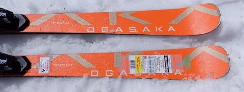
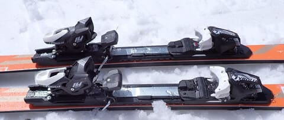
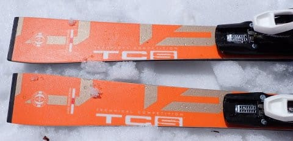
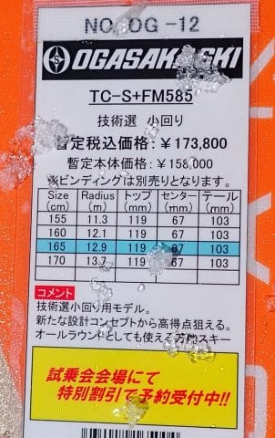
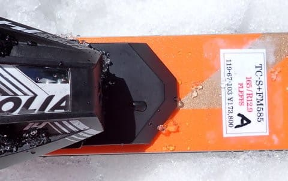

# 2025シーズンモデルのスキー板，試乗レポートその19…OGASAKA TC-S+FM585

📅 投稿日時: 2024-06-26 03:12:17

ヤバい…

明日も朝早いのに，もうこんな時間（涙）

でも，明日の宿題がまだ終わってない…（激泣）

スキーシーズンが終わったら，週末に

仕事がやっつけられるから，平日は

ちょっと楽になるかと思いきや．

先々週もスキーシーズンが終わったら

行こう…と思っていたとある場所に，

片道450km車で走って土日で出かけて

しまったし．

先週も山に行って，その後洗車やら

スキーウェア3セットの洗濯したり

（ウェアはクリーニングに出さず手洗い派），

月山から帰ってきて放置していた

スキー板のワクシングやら，

その他スキーシーズンに行けなかった

買い物やら何やらをしていると，

あっという間に土日2日間終わってしまい．

…今週末こそのんびりして，あとは

ちょっと仕事をやっつけようと思いつつ．

たぶん今週末も天気が良ければ山に

走りに行ってしまいそうだし．

車の12か月点検もあるし，

娘の勉強も見ないといけないし．

睡眠不足を解消するだけ寝ないといけ

ないし…

うん．

おそらく今週末も．

仕事は1ミリもできそうにないな（涙）

とりあえず，今は早く寝たい．

今日は外が明るくなる前に寝るぞ～！！

…ってなことで，本題へ．

今日も2025シーズンモデルのスキー板

試乗レポート．

今回も昨日と同じオガサカ編です！

〇OGASAKA TC-S+FM585 165cm

基礎小回り

[前回レポートはSRプレート付き](e8322283db152ed668b7f619df19742ee.md)でしたが，

こちらは優しめのFMプレート付きです．

これは…SRプレートと全然違う！

たわむ！曲がる！

SRプレート付きと比べると，たわみすぎ

では？と思うくらい，たわみが出やすい

板ですね…

SRプレート付きは重厚さを感じるほど

でしたが，FMプレート付きは軽快さと

反発の早さがあり，レスポンスの良さを

感じられる，きわめて乗りやすい板．

良くたわむので，旋回性が高いです．

たわんだ中でトップとテールエッジがしっかり

効いて，たわんだエッジに乗ってキレた

小回りができます．

たわみを大きく出して，しっかり山回りまで

回しこんでいけて，そこから板の返りを使って

早い段階から雪面を捉える谷回りに入っていく

ことができ，めちゃくちゃ傾きを

大きくとった深回りターンが決められます．

急斜面でも，谷回りの早い段階で雪面を

捉え，板のトップシートを谷側に見せる

ような，鋭いカービングターンで滑って

いけます．

スピードを乗せても板が負けることはなく，

気持ちよくエッジの線に乗って板が回って

行く，結構快感度が高い板．

踏む量のコントロールでターン弧を

調整できる自由度も高いし，

ずらしのコントロールも良いので，

板を動かして弧を仕上げていくことも

できます．

縦目に落とすターンからじっくり深いターン

まで，自由な中回り～小回りの弧が作れて，

かなりのハイスピードでも怖くないですね～．

ただ，板のたわみが出やすいので，

スピードが出ていくと小回りチックに

なっていきますが…

とりあえず，私レベルだと，SRプレートより

FMプレートが好きかな．
