# 10月31日　Yeti

📅 投稿日時: 2010-11-01 00:24:38

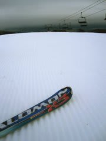

気温：10度前後

天気：小雨(涙)

雪質：アイスクラッシュなので…

積雪：石ころを踏んづける心配はほとんど無し，ってくらい

リフト：待ちほぼなし．

路面：ウェット

ということで．

この週末．今シーズン2回目のスキーです．

土曜日に行く予定でしたが，台風で営業中止だったので．

日曜に行ってきました．

日曜朝…

駐車場はがら空き．

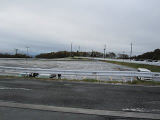

天気もよくないし，台風の後で雪も溶けちゃっただろうし…

と思ってるんでしょうかねー．

リフト営業開始の8時に，ゲレンデにいたのは10人未満．

ガラガラだよ…

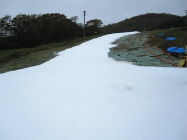

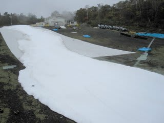

コースに誰もいない…

しかし．

ふもとの御殿場ではうす曇程度の天気でしたが．

ゲレンデは小雨（涙）．

途中，結構強く降ります．

でも，天気が悪いにもかかわらず．

昨日，土砂降り強風だったにもかかわらず．

雪の状態はいいです．

昨日一日，シートをかぶせて保護してあったからでしょうね～．

思ったより雪は溶けておらず，コース幅もオープンの日から

狭くなっていることも無く．

雪の厚さも，すごく薄くなっているかと心配したけど

それほど変化が無く，土が出ているところはありませんでした．

あ…

でも．

リフト乗り場・降り場は雪が無くなってました．

スキーを脱いで乗り降りしなくてはなりません．

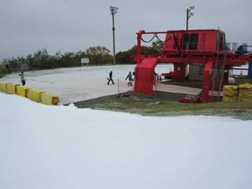

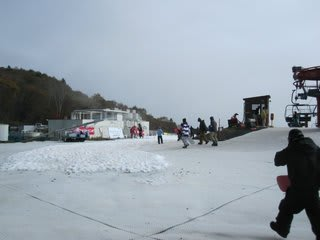

ちょっとめんどくさいですが，リフト直前まで

滑り込めるし，6月の月山に比べたら天国…

しかし，ホントにガラガラだな～

朝9時過ぎまで，リフト待ち0．

コースも結構空いているので，ほとんど

人の心配なく快適に飛ばせました．

うーん．10月でこれだけ滑れたらいいんじゃないかな？

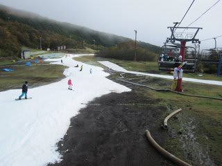

この週末から軽井沢もオープンだけど，軽井沢はすごい

混んでるだろうなぁ…

Yetiにして良かった～．

10時前くらいから，時々リフト待ちが出たものの，せいぜい4-5組

待てばリフトに乗れるレベル．

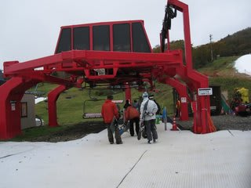

リフト待ちは最高がこのくらいでした．

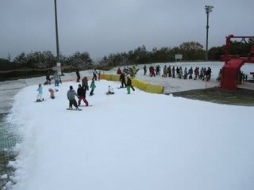

これだけ待ったのは，ほとんど無かったですね～

ただ，ゲレンデの人が増えてきたので好き勝手なラインは取れれない

ようになってきましたが…

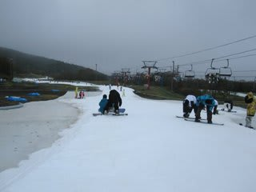

11時ごろからは雨も弱まりだし，ほぼ上がりました．降っても霧雨程度．

…でも，天気は回復してきたけど，ゲレンデがちょいと凸凹になってきたカナ…

人も増えてきたし，ゲレンデも凸凹になってきたし，

なんだかんだ言ってリフト33本滑ったので，2時ごろに

切り上げました．

なんにしろ，朝のうち，人が少ないゲレンデを飛ばせたので満足．

帰りも渋滞が無く快適…

さすがに台風の週末，出かけた人は少ないんだろうな．

いつも混雑する高速も渋滞無しでした．

というわけで．

来週もYetiでもいいか？

うーん．軽井沢とどっちがいいかなぁ．

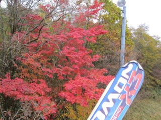
