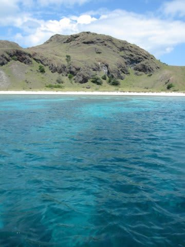

# コドモとコモド！子連れダイブクルーズ 8　意外な盲点!?

📅 投稿日時: 2011-07-11 01:34:50

で．

娘を海にドボンしたのはいいんだが．

うーーむ．

ちょっと岸から遠すぎる…

ホントは完全にボートを岸に寄せてくれると

うれしいんだけど．

底が砂地じゃなく，珊瑚の海岸なので，どのあたりまで

ボートが寄せられるかの見切りが難しくあまり岸に

寄せられない様子．

ビーチまで50mはあろうかというところだったので，

上陸はあきらめて適当に泳ぎます．

いやー．

しかし，きれいな海ですな～．

娘はきれいな海に最初は大喜び．

岸からも離れ，ボートも離れて行き．

底は5mほどの足がつかない海を．

浮き輪も無く，ヘルパーだけできゃっきゃと

歓声を上げながら泳ぎます．

うーーん．

ワイルドに育ったものだの～．

わが娘．

しかし．

10分ほど泳いでいると．

さすがに座って休んだり出来ないので疲れたらしく

「座る～」

と言い出しました．

ちょっと．

海底までは5m以上，

ここは座れないよ．

手を振ってボートを呼んで，

ボートに拾ってもらいました．

ちょっと疲れたのか，その後は泳ぎたがらなかったわが娘．

うーーん．

プールなら2時間でも3時間でも遊んでるけど，

それはやっぱりこまめにプールサイドに上がって

休めるからなんだな．

さすがに足がつかない海では，1時間も遊んでられないか…

その後，ボートの上で

「ママまだもぐってるのかなぁ．ママ帰ってこないかなぁ…」

と．

娘と二人，ボーっと景色を眺めつつ，

ダイバーのバブルを追っかけるボートの上で過ごしました．

しばらく後．

海にぽっこりフロートが浮き上がってきました．

んで，みんながエグジット．ボートに上がってきます

「ママ帰ってきた～（喜）」

しまじに戻り，シャワーを浴びて．娘を着替えさせて．

娘はリビングでお遊びタイム．

ここで．

なんと！ベビーシッターさん登場．

マネージャーのK澤さん，今回わざわざ我々一家のために

ベビーシッターさんを雇って，船に乗ってもらったそうな…

そ，そこまで気を使ってくれていたとはっ！！！

で，このベビーシッターさん．

お仕事熱心な方で，しばらく娘と遊んでくれましたが，

一生懸命やってくれているのですが，

娘が話しかける日本語が分からず，困っている様子．

娘も，相手が言葉が通じないと分からないので，

いろいろ話しかけているのですが…言ったことを

やってくれなかったり，返事が無かったりで

戸惑っている様子．

娘「この人なに言ってるかわからないの…」

よ，予想外！！！

喋れるようになったら，日本語を離せるベビーシッター

じゃないとダメなんだ…！！

がががーーん．

せっかくベビーシッターさんに乗船してもらったのに，

ベビーシッターさんに子供を預けて我々夫婦が潜りに行く，

というのはとても不可能だ…ということに．

すでに．

気づかされてしまいました…

ちょいとショック．

結局，妻と私が交互に潜るしかないのかっ…

そうこうしているうちに，あっという間に2本目の時間．

仕方ないので娘を妻に託します．

今度は妻が子守で私がダイビング．

で，娘に見送られて，ボートに乗り込み，ポイントへ向かいます．

ポイントは「TATAWA BESAR」

小さな島の周りを，スロープに沿って移動する感じのポイント．

さて．

私にとって，このクルーズ一本目のダイビング．

果たしてコモドの海は，私を歓迎してくれるのか？？

いざ，コモドの海へエントリー！
