# 今週末の志賀高原スキー場は，土日とも雨になりそう(涙)．そして16日(月)は冷えて雪，17日(火)は雪の後の晴れでいいコンディションかも？？

📅 投稿日時: 2023-04-14 02:09:31

🏷️ カテゴリ: [日記](cc4b5682fb7b8b144980957a978653fb0.md)

えー．

ダメですね．

今週末は，ダメです…(涙)

最新の16日の日曜の予想天気図を見てみると．

…ダメだ．

ダメな感じだ…(泣)

水色の降水域がかかっているので，

終日何かが降ります…

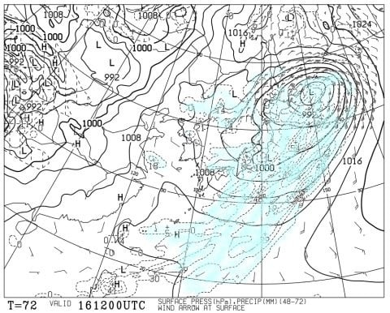

そして，850hpa図を見ると．

赤い0℃線はかなり北にあり，志賀高原は

水色の+3℃線より南にあるので…

これは，降れば雨

ですね（激涙）

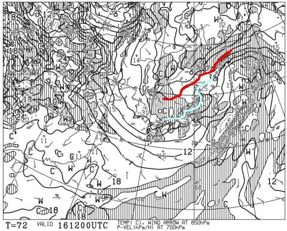

ということで．

狙ったように土日の2日間かけて

低気圧が日本の上空を通過する

という，嫌がらせをしているとしか思えない

低気圧の気まぐれにより．

今週末は土日ともずっと雨

です．

繰り返します．

今週末は土曜の朝から日曜の午後まで雨

です．

…ただ，雨が強く降るのは土曜の午後遅くから夜にかけて．

土曜の午前や日曜はそこまでザーザーぶりにならない

かな…

しかし…見事に土日の2日間かけて日本上空を

通過するとは，今回の低気圧には

殺意すら覚えますね…！！←低気圧は殺せないから

あ，ちなみに．

日曜に低気圧が通過した後は冷えます！！

17日の月曜は終日雪がぱらつきます！！

もしかすると，1日で10cm以上積もるかな…

そして，18日も午前中は冷えて…

さらに晴れます！！

18日の火曜は，前日に雪が降ったうえに，

晴れるのに気温が低めの良い一日かも！！

で．

そのまま冷え込みが続いてくれればいいけど．

毎週木曜発表の，一か月予報を見ると…

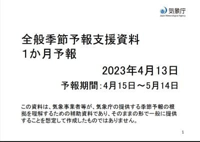

うぎゃーーー！！

また，1週目の4/15~21日が高温になる確率80％！！！！

…ダメだ…

やっぱりダメだ…（涙）

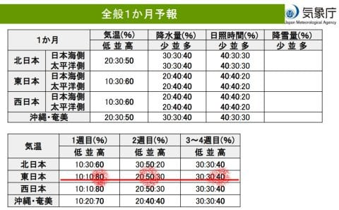

ただ，下の図の赤矢印の1週目が終わると，

2週目以降は高温にはならず，

平年並みの気温になりそうですが…

そのころ，志賀高原は滑れるのか…！？？

雪が無くなってから冷えても遅いんだけど…

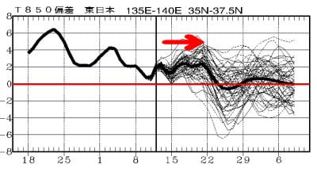

ダメだ…

今シーズンはダメな感じ…

ってな感じの悲しいニュースのあとは，

いつもと順番が変わってますが，

ここから本日の特派員情報です！

今日の志賀高原は，朝から気温はプラスだった

みたいですが…

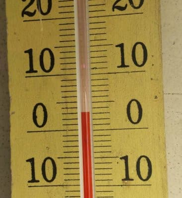

昨晩から早朝にかけてはかなり冷え込んだので，

バーンはかなり硬めのシマシマだったようです！

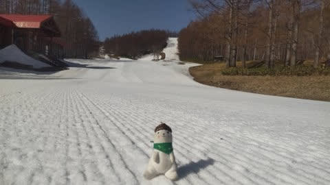

朝圧雪の奥志賀は，硬いながらもそこまで

ガチガチではなかったみたいですが，

夕方圧雪の焼額は，朝はかなり硬かった

みたいです…

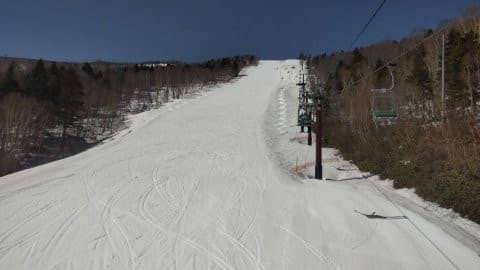

奥志賀の第2高速沿いのエキスパートコースも，

ちょっと下の部分は土が出始めましたね…（涙）

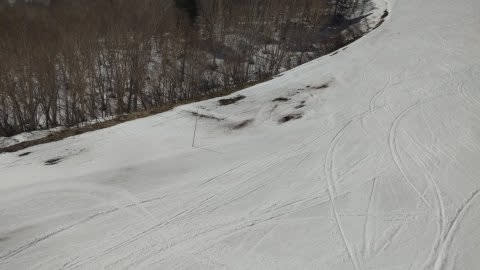

ゴンドラ側のダウンヒルコース側．

かなり雪が減って，土のエリアが広がって

ますね…（泣）

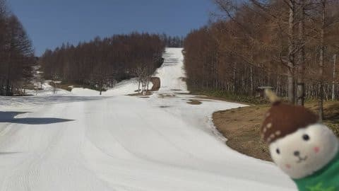

ただ，一の瀬正面バーンはまだ白いし．

あと1週間はもってくれるのかな…

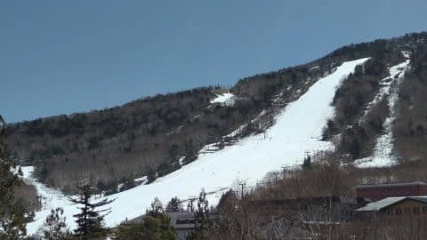

とりあえず．

今週は土曜夕方から日曜にかけて，

かなりの雨になるので．

この雪が無事もってくれるのか…

何か奇跡が起きて，今週末雨じゃなく

雪にならないかな～…

でも，この天気図だと．

もう，気温が冷える可能性はゼロだな…

うん．

そうだ．

気温が冷えないなら．

水が凍る温度が明日から+10℃に変わって，

+10℃なら雪が降ってくれるような奇跡が

起きればいいんだ！

明日から，+10℃で水が凍るようにならないか，

みんなで念じてみよう…！！←シーズンが予想以上に早く終わりそう

というパニックで狂ってきてる…

## 💬 コメント一覧

### 💬 コメント by (ぽんちゃん)
**タイトル**: Unknown
**投稿日**: 2023-04-14 11:48:58

物理の法則は、神様でもなかなか変えられないですね😢

### 💬 コメント by (Skier_S)
**タイトル**: ＞ぽんちゃんさま
**投稿日**: 2023-04-15 12:33:04

祈れば物理法則も変えられる…訳はないのですが（笑）．

ただ，世の中の真実だと長く思われていたニュートン力学も相対性理論が出て来て

速度が遅い領域の近似解でしかないことが分かったり，

量子論が出て来て巨視的な領域の近似解でしかないことが分かったりと，

この世の常識は後で塗り替えられるので…

もしかしたら，氷が0℃で凍る常識も塗り替えられるかも？？←それは無い

