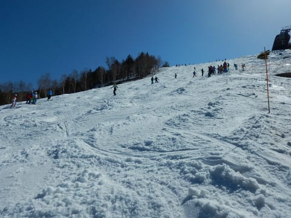
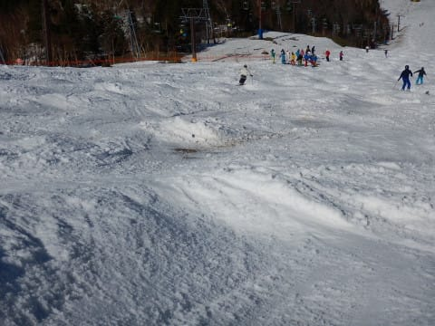

# 4月28日（土）GW前半3連休初日レポート続編…奥志賀スキー場の状況と焼額の夕方

📅 投稿日時: 2018-04-28 21:04:48

ということで．

[本日の前半のレポート](e7dd01f3ba6db46146ec3e7fa2cf64f69.md)の続きです…

ってな感じで．

午後になったら，奥志賀の方へ足を延ばしてみた

わけですが．

…ふむ．

焼額～奥志賀をつなぐ山頂通路．

まだちゃんと雪が残ってますね…

そして，奥志賀の山頂へやってきてみると．

奥志賀第4は，まだたっぷり雪がありますね…

そして，コブ道場も健在．

で．

この奥志賀スキー場．

ゴンドラ側のダウンヒルコースは

もうクローズになっているので．

ゴンドラは山麓との連絡用に動いているだけ．

ダウンヒルコースの雪は，滑走コースの

雪出し用にピステンでせっせと運ばれて

ました…

ゴンドラが滑れないので．

滑れるのは第3～エキスパートのリフト側のコースになりますが．

奥志賀第3コース，まだ幅いっぱい滑れます！

そして，エキスパートコースは…

やはり，午後はコブになってますね…

一見まともそうに見えるこぶ斜面ですが．

ちょっと惜しいことに．

コブ溝に，結構そこかしこでブッシュさんが

コンニチハしています…（涙）

コブラインを滑っていると，いきなりこんな感じで

底が抜けているので，注意しないと

ガリっと行っちゃいます（涙）

でも．

ところどころコブの底が抜けているとはいえ．

まだコース幅いっぱい雪がついてるし．

一番下の緩斜面も，

まだ結構幅があるし．

…まぁ，リフト乗り場近辺は，ちょっと細く

なってきてますが…

でも，頑張ればGW後半まで，

なんとか行けそうな感じ．

春雪のコブは，柔らかくて滑りやすいので．

コブが嫌じゃなければ，結構楽しめますね～！

ってことで．

奥志賀は午後4時半まで営業しているのですが．

焼額は午後4時までですので．

4時前に，奥志賀第4リフトに乗って…

営業終了直前の焼額へ戻ります．

で．

本日が今シーズンラストのGSコース．

まさに今シーズンの最後の状況は…

状況は…

状況は…！

コース幅も，もう板を横にするとぎりぎり．

良くここまでもたせたなぁ…

というのが正直な感想．

もう，絶対今週まで持たないと思ったので．

今日滑れただけ，ラッキーだったかな！

ということで．

12月から滑り続けたGSコース．

本日をもって終了ということで．

今シーズンのお別れを告げてきました…

そして．

明日からまだ2日間滑れるパノラマコース．

本日最後はどんな状態だったかですが．

さすが，大体の場所はあと2日間は

もちそうな感じ．

雪付けをしていたこの部分も…

ブルで雪山を作ってあったので．

明日の朝は，圧雪車でこれをつぶして，

朝はきれいなコースになってるんじゃないかな～．

ここ以外は，ところどころ狭くなるところも

あるものの．

まぁ，雪の厚み的に，あと2日は滑れそうな感じ．

ってな感じで．

コブ溝に穴が開いたものの，奥志賀は

まだ滑れそうだし．

…焼額も，営業予定のあと2日はもちそうな感じかな！

…

でも．

焼額，よくここまで雪をもたせたなぁ…

これなんか見てもわかるように，見事な

雪寄せをしてます．

うーむ．

GW最後までもたなかったのは残念だけど．

3連休までもたせたこの努力は素晴らしい…

ってな感じで．

本日もいつも通り．

雪の状況が悪いにも関わらず．

早朝からゴンドラ終了まで，

しっかり滑り倒した，Skier_Sだったのでした…

うーむ．

明日は今日よりあったかくなりそうなので．

さらに雪解けが進むのかなぁ…（涙）

PS.

業務連絡ぅ～．

明日のSkier_Sは，早朝から奥志賀スタートの予定ですぅ～

＃通常営業開始から午前中いっぱいくらいはヤケビにいると

思いますが

## 💬 コメント一覧

### 💬 コメント by (もりや)
**タイトル**: ヤケビ通常入りします
**投稿日**: 2018-04-28 22:39:33

いやーこんなに雪が減ってたんですね。驚きました。それも明日は早朝営業無しとは(涙)情報助かりました。ありがとうございます。明日は通常営業入りでヤケビ入りします。

### 💬 コメント by (Goku)
**タイトル**: Unknown
**投稿日**: 2018-04-28 23:08:01

先週の雨さえなければ、ＧＳはともかくパノラマ～サウスは後半まで持ったかもしれませんね。

それにしても、ヤケビスタッフの努力がすばらしい‼

明日もよろしくお願いします🎵

### 💬 コメント by (筋 肥大)
**タイトル**: Unknown
**投稿日**: 2018-04-29 12:27:06

Skier_S様

残念ですがゴールデンウイーク中は仕事で、滑れません(涙)

焼額のスタッフ、素晴らしいですね。流石、西武王国時代の気質が受け継がれてるんですね。

昔話を一つ。３０年前ぐらいの話になりますが当時はまだ西武、堤王国でした。

万座スキー場で朝イチの事です。ヘリコプターで堤氏がゲレンデにたち降りました。出迎えたパトロール隊長にむかって、いきなり張り手を

みまったのです。その原因はゲレンデ整備で

雪上車の継ぎ目が畝のように何本もできていたからです。当時はまだまだ雪上車の性能も良くない時代でしたのでコース整備は苦労したようです。今シーズン焼額に初めて行き、ゲレンデ整備の良さを知り、昔の話を思い出しました。

### 💬 コメント by (小林です)
**タイトル**: 奥志賀でお待ちしております
**投稿日**: 2018-04-29 20:28:06

今日は奥志賀で極楽さんとお会いしたのでお願いしておきました。

冷え冷え踊りをYouTubeにのせてくださいと。

踊りはもちろん

Sさんで

### 💬 コメント by (Skier_S)
**タイトル**: 今年の4月は暑すぎる…
**投稿日**: 2018-04-29 22:26:07

＞もりやさま

今日はお世話になりました～！

雪の減り方，かなり衝撃的だったのでは

ないでしょうか．

5月5日まで，奥志賀がもつか微妙な感じに

なってきました…

もし，5日まで滑れるようならまた

お会いしましょう！

＞Gokuさま

今日はお世話になりました！

すっかりごちそうになってしまいました…

わが人生で始めての経験でした(笑)．

しかし，先週の雨が惜しい…

そして．

また今週も水曜に雨（涙）

これが致命傷になりそうな予感…

＞筋 肥大さま

あら．お仕事ですか…

残念です．

しかし，焼額のスタッフはすごいです．

今日も人海戦術で暑い中雪出ししてました…

圧雪のクオリティといい，さすがと思います．

今シーズンはお会いできませんでしたが，

また来シーズンにお会いしましょう！

圧雪車についていろいろ教えてください～！！

＞小林さま

冷え冷え踊り，私が踊るんですか！！

残念ながら，顔出しNGなので期待に沿えないかと(汗）．

…うちの娘に踊ってもらいましょうか…

バレエで異常な柔軟性をもっているので，

他の人が踊れない踊りになってしまいそうですが(笑)

