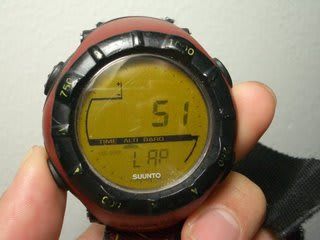

# 今日はどれだけ滑ったかな？？が気になる人へ

📅 投稿日時: 2011-01-20 00:16:00

「今日は何本滑ったかなぁ…．リフト30回くらい乗ったかな」

「昨日より今日の方がたくさん滑った気がするなぁ．

　どのくらい滑ったかな？」

…って，気になるとき，ありますよね．

…ありますよね．

…気になりますよね…

…

…

気になる人がいる，ということで，話を進めましょう．

私が愛用している，Suuntoの腕時計，[Altimax](http://www.suunto-japan.jp/products/contents/sportscomputer/snowsports/all/SS004787100).

こいつは高度計を内蔵しているんですが…

ただの高度計じゃなく，ログ機能を持っているんです．

ログ記録を開始すると，その時点から

・どれだけの標高差を滑ったか

・何回リフトに乗ったか

を記録してくれるんです…

最大12時間記録して，これを過去10回分覚えていてくれます．

厳密には，何回リフトに乗ったかではなくて，

「50m以上上ったあとに，50m以上の標高差を下った回数」

が記録されますが，まぁ，だいたいリフトに乗った回数って

ことです．

この時計があれば，今日は昨日より滑ったのか？

一日券の元を取るだけの回数リフトに乗ったのか？

とかが一目瞭然．

ボタンひとつで，「今リフト何本目だっけ？」ってのが

読み出せるので，結構面白いですよ．

…面白いですよ…

（もしかすると，面白いと思ってるのは私だけ？？？）
