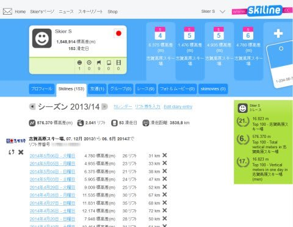
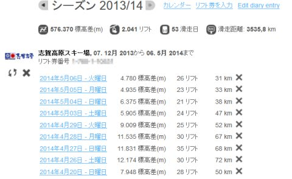
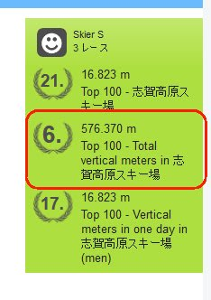
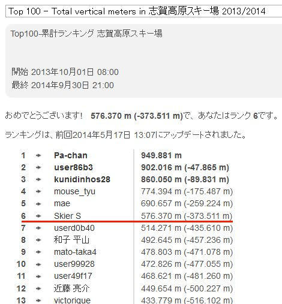
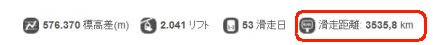

# 志賀高原のシーズン券も終わったので…2014シーズンのSkilineの結果を振り返ってみる

📅 投稿日時: 2014-05-24 02:30:33

🏷️ カテゴリ: [スキー雑談](c1f9d2cb7478308da16419928ea3945e9.md)

えー．

スキーシーズンはまだまだ続いてますが

＃普通の人は，もうシーズン終わっていると思う…

志賀高原の2014シーズンのシーズン券も終了したので．

今シーズンの，Skilineの結果を振り返ってみましょうか…

私のSkilineのトップページを見てみると…

こーゆー感じで．

拡大すると…

ふむ．

今シーズン，志賀で53日滑ったわけですね…

…志賀だけで，53日…

1年365日の1/7を志賀で過ごしているのかっ！！

まぁ，去年と同じ日数なのですが．

良く滑りましたね～．

で．滑走標高差は，と言いますと．

57.6万m．

…うーむ．

この数字だけ見てもよくわからないけど．

大体，富士山頂からふもとまで，150回くらい

繰り返して下りた計算になりますね～．

この滑走標高差は，こんな感じで．

今シーズンの滑走標高差ランキング，6位ですか…

…まだ，上に5人いるのか…っ！！？

ちなみに，ランキング一覧を見てみると．

う～む．

8位以下は，結構僅差だな～．

でも．

私より上位は．

みんな，なんだか突き抜けてるんですけどっ！！！

私と一つ上位の人との差が10万m超えてますっ！（笑）

…これは．

順位を一つだけ上げるために，あと10日間くらい

全力で滑りつづけないと抜けないレベルですね…

頑張ればどうなるとかいう差じゃないです．

トップの人なんて，私の倍近く滑ってるんですが…．

…いったい，どういう人たちなんでしょう←お前が言うな！

そして．

シーズンの滑走距離，3535km．

…これは…

東京からだと，グアムや香港より遠い…．

大体，パラオくらいまで行った換算になりますか．

…これは．

板のマイルド化が進んでも仕方がないのかも…

って感じで．

とりあえず．

シーズン券のモトはとった

と，思わせるシーズンだったのでした．

## 💬 コメント一覧

### 💬 コメント by (komu)
**タイトル**: かぐらセミファイナル
**投稿日**: 2014-05-24 18:45:59

いや～天気良くて最高でしたよ^_^

思いのほか雪があり滑りやすかったですね。

午後は全面コブバーンになりましたが。

明日のファイナル楽しんで来て下さい。

### 💬 コメント by (Skier_S)
**タイトル**: komuさま
**投稿日**: 2014-05-24 18:54:17

いいなあ…

今日行きたかった…

込んでませんでしたか？

ジャイアントまだいけますか？

私は明日楽しんできます～

### 💬 コメント by (komu)
**タイトル**: 先週より空いてましたね
**投稿日**: 2014-05-24 19:02:53

ジャイアントは所々見たくないモノがありましたのであまり滑りませんでしたよ。

猿ヶ京で温泉入って帰路です。

### 💬 コメント by (ひろちゃん)
**タイトル**: 神楽満喫
**投稿日**: 2014-05-25 00:53:00

スキーヤーエス様後何時間後、ファイナルへ出発かしら？先週の、s様の、コブのツボで、学習したです。私なりに、成長あり、満足。ゆき、ギリギリ大丈夫ですよ、思い出のひになりますように(o^^o)

### 💬 コメント by (Skier_S)
**タイトル**: かぐら混んでる
**投稿日**: 2014-05-25 08:52:47

>komuさま

今日のかぐらは薄曇り。

混んでます…

 雪、へりましたね～

>ひろちゃんさま

たのしめましたか～

こぶ上達しましたか～

かぐらファイナル、楽しんで

きます！

