# 1月11，12，13日の週末，3連休の志賀高原スキー場の天気は…11日は雪～曇り，12日は曇り夜から雪，13日は雪→曇り

📅 投稿日時: 2025-01-09 01:12:21

🏷️ カテゴリ: [スキー天気予想](c6554f5c3c106093b511a8daae23757e8.md)

えー．

最近は志賀高原の特派員からの写真が

送られ来ず，特派員情報がないのですが…

今日8日（水）の志賀高原は朝までに

30cmの新雪が積もったようで，

まぁ予想通り，非圧雪で脛パフ

くらいの新雪だったみたいですね…！

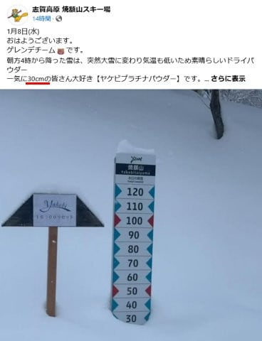

（[焼額山スキー場Facebook](https://www.facebook.com/yakebitaiyama/posts/pfbid02t8sZkkUruQp624oHrXUM8DZyQLvrkv4tzDBDDm4TCJ63F6EuXX3KUMZM4fbrFaYHl)より）

ただ．

大雪と言われていながらも，焼額の

積雪はわずか30cm．

西風の志賀高原はそれほど積もらず．

明日の9日もそこまで積雪がなさそう

な感じ…（涙）

まぁ，もう十分な積雪があるので

そこまで積もらなくてもいいんですが．

どうせなら週末にパウダーになるように

降ってくれると嬉しいかな…

ということで．

正月休みが終わったばかりというのに，

今週末は3連休！

この3連休の志賀高原の天気を，

いつも通り天気図で予想してみましょう…

まず，9日（木）の850hPa図を見ると．

志賀高原には-9℃線がかかる程度なので，

かなりの冷えですね…！

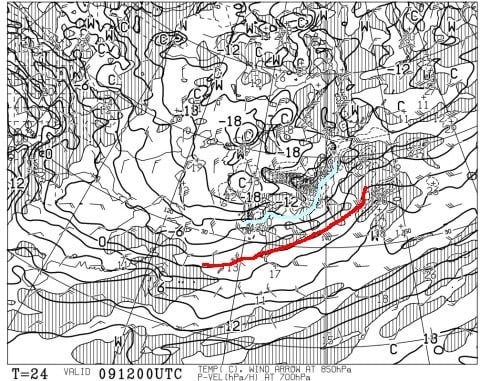

で．この日の地上天気図を見ると．

うーん．JPCZが出て，日本海に水色の

降水域がかかってますが…

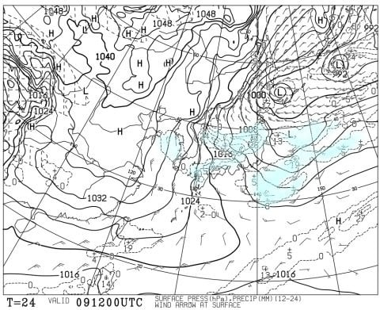

このJPCZ部分を拡大すると，

見事に東向きにたなびいていて…

完全な西風ですね（涙）

赤い線で示す北アルプスに雪雲が

ブロックされているのがよくわかる

降水域になってます…(泣)

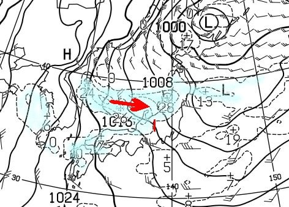

続いて10日(金)の850hPa図を見ると．

この日は赤い0℃線が沖縄より南に

下がり，かなり冷えそう…！！

志賀高原にも-9℃線が引き続き

近づいていて，昼間も激冷え！

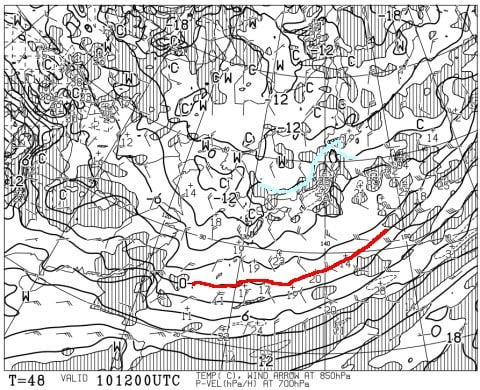

そしてこの日の地上天気図は…

見事な縦じまの天気図で，これなら

北風！！

日本海側に降水域がかかっているし，

JPCZの向きも，赤矢印で示す南向きに

なり，見事な北風なのが分かりますが…

ただ，日本海側の降水域が狭くて．

そこまですごい雪じゃなさそう．

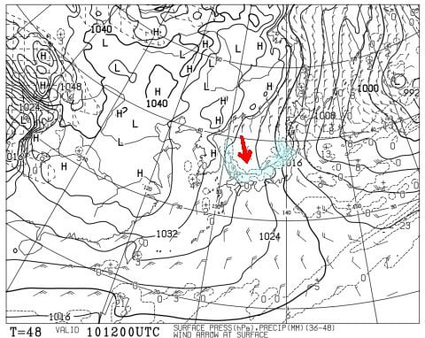

そして肝心な週末，11日(土)の850hPa図は…

この日は志賀高原に近づくのは-6℃線．

10日までよりは冷え込みが弱まるけど，

十分な冷え込みです…！

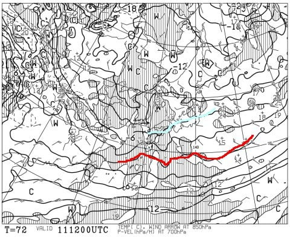

この日の地上天気図も，JPCZが

南にたなびいているので…

志賀は雪が降りそうですね．

ただ，午後9時の段階のこの図では，

日本は縦じまの等圧線じゃなくなって

いるので，午後には雪は止みそうかな．

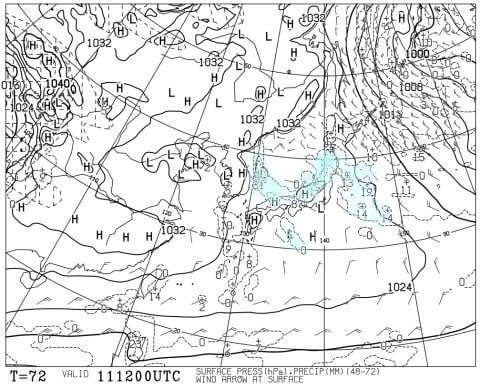

続いて，12日日曜の850hPa図ですが．

この日は志賀にかかっているのは-3℃線．

赤い0℃線もかなり北上していて，

ちょっと気温が上がりそう…

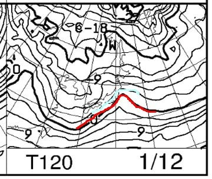

この日の地上天気図は，二つ目玉の

低気圧ですね…

低気圧がそこまで発達してないので

荒れないと思いますが，低気圧が

通過する夜は，南の低気圧がもたらす

南岸低気圧っぽい天気で，気温が

上がることもあり，ちょっと湿った雪に

なるかも．

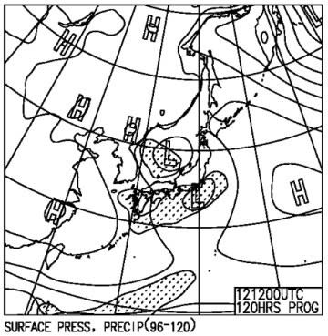

最後に，3連休最終日の13日の850hPa図は，

今度は冷えが戻ってきて，-6℃線が

志賀に近づいてます！

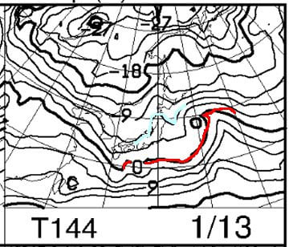

そして，この日の地上天気図は…

ちょっと冬型に近づいているので，

雪がぱらつく天気になりそう…

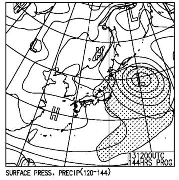

ってなことで．

まとめると．

9日(木)：朝までの積雪は10～20cm

　程度かな？

　新潟・東北は降りそうだけど，志賀は

　大雪と言われている割に降らない．

　朝の気温は-10℃前後．

　昼間もそんなに気温が上がらず，

　雪が降ったりやんだり．

　昼間の積雪は5cm程度か…

10日(金)：朝までに30cmほど積もりそう．

　朝は非圧雪コースは脛パフ！！

　朝の気温は-12℃程度と激寒．

　圧雪コースもコース上に新雪が乗り，

　全面パフパフ．

　終日雪が降り，根性の無いスキーヤー

　ふるい落としデーになるか…

　午後はコースがモサモサになって

　荒れていく

11日(土)：朝までの積雪は10～20cmほど？

　朝の気温は-10℃前後．

　朝は圧雪の上にうっすら冷えた新雪！

　非圧雪バーンはブーツパフ．

　午前中は雪が降ってそうだけど，

　午後に止んでいくか…

　雪質はいいけど雪が柔らかく

　昼頃からバーンは荒れ始め，

　午後は急斜面は凸凹になっていく．

12日(日)：朝までの積雪はほぼ無し．

　積もって数cm．朝の気温は-7℃程度？

　朝から曇り空だけど，朝イチは

　柔らかめのシマシマバーン！

　トップシーズンらしいいい感じ．

　ただ，午後に向かい気温が上がり，

　曇り時々薄日も射す昼間だけど，

　午後からしっとり重めの雪が

　ぱらつき始める．

　夜は湿った雪が降る．

13日(月・祝)：朝までの積雪は10cmほど？

　前日の夜の志賀にしては重い

　下地の雪の上に，朝方は冷えた

　軽い雪が乗る．

　朝はしっかり圧雪の上にうっすら新雪．

　非圧雪バーンは重めのブーツパフ．

　午前中は雪が降り，午後は雪が止むが

　曇り空．

　気温は平年並みで，昼間の気温も

　-5℃程度までしか上がらない．

といった感じでしょうか…

すっきり晴れの日はなさそうですが，

逆に，一日吹雪という根性の無いスキーヤー

ふるい落としデーもなさそうで．

曇り時折雪がぱらつくという天気が

続きそうですね…

まだ，12，13日の予想は変わる可能性が

高いので，また追って予想を修正して

いきます～！

## 💬 コメント一覧

### 💬 コメント by (レインボー77)
**タイトル**: Unknown
**投稿日**: 2025-01-09 15:07:55

水曜日の志賀高原情報

遅くなりましたが、この日は大雪で、ニゴンパークの圧雪が大幅に遅れててんやわんや。30センチくらいありました。雪は重くてあんまり快適ではない。傷めた腰を守るため、１時間で終了しました。はやっ！

### 💬 コメント by (レインボー77)
**タイトル**: Unknown
**投稿日**: 2025-01-09 15:45:44

木曜日の志賀高原情報

朝の蓮池-7℃。新たな積雪は殆ど無い。一番乗りのパノラマは最高。唐松も昨日よりずっと滑りやすくて、傷めている腰にも優しい。。あとは天国の三高でリハビリスキーをして、２時間で終了。

今夜から大雪が予想されるので、明日は太板の出番。でも腰が！

### 💬 コメント by (レインボー77)
**タイトル**: Unknown
**投稿日**: 2025-01-10 08:21:22

＞ レインボー77 さんへ

＞ 水曜日の志賀高原情報... への返信

レインボー77さん

お正月にお会いできず残念でした

お身体ご自愛くださいね

次回、自分は18 19日で出張予定です

お会い出来たら宜しくお願いします🙇

### 💬 コメント by (Skier_S)
**タイトル**: ＞レインボー77さま
**投稿日**: 2025-01-10 12:29:51

水曜は結構積もったんですね…

今日もかなりの新雪を楽しめたのではないでしょうか？？

腰を痛めたのですね…お大事に…

そして，レインボー77さんへお返事くださった方はどなたでしょうか？

お名前がレインボー77さんになってます…

### 💬 コメント by (Kyotoヒロシ)
**タイトル**: Unknown
**投稿日**: 2025-01-13 09:14:01

＞ Skier_S さんへ

＞ ＞レインボー77さま... への返信

失礼しました

Kyotoヒロシです

### 💬 コメント by (Skier_S)
**タイトル**: ＞Kyotoヒロシさま
**投稿日**: 2025-01-14 01:23:57

誰だかわかって安心しました（笑）

