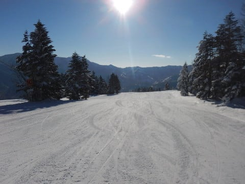
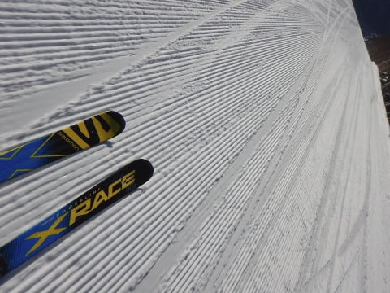
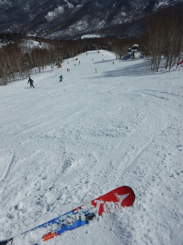
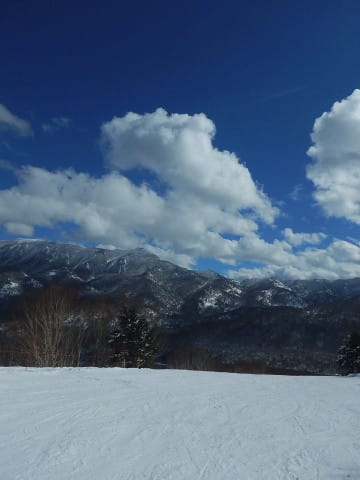
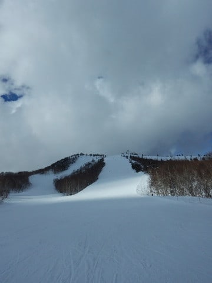
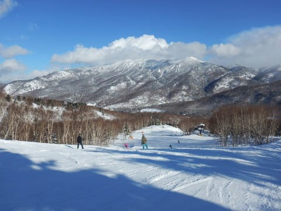
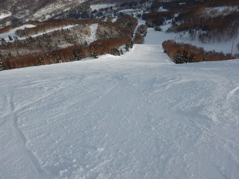
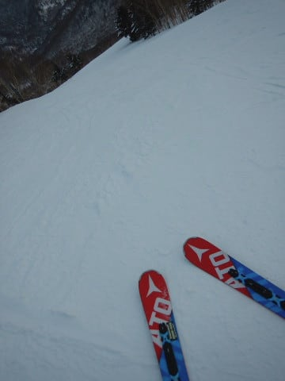
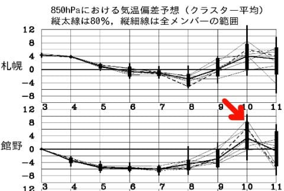
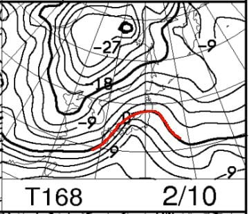

# 2月4日（日）の志賀高原速報レポート…朝はすっきり晴れ！午後は一時曇ったものの，ラストまでフラットで快適バーン！！

📅 投稿日時: 2018-02-05 02:24:57

ということで．

本日もいつも通り，

しっかりとラストリフトまで滑ってしまい．

帰宅が夜遅かったので…

はい．

本日の志賀高原レポートは．

日曜夜定番の，速報モードにてお送りします…

まず．

朝は，天気予想通りの晴天でスタート！

昨晩からの積雪はほとんどなかったので．

朝イチは結構締まり気味の，超絶ハイクオリティ

圧雪バーン！！

うはははは！

ガッツリエッジが食い込むけどスピードが出る，

快楽バーンなのだ！！！

で．

2月に入ったというのに．

ゲレンデはそれほど混まず．

ピークでもこの程度の人口密度で．

そして，日が射しているのに気温は低く．

雪は冷え冷え！

でも，予想通り時折雲が飛んできて…

午後2時過ぎには，小雪がぱらつく

タイミングもあったけど．

午後3時過ぎにはまた太陽が顔を出して

くれましたね～！

…これは．

金曜夜の，

　ただ，時々根性のある雪雲が北アルプスを越えて

　飛んできて，雪がぱらつくタイミングもあるかも…

　晴れたり雪が降ったり，という天気かな～．

というのが当たった感じですね…

で．

午後のゲレンデは．

ここしばらく，積雪が少なめだったので．

しっかりパックされた，ザラっとした感じの

固めの下地が表面に出てきましたね．

硬めとはいえ，エッジはそこそこ効く雪なので．

ハイスピード好きにはたまらない

雪質でしたね～！！

さらに，バーンが硬めだったおかげで．

夕方のリフトストップまで，ほぼフラットな

バーンをかっ飛ばせましたよ～！

今日は恵まれてた．

シーズンでも数回レベルの，

Goodコンディションで楽しめました～！！

しかし．

今日の天気は．

水曜夜の予想の．

　朝の気温が-12℃ってのも．

　朝の雪質が冷え冷え締まり気味圧雪ってところも．

　晴れるけど時々雪雲が飛んでくるってところも．

　午後までフラットバーンってところも．

100％当てましたよ～っ！！！

…と．

当てた時には必死にアピールしてみる．

いやー．

これで，これから一週間はかなり冷えてくれるし．

次の週末も安泰だな…

…

…

…

…って．

うむ！？？？？

えええええええっ！！！

…

…

大丈夫．

たぶん．

GSM予想は平年比+6℃だけど．

アンサンブル平均は+3℃程度に収まってるので．

おそらく志賀は雨にならずに済むはず…

…

…と，信じたい（涙）．

しかし．

今シーズンの天気は極端すぎるんですけど．

むちゃくちゃ冷えが続いたかと思うと，

雨の危機が…（泣）．

いや！

雨は降らない！

なぜなら，

久しぶりに，あの踊りを踊るから！

…そうです．

10日に雨にならないように願うスキーヤーは，

みんな，願いを込めて踊るのです！！

気温が上がって雨になっちゃうことを

阻止する願いを込めまくった，冷え冷え踊り　2018verを…

まさか今シーズン，この踊りを踊ることになろうとは…

12月の段階では全く思わなかったよ（泣）

## 💬 コメント一覧

### 💬 コメント by (Reader)
**タイトル**: 日曜日のお昼頃・・・
**投稿日**: 2018-02-05 08:29:39

1ゴンでSalomonをはいていらっしゃいましたか？

20000メートルのシールがあったのですが・・・．

### 💬 コメント by (かず)
**タイトル**: Unknown
**投稿日**: 2018-02-05 10:55:08

10日雨予想ですか〜寒波来てるようですが9日まではパウダー期待出来そうですかね？

### 💬 コメント by (サトシ父)
**タイトル**: 今度こそ！
**投稿日**: 2018-02-05 14:16:55

土曜日の熊の湯日帰りは多少慣れたのか当日は帰宅しても疲労感はあまりありませんでしたが昨日は死んでましたwww

次回は11日からの予定、朝礼には間に合いませんが、今度こそS様にお会いできること楽しみにしています！

### 💬 コメント by (yama)
**タイトル**: 20000メートル
**投稿日**: 2018-02-05 21:36:01

４日は奥志賀スタートで一の瀬を往復しました。帰りにGSコースを滑るSさんを見ましたが、ゴンドラ減速していたのでそのまま奥志賀に移動しました。iskiで初めて20000m越えました。奥志賀でOlafさんを見ました。来週はヤケビに大きな

### 💬 コメント by (しんちゃん)
**タイトル**: 超ピーカンでしたね
**投稿日**: 2018-02-05 21:52:10

日曜はご一緒頂き、お世話になりました。

朝一の朝礼には間に合いませんでしたが、Ｓ様はじめ皆さんとゴンドラに乗ってしまえば会話も弾み遅めの朝礼になった気がしています。

天気も最高で、会話も雪質もめちゃめちゃ楽しかったです。みんなで疾走するとやっぱり楽しいですね。

３高のシマシマ、気持ちよかった～。おかわりしてしまう気持ちはみんな同じだったことも楽しさ倍増でした!!

個人的にはオリンピックコースで初めてiski最高速3ケタ（101km）になったことも達成感ありました。

### 💬 コメント by (にの)
**タイトル**: 心配をおかけしました
**投稿日**: 2018-02-05 23:27:18

日曜日は大変お世話になりました。そして、心配をおかけしてごめんなさい。オリンピックコースを転がり、ヘルメットがパックリと割れてしまいましたが、幸い打撲とすり傷のみで、今朝も元気に⁉︎出勤することが出来ました。次回からは、後方確認もしっかりおこない発進したいと思います。新しいヘルメットには「安全第一」と記します！

### 💬 コメント by (いか)
**タイトル**: Unknown
**投稿日**: 2018-02-06 01:39:35

日曜日はヤケビのご案内、ありがとうございました～。終礼で最終搬器まで乗れてよかったです（笑）またお伺いした際は、朝礼で業務連絡からお願いいたします！

### 💬 コメント by (Skier_S)
**タイトル**: 日曜は良かった…
**投稿日**: 2018-02-06 03:00:25

＞Readerさま

コメントありがとうございます～．

昼は私はSXを履いていたので，

昼にSalomonのX-raceを履いていたのは，

私の古いX-raceを貸していた，私の友人だと

思います…

朝10時半くらいまではSalomonを履いていたので，

それまでだったら私の可能性が高いんですが…

＞かずさま

うーむ．

微妙です．

10日までに降りそうなのは，8日朝

くらいでしょうか…

8日朝は，少なければ10cm，

多ければ脛パフくらいは行きそうな

天気図です．

7日，9日はそんなに積もらなさそうな

感じです…

＞サトシ父さま

今度は11日ですか．

私は11日は子連れで滑ってると思います．

11日は焼額グルグルしていると思いますが，

12日はいろんなところを遠足している

かもしれません…

発見できたら声かけてください～！！

＞yamaさま

あら．

日曜はお会いしないと思っていたら，

焼額スルーだったんですね．

iSKIでも20000m越えですか！

一の瀬張り付きじゃないのに20000m越えとは…

私もヤケビでolafさんにお会いしましたよ～！

…コメントが途中で切れてるみたいなのですが…

＞しんちゃんさま

日曜はお疲れ様でした．

朝イチ朝礼への遅刻は残念でしたが，

この日は超絶に最高のコンディションでしたね…

しばらく間が開くのが惜しいですが，

また次の焼額参戦お待ちしています！

＞にのさま

ヘルメットが割れたのを見たのは

かなり衝撃的でしたが，

おかげで怪大した我なく済んだようで，

ヘルメット様々ですね．

ぜひ，次のNewヘルメットは

「安全第一」で行ってみてください（笑）

＞いかさま

日曜は一日お世話になりました！

なかなか楽しかったです．．

日曜の朝礼が人が少なくて残念でしたが，

また今度は1ゴンいっぱいのメンバーでの

朝礼にご参加ください（笑）．

またの志賀高原への来訪，お待ちしています～！

