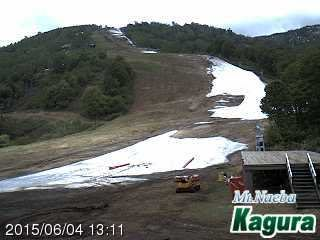
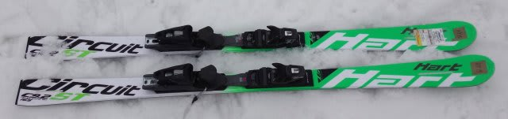
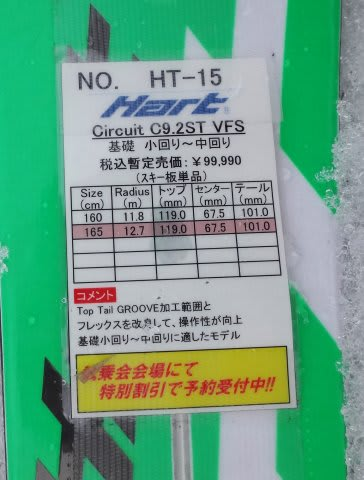
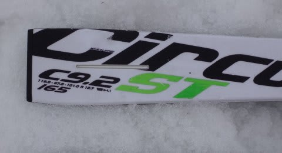
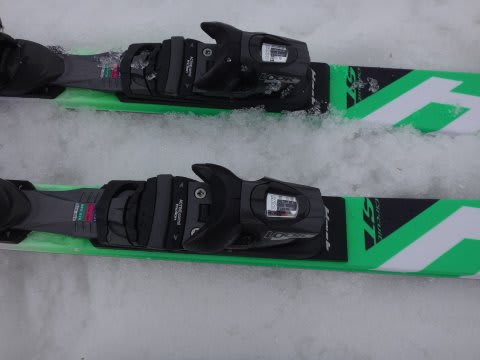

# もう少し続く，2016シーズンモデルのスキー試乗レポート第21回…HART編

📅 投稿日時: 2015-06-05 02:26:50

🏷️ カテゴリ: [スキー板試乗](c0bd8048615710cee890e403a36cc9a2b.md)

つい4日前まで滑れた，かぐらスキー場ですが．

…もう，こんなになってますね…

いやー．

もう，コースも切れ切れで，

ホントによくもまぁ，数日前まで滑れたもんだ，って感じですね～．

あぁ…

シーズンが終わっていく…（落涙）．

ということで．

本題へ．

まだ終わってない，2016シーズンモデルのスキー板の

試乗インプレッション．

今日は，ハート編です．

では，どうぞ～！

○HART C9.2ST VFS 165cm

基礎小回り用．

履いた感じ，

ちょっと板のしなやかさが足りず．

突っ張るような，たわみの出にくさを感じました…

で．ちょっと硬さを感じるというのもあり．

オートマチックで回ってくる板ではなく，

自分で動いて行かないといけない板に感じます．

切換えから谷回りにかけて，大きく動いて

トップのエッジを食わせに行かないと，

トップがグリップせず，トップがキョロキョロするように感じます．

谷回りで板を大きく外に出してしばらく待つと，

トップが食いついて下に向き始める感じ．

そのあと，山回りでしっかりテールに乗りこんでいけば，

山回りで板が回っていきます．

かなり積極的にスキーの前後を使わないと板が

回っていかない感じで，去年までより手ごわさが

上がったように思っちゃいました…

かなりレベルが高い人じゃないと難しいか？

私程度の腕前だと，荒れてる雪とかじゃ難しく，

気楽にフリーで履ける板じゃないかな…と

感じてしまいました．

ただ，この試乗板．

本来，トゥ側とヒール側でセパレートされてるプレートが，

試乗用につけられたサイズ調整可能なビンディングで

つながれた形になっちゃってるので．

もしかすると，これが板のフレックスを阻害して，

本来の性能と違う感じになっているのかもしれません…

なので，このレポートはあまり参考になってない

可能性がありますので，ご注意を…
