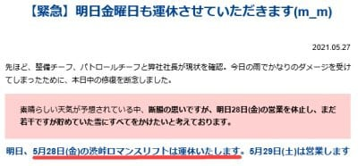
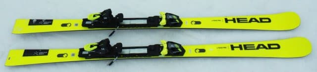
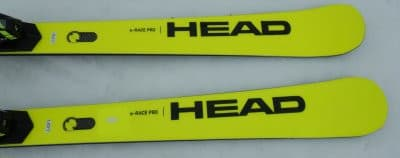
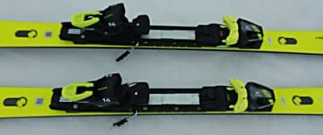
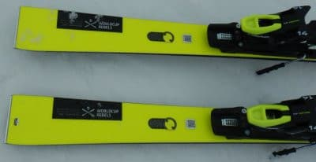

# 2022シーズンモデルのスキー板，試乗レポートスタート！…まずはHEAD e-RACE PRO

📅 投稿日時: 2021-05-28 04:46:01

えー．

昨日の記事に書いたように．

本日，志賀高原の渋峠スキー場は，

悪天候＆コース整備のため運休

と事前にアナウンスされていましたが．

…なんだか，思った以上に今日の雨の

ダメージがでかかったらしく．

コース整備のために，

28日(金)も運休となったようです(涙）

（[横手山スキー場ホームページ](https://yokoteyama2307.com/news/14604/)より）

これは，かなりゲレンデがやられちゃった

ということですね…

土曜には復活するようですが，これは

29，30日の週末で営業が終了しそうな気配…

果たして，この雨の影響でどこまで雪が

減ったのか？

土曜の特派員レポートを待ちましょう…！←他力本願

ってなことで，本題へ．

…今シーズンも，来シーズンモデルの

スキー板をいくつか試乗してきたわけ

ですけども．

試乗レポートを書くのは意外と時間がかかり．

今シーズン，仕事がご無体でなかなか

試乗レポートを書く時間が無かったのですが．

渋峠が運休となり，特派員レポートが無い本日．

そろそろ試乗レポートを書かねば，ネタが…

という内部事情により．

ついに皆さんお待ちかねの，2022シーズン

モデルのスキー板試乗レポート，

スタートです！←え？待ってる人なんていたの！？？

えー．

まずは，3月7日にエキップさんが

一の瀬ダイヤモンドで開催してくれた

試乗会のレポートからです！←もう2か月半以上前だよ…いまさら記事にするって，遅いよ…

[試乗したこの日](d20210307.md)は…朝から雨(涙)

だもんで．せっかくの3月上旬の試乗会

というのに．

「4月下旬か！？」というような雨で湿った

重めの雪での試乗レポートです…

ただ，ポールバーンを貸し切って

くれたので．

他の人が入らない，フラットなバーンでも

板を試すことができ．

フラットで比較的締まった斜面と

重く荒れた斜面の両方で試すことが

できました．

ただ，どちらにしろ雪は融けて緩んだ

雪だったので．

硬めの板は本領が発揮できない感じ

だったかな…

で．

後は試乗している人間の情報を…←人間じゃないという説もあるようですが

試乗しているのは，指導員もテククラも持って

なければ，レースをやっていたわけでも無い

単なるレジャースキーヤーです．←ここ強調しておくところ

レジャースキーヤーが自分の好き嫌いを

言っているだけのたわごとなので，

私がいいと思った板でも，

「なぜこれを誉める？」

と思う方もいっぱいいると思いますし．

逆に，私と合わなかった板でも，

「なぜこの良さが分からない…？」

という方もいっぱいいると思います．

あくまで，いちレジャースキーヤーが，自分の

主観を述べているだけですので…

一応，私の板の嗜好を書いておくと．

比較的スピードを出して滑ることが多く，

また，ガッツリ板を雪面に喰わせての深めの

ターン弧を好むという嗜好もあり．

比較的フレックスがしっかりした，トーション

強めのグリップが強い板が好きです．

特に今シーズン，エキップさんでブーツを

作ってから．

これまでよりしっかり板が踏めるように

なったせいか，これまでの板がどれも

柔らかく感じるようになった…

というのもあり．

今シーズンの試乗レポートは，昨年までの

ATOMICブーツでの試乗と異なり，かなり

フレックスが強めの板の評価が高くなる

傾向にあります．

柔らかい，優し目の板は評価が低くなって

いるので，ご注意を…

ってなことで．

レジャースキーヤーの言いたい放題な

いい加減な試乗レポート，スタートです！

○HEAD WORLDCUP REBELS e-RACE PRO 165cm

小回りベース基礎

基本的に2021シーズンモデルのキャリー

オーバーとなるらしい，このモデル．

…ってか，2021シーズンモデルと全く見分けが

着きませんね…

HEADのネオンイエローの機種としては，

大回りがガチ競技用のWC REBELS e-GS RDと

もう少しRがきついのWC REBELS e-SPEED PRO，

小回りがこれも競技用のWC REBELS e-SL RDと，

競技用よりRが緩めのWC REBELS e-RACE PROの

4種類あるんですが…

このうち，小回りでSL競技用よりちょいと

優し目となるモデルですね．

ちなみに，e-RACEの「Pro」がつかない黒色の板

との違いは，プレートが違うのみです．

「Pro」が着く方は，競技用と同じしっかりした

WCR 14 Raceプレートが着きます…

ちなみに，このプレートは2021シーズンモデルから

ちょっと短くなって，板の扱いやすさが

向上しているとか…

ってなことで．

滑ってみると．

コアの張りがしっかりあり，フレックスは

かなり強めの板です．

ただ，サイドカーブがR13と小さいので，

板を踏んでたわませなくても，角づけだけで

板が回り出す，旋回性の高い板．

角づけを左右に変えていくだけで，簡単に

レールターンに入れます．

あまりたわみの出ないスピード域では，

板のばね感による返りというより，

サイドカーブで板が体の下を左右に

するすると入れ替わっていく…という

感じで，簡単に切り返せる板ですね．

フレックスは強く，エッジグリップもかなり

強めだけど，サイドカーブに乗ってスルスル

滑って行けるので，強い反動をもらっちゃう

ような手ごわさは感じず，強いエッジグリップに

頼って，ひたすらレールターン的に中回りから

小回りまで滑れちゃう板．

フレックスが強いので，スピードをガンガン

出して行っても，板が負けたりたわみきったり

することは無く．

スピードが出ていった領域でも，低速と同じ

安定度でするすると滑って行けます．

というか，スピードを出せば出すほど

フレックスが強く感じていき，むしろ

足元がしっかり捉えていく感じ…

板のグリップは強めだけど，それに負けない

くらいフレックスが強いので．

グリップは強いけどしなやかにたわんで

捉えていく板のように，板を動かそうと

思うとたわみが増える方向に行くのではなく，

脚力で板を動かしていけば，スピードを

出した中でも板を動かしていくことが

できます．

私はどちらかというとばね感が強く，

グッとたわんで圧が溜まり，それがポンと

解放される板が好きなんですが，

この板は，たわみ＆ばね感は弱いけど．

サイドカーブと強いエッジグリップで

クルクル回っていくという．

私の好きな板とは対極の方向性だけど．

良く回るし，スピード耐性と安定感がある，

結構いい板だな…と思いました．

## 💬 コメント一覧

### 💬 コメント by (Northfox)
**タイトル**: 待ってました！！
**投稿日**: 2021-05-28 16:35:45

スキー板試乗レポート、自分はいつも楽しみに待っていますよ！

でも、もっともっと楽しみにしているのはSkier_S様のスキー用品お買い上げレポートです😅

### 💬 コメント by (ikkun)
**タイトル**: Unknown
**投稿日**: 2021-05-28 17:15:32

guitar？きたー🎵(笑)  しかも一緒に準指受けた大将が履いていた昨年seasonmodelでした❗なかなか滑りやすいとは言っておりました  何をおっしゃいますか？(笑)楽しみにしてます

### 💬 コメント by (しんちゃん)
**タイトル**: 待ってました！！
**投稿日**: 2021-05-29 00:05:28

ついに始まった～！スキー板試乗レポート。

いつも楽しみにしています。

小出しで、また、短くても構いませんので、ちょいちょい掲載お願いします(笑)

### 💬 コメント by (Skier_S)
**タイトル**: 試乗レポート，スタート！
**投稿日**: 2021-05-29 04:11:45

＞Northfoxさま

スキー試乗レポートを楽しみにしているということは，

試乗レポートを参考に物欲にまみれていく…ということですね(笑)．

私の物欲選手権は………ノーコメントで(笑)．

＞ikkunさま

試乗レポート楽しんでもらえているようで良かったです…

今シーズンは25種類くらい乗ったかな？

またボチボチ書いていきますので，お楽しみに～！

＞しんちゃんさま

今年はもう小出しで書くしかできなさそうなので，

気長に最後までお付き合いください…

### 💬 コメント by (アリス)
**タイトル**: 待ちに待ちました
**投稿日**: 2021-05-29 17:54:10

S様

ずっと待っていました。

来シーズンの購入板用の参考にさせていただきます。

それにしても25種類も試乗した内容は覚えているのですか？メモを取っているんですね？

初回のヘッドいいですね♪

### 💬 コメント by (Skier_S)
**タイトル**: ＞アリスさま
**投稿日**: 2021-05-30 04:04:26

私が試乗しているところを見たことある人は知っていますが…

カメラの動画で音声メモを取ってます．

乗った直後に，インプレッションを1分程度カメラに向かってしゃべってます．

それを記事に起こしているので，時間が経っても記事にできるのです…

さすがに記憶だけでは書けないです（笑）

