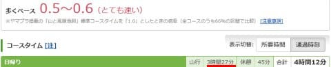

# 今度はTecnicaのトレランシューズで小仏P⇔陣馬山往復！La Sportivaとどっちが速かったのか？その1

📅 投稿日時: 2023-07-18 02:16:06

ということで．

この土曜日も山に行ってきたわけですが…

土曜日は，午前10時から娘と一緒に

でかける約束をしているという理由と，

3連休の後半2日の日・月は仕事を

集中してやっつけたいという計画を

考えると…

うむ．

土曜朝10時に，娘と出かけるまでに下山して

帰宅できる予定なら，山に行けるな←普通はそれなら山に行かないと思う

と．

金曜夜も帰宅が遅く，寝たのが2時だった

にもかかわらず．

睡眠時間1時間半で，2週連続となる

小仏P⇔陣馬山往復に行ってきました～！！

で．

すでに小仏P⇔陣馬山往復は，

[以前の記事](e24cd3e119b08fa99b6b34c0cce05132b.md)に書いたように，

HOKAのSpeedgoat MID GTXと

La SportivaのUltra Raptor2 MID GTXの

2種類のタイム比較をしていたので…

今回，私が持っているもう一つの靴．

唯一のローカットのトレランシューズ，

TecnicaのSupreme MAX3.0

でのタイムを測ってみました～！！

この靴．

昨シーズンのラストでデビューだったので，

実はまだ今回が2回目の出動です．

…いや，この靴のデビューで行ったのが，

八ヶ岳の天狗岳方面．

ローカットのトレランシューズのデビュー戦で，

こんな本格的な山道を歩いたのですが．

まぁ，歩けないことはないけど，

こういうところにはこのシューズは

適さないな…

と思ったわけで．

その結果，ある程度本格的な山を歩く

ための靴として，ちゃんと防水で，

プロテクションもある程度しっかりしてそうな

Ultra raptorを買ったというのが，これまでの

経緯．

ただ，景信山～陣馬山の道って，結構

フラットでしっかり踏まれた歩きやすい

道なので…

こんな道ならTecnicaシューズが得意の

領域かも…？

と思って，タイムを測ってみました～！！

ってなことで，いきなり結果に行きましょう！

小仏P⇔陣馬山往復タイムは…

HOKAのSpeedgoat MID GTX：3時間27分

La SportivaのUltra Raptor2 MID GTX：3時間15分

TecnicaのSupreme MAX3.0：2時間58分

という結果でした～！！

Hoka SpeedgoatよりLa Sportiva Ultra Raptorが

15分近くタイムが早かったですが．

さらにTECNICAのSupreme MAX3.0では，

La Sportivaよりタイムを15分以上詰めました…！

ついに小仏Pから陣馬山の往復タイム，

3時間を切りましたが…

TECNICA，なんでこんなに早いの？？

先週のUltra Raptorで走った時と今回で，

気温はほとんど変わってないので…

どちらかが気温が高くてへばったわけでも

ないし．

（先週，Ultra raptorで行った時の気温）

（今週，TECNICAで行った時の気温）

むしろ，前回は平均心拍150だったところ．

今回は登りの平均心拍は147で．

（今週，TECNICA Supremeの登り時の心拍数）

下りも平均心拍148と，ちょっと追い込み

切れなかった感じ…

（今週，TECNICA Supremeの下り時の心拍数）

今回は，心拍数も追い込めなかったこともあり，

走り終わった後にかなり体力に余裕が

残っている感じで．

Garminさんが測定している「スタミナ」を

見てみると…

先週，Ultra Raptorで登った前回は，

登り終わった時点での残スタミナは30％．

（先週，Ultra Raptorの登り時のスタミナグラフ）

そして，下りでは最後の残り1％と，

ほぼすべてのスタミナを使い切った…

と言っていたけど．

（先週，Ultra Raptorの下り時のスタミナグラフ）

TECNICAで走った今回は，

登り終わった時点で残スタミナ60％以上！

（今週，TECNICA Supremeの登り時のスタミナグラフ）

そして，下り終わっても30％程度の

スタミナが残っており…

TECNICAだと，一往復しても

Ultra Raptorの登りだけと同じスタミナ

しか使ってません…！

（今週，TECNICA Supremeの下り時のスタミナグラフ）

実際に走り終わった後での感覚も

これとよく一致していて．

Ultra Raptorで走った先週は，

「疲れた…よく走った…」

という感じだったけど．

TECNICAで走った後は，

「まだ全然走れるな…」

という余裕が残っている感じ．

果たして，この違いはどこから来ているのか？

Garminさん得意領域の，いろんな分析を

見てみるわけですが…

　

おそらく疲労に効くと思う，

ランニング上下動ですね．

これが小さいほうがより良いエネルギー

効率で前進できるので．

TECNICAのほうが上下動が抑えられて

いるんじゃないかな？？

と思ったら．

むしろTECHNICAのほうが，

わずか0.1㎝とはいえ，平均上下動が

大きいですね…

ただ，TECNICAのほうが平均歩幅が広く，

歩幅ー上下動比率である，平均上下動比は

どちらも8.2％と同じ値になってますね…

さらに，TECNICAのほうがピッチも

早くなっていて…

同じ平均上下動比でも，TECNICAのほうが

よりピッチが早く，歩幅も広く効率的に

前進しているようです…

ふーむ．

とりあえず，Garminさんはまだまだ

いっぱいデータが測定できるので．

なぜTECNICAシューズのほうが速かったのか？？

データをもとに，原因を突き止めてみましょう！

（続く）
