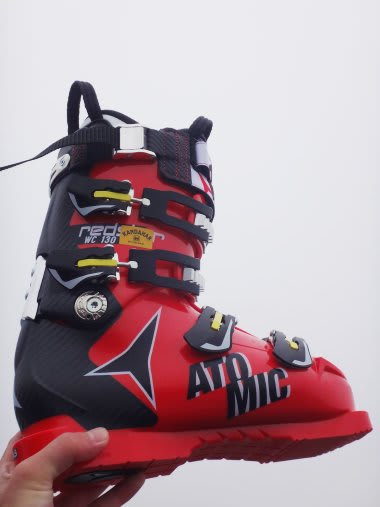
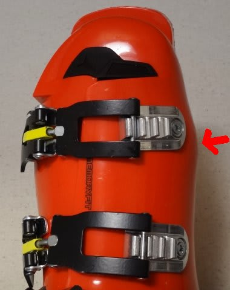
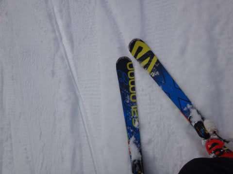

# ニューブーツ，ATOMIC Redster WC 130のインプレッション…2か月ちょっと滑ってみて

📅 投稿日時: 2016-02-03 01:39:13

ということで．

[この11月の物欲選手権](e676591ac0d87f01c70ad0ad2ceae84f6.md)に大敗してしまい，

予想外に購入してしまったニューブーツ，ATOMICの

Redster WC130ですが．←いや，ほとんどの人にとっては想定の範囲内だから

そろそろ，購入後2か月ちょい．

26日ほど滑ったので．←冷静に考えると．2か月ちょいで26日って…普通の社会人としてあるまじき数字では？？

どんな感じか，ちょいとレポートしてみましょう…

で．

このブーツ．

[購入直後に報告](eb2561af4d4b1f29ed5fc6337e3c76e93.md)したけど．

異常に幅広の私の足に合わせるため，

かなーーり強引に幅を広げ，

幅が全く足りず試し履きすらできないブーツを，

なんとか履けるようにした…

というものなので．

…なんだか．

こんなところとか．

こんなところが，

ぼっこりと出っ張っているのが分かるかと…

写真では分かりにくいけど，小指＆小指の付け根部分も

「これ以上広げると，バックルを固定しているねじが抜けるかも」

という限界まで広げてるんですね～．

ってことで．

「こんなブーツ，履けるんか？？」

と，心配になったりもしましたが．

実際に履いてみると…

…

…をを！

ぴったり！

痛くない！

以前履いていた，ラスト幅98mmのブーツ．

それにシェルの熱成型をかけたATOMIC REDSTER PROですら，

かなり当たって痛かったのに…

まさか，それより幅が3mm狭い，ラスト幅95mmの

ブーツが履けてしまうとは！

＃実際は，試しで滑ったあと，小指部分をさらに広げてもらったけど

で．

実際にこのブーツで滑ってみたところ．

…をををををを！

足首の締まりが違うっ！！！！

足の甲の抑え込みが違うっ！！！

ATOMICのREDSTER PRO 130とWC 130.

ラスト幅が違うだけかと思ったら…

足首のボリュームも，足の甲の高さも違って．

全体的なボリュームが全然違うのか…っ！！

だもんで．

REDSTER PRO 130だと，ホールド感が足りず，

こぶ斜面なんかの突き上げで，ちょっとブーツの中で

足が遊ぶのが気になっていたけど…

WC 130だとすごいぴったり感！

この，ぴったり感のおかげで．

ブーツのレスポンスが，かなーーーり早く感じるように！

…WCの方がインナーブーツが薄め，…ってのも効いてるのかな？

そして，

意外なことに．

PRO 130と同じ，フレックス130のブーツのはずなのに．

ブーツの強さも，PRO 130よりずっと強く感じるんですが？？

前屈フレックスの硬さではなく，

トップスピードで強い横Gをかけた領域に入った時の，

サイドやバックのしっかり感が強く．

PRO 130より，さらに強く板を押さえに行ける感じがあります．

…そして．

ブーツの返りも，PRO 130より早い気が？？

ブーツにたまった圧が開放されるとき．

かなり強いばね感で，ブーツからの反動が返ってきます．

もう，ビヨーーーン，って感じです．

ということで．

ATOMICのREDSTER PRO 130とREDSTER WC 130．

足幅が違うだけかと思ったら…

高さや足首のホールドが全然違い．

さらに，レスポンスやフレックスも違ってて．

WC 130は，かなり攻撃的なブーツに感じます．

…だもんで．

「かなり強烈な板」

…と思っていた，わが大回り用マシン，

[SALOMON X-RACE 165cm](e587111dcba9e3b9e9174d9bd849610e6.md)．

この板が，WC 130で滑るといとも簡単にたわんでしまい．

「あれ…？？この板．

　これまで165cmでも大回りOKと思っていたのに…

　なんだか，このブーツだと，簡単にたわんじゃって，

　やっぱり165cmだとギュンギュン回る小回りマシンだよね…

　って感じになっちゃったんですが…？？」

…

…

…

大回り用に，せめて175cmの，

このブーツとバランスがとれる，X-RACE並みに強い板が

欲しくなってきた，今日この頃．

…

…いや．

買わないぞ．

大回りの板なんて，買わないぞ～っ！！！

＃もしかして，X-RACEもマイルド化が進んだのでは…

＃という，恐ろしいことは考えないようにしたい…のだが…

## 💬 コメント一覧

### 💬 コメント by (れお)
**タイトル**: 買っちゃいましょう!!
**投稿日**: 2016-02-03 13:24:36

シーズン中の物欲選手権で買っちゃいましょう!!

期待してます～ 笑

もう大回り板の候補は挙がってるんですか？

### 💬 コメント by (Skier_S)
**タイトル**: れおさま
**投稿日**: 2016-02-03 23:58:26

いや…

買いません！

今シーズンは買いませんよ～っ！！！

…と，今のところは思ってます（＾＾；

次の候補は…

X-RACEの175cmが第1候補なんですが…

### 💬 コメント by (Goku)
**タイトル**: Unknown
**投稿日**: 2016-02-04 22:42:54

いや、買うでしょ！

絶対に・・・（笑）

### 💬 コメント by (Skier_S)
**タイトル**: Gokuさま
**投稿日**: 2016-02-04 22:53:18

いや…

買わないですよ…

買わないです．

…しばらくは（＾＾；

