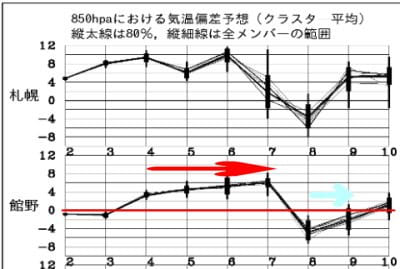

# 4月3日志賀高原スキー場特派員レポート…そして今後の天気は，6日まで高温晴れ，7日金曜に高温の雨（涙）8，9日の週末はちょっと冷えそう！

📅 投稿日時: 2023-04-04 05:45:15

🏷️ カテゴリ: [2023スキー滑走日記](cd943df30cfcc3d0896469e2ff98720cd.md)

もう，朝5時過ぎてるよ…（涙）

今日もとんでもない時間になってしまったので，

手短に更新…

昨日，一昨日とレポートしたように，土日とも

志賀高原は晴天高温が続いたわけですが…

特派員情報によれば，この4/3の月曜も気温は

比較的高めでだったようで．

今日も志賀高原は昨日の日曜のコピーのように，

すっきり晴天で始まって…

これも日曜のコピーのように，朝は雪が

硬くてガリガリ君で…

でも，気温が朝からプラスだったので．

これも昨日通り，じき雪が緩んでザブザブに

なっていったようです…

とはいえ，さすがにまだ4月上旬の志賀高原．

例年よりは少ないとはいえ，一の瀬ファミリーも

まだ真っ白だし．

高天ヶ原も，意外なことにモーグルバーン

側も全く土が出て来てませんね…！

ただ…

昨日の4月2日の日曜までで一の瀬より下は

ほとんど終了となり．

今日以降も動くのは，

・横手＆渋峠

・高天ヶ原トリプル

・一の瀬ファミリー

・寺小屋

・一の瀬ダイヤ

・焼額第1，第2ゴンドラ（第2ゴンドラは9日で終了）

・奥志賀

だけとなります…（涙）

例年ならGWまでやる高天ヶ原クワッドも，

今シーズンは4月2日で終わってしまい，

タンネの森も，今シーズンの営業は終わって

しまいました…（涙）

山の神ももう営業が終わったので，

一の瀬と焼額は，車で移動するしかなくなりました…（泣）

あぁ…

シーズンが終わっていく…

で．

これから先の天気ですが．

先日書いたように，7日までは高温が続きそうですが…

8，9日は水色矢印で書いたようにちょっと冷えそう！！

6日までは気温が高いながらも，晴れてくれそう．

ただ，7日の金曜日は…

気温が激烈に高いのに，地上天気図では降水域が

かかっていて．

この日は，液体が空から降ってきます（涙）

ただ，降る時間は短いかな…

寒冷前線通過なので，短時間に激しく降りそう

そしてその後の8日の土曜は冷えて，降水域が

志賀にかかってるので．ちょっとだけ

雪が積もるかも…

次の9日の日曜は高気圧に覆われて，気温は

低いけど晴れそうかな．

とりあえず，この土日は冷えて，

運がよければ土曜に雪がうっすら積もって，

朝はコンディションいいかも？？

日曜も結構冷え込んでくれそうだけど…

一日バーンはすごい硬いままか？

上のグラフの線のばらつきは少なく，

予想は安定しているので，この予想は

多分大きくずれないはず…！！

だもんで，土日は冷えて路面は凍りそうかな…

この週末，夏タイヤで志賀高原にチャレンジすると，

車でダンスを踊って壁にディープキスしちゃう

可能性が高いので，ご注意を…

とりあえず，久しぶりに冷えそうな今週末に期待！！

## 💬 コメント一覧

### 💬 コメント by (アリス)
**タイトル**: こんばんは
**投稿日**: 2023-04-04 22:53:34

S様

お世話になっております♪

①この時間は、夜通し起きてる時間ですか？

②朝に起きた時間ですか？

まさか①ではないですよね？

### 💬 コメント by (Skier_S)
**タイトル**: ＞アリスさま
**投稿日**: 2023-04-05 02:55:08

残念ながら，夜通し起きてる時間です…（涙）

