# 2021/5/23(日)のかぐらスキー場ファイナルデー，速報レポート！…終日ガス(涙)．リフト待ちはないけどコースがすごいことに

📅 投稿日時: 2021-05-24 02:24:14

えー．

本日，ついに今シーズンのかぐら

ファイナルデーとなったわけですが．

…残念ながら，念願の1mのパウダーは

積もりませんでした…←いや，当たり前だから

ということで．

昨日より雪が減った本日のかぐらスキー場．

いろいろすごかったです．

何がすごかったかは追って話しますが．

楽しめたかというと…微妙な感じ（涙)

でも，スキー禁断症状の回避には役立ち

ました(笑)．

しかし，

クワッドで営業できるのは今日がギリギリ

だったかな？？？

という感じで．

今日がファイナルでちょうど良かったのかも

と思えるコンディションでしたね～．

とりあえず，かぐらファイナルレポートと

言っておきながら．

まずはいつもの志賀高原特派員による，

志賀高原情報から！

えー．

本日の志賀高原．

渋峠は6:30からの早朝営業をやっていた

ようですが…

朝の気温は3℃と，かなり低めの気温だった

ようです！

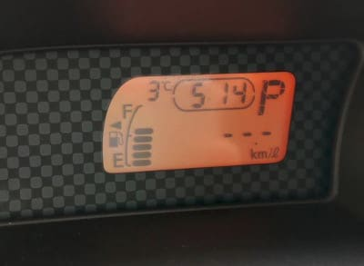

ただ，朝から天候はガスっていて…

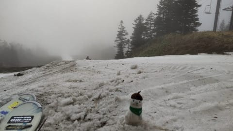

うーん．

コースも見事な廊下状態ですね(ちょい涙)

リフトは最大5分ほど待ったようで．

今日は意外と人が来てたようですね！

…でも，リフトの輸送力が低いのと，

コースが2本オープンしていたおかげで．

コース自体は全く混まなかったようです…

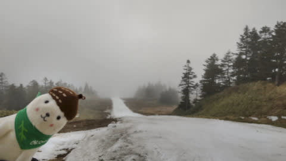

そして．

昨日なんとかつないだウエイバーコース．

今日までかと思ったら．

明日の月曜も非圧雪ながらオープンする

とのこと…

ただ，月曜でホントに終わりかな．

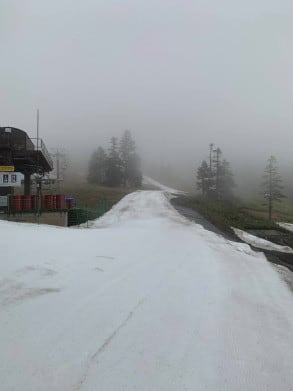

ウエイバーコースが終わったあとは，

そのあと残る派ゲミュートコース1本

のみになりますが．

やはり，当初予定の6月6日までの営業は

厳しいようですね…（涙）

なんとか週末の5月30日まで．

可能なら，6月1日まで営業する…

との気合の宣言が，横手山のホームページの

お知らせに書かれてました…！

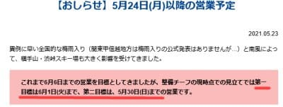

（[横手山ホームページ](https://yokoteyama2307.com/news/14571/)より）

…しかし．昨シーズンから，横手山の

気合の入れ方が違いますね…

この雪の状況で，ホントに6月まで

営業できたらすごい！！

…でも．

やっぱり海和ゲレンデじゃなく，

渋峠に人工降雪機を設置すればよかった

と思うのは，私だけじゃないはず…

おそらく水利権その他で群馬県側の渋峠の人工降雪機設置が厳しいと思うんだけど(勝手な推測)

ということで．

ようやっと本題のかぐらスキー場の

速報レポートへ！

えー．

本日のかぐらは…

昨日よりは混んでいたようですが．

先週に比べれば，かなり人が減りました！

朝イチロープウェーも，最大20分待ち

程度で．

[1時間以上待った先週](ef911f619114f0521360839a402d267d6.md)の列に比べれば

ずっと短かったですよ！

これは，かぐらクワッドもそんなに混まない

はず…！

と，期待してかぐらゲレンデに向かいます．

登りのリフト，ゴンドラの待ちもせいぜい

搬器数個程度の待ちで登れて．

先週に比べれば，ずっと快適！

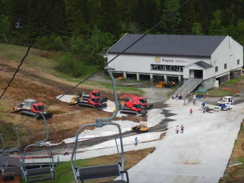

…しかし．

先週まで滑れたゴンドラコースの雪，

跡形もなく完全に消えてますね…

で．

山頂のゲレンデに着くと…

うぎゃーーーー！！

雪が減ってる！！

…昨日のかぐら特派員写真で知っていた

ものの．

実際にこの目で見ると，わずか1週間で

ここまで雪が消えるのか…

と，衝撃を受けるレベル（激泣）

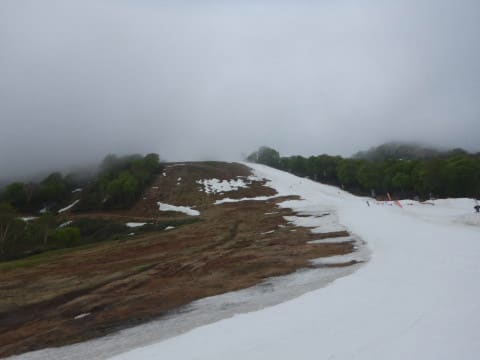

和田小屋からリフト乗り場までも，

狭いところで幅5mないくらいの

廊下になっちゃってるし…

当然，テクニカルコースの雪は

完全に剝げてます(涙)

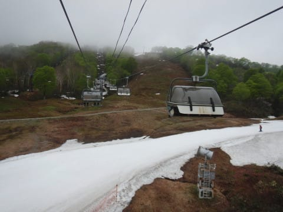

クワッドリフトを降りたところも廊下で．

雪を入れ続けないと，すぐに途切れそう…

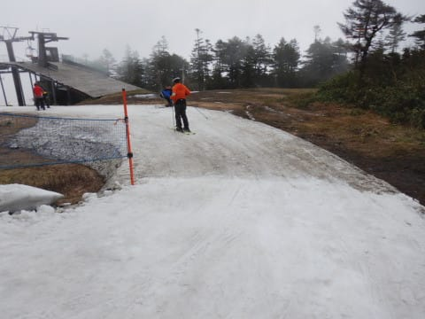

リフト待ちは最大のピークでもこの程度．

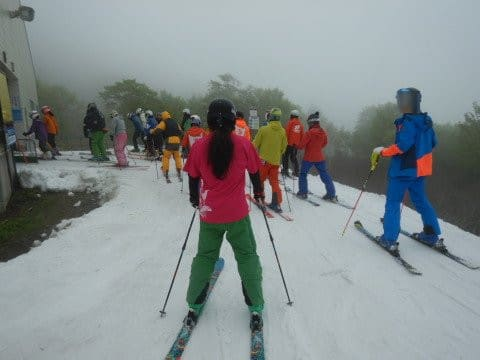

午前中は1-2分待ち，昼からはほぼ

待ちなしでした！

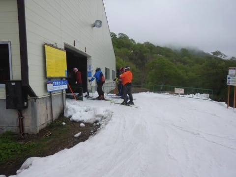

いや．

先週から人は減ったんだけど．

コース幅が狭くなったので．

コース上の人口密度が，すごいことに…(涙)

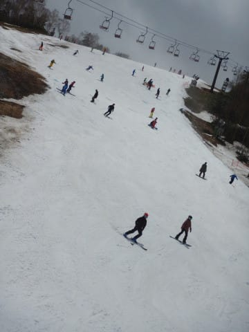

さらに，ただでさえ幅が狭いゲレンデ．

大勢の人が滑るので，雪が削られて，

だんだん地肌が出てきてるの

ですが…っ！(激泣)

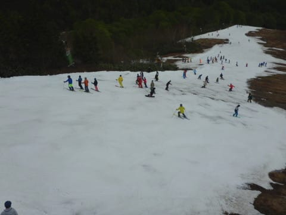

午後になると，もうこんな感じで．

一体どこを滑ればいいんだろうか？？

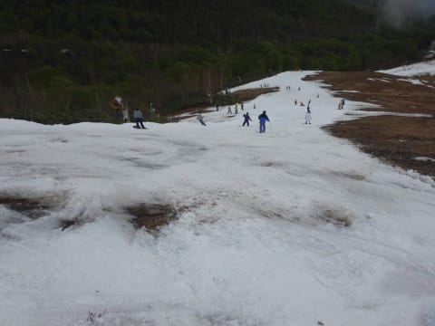

…そして，さらに．

これまでの写真ではゲレンデがすっきり

見えている写真ばかりでしたが．

実際は本日は終日ほとんどゲレンデ

全面にガスがかかっていて…

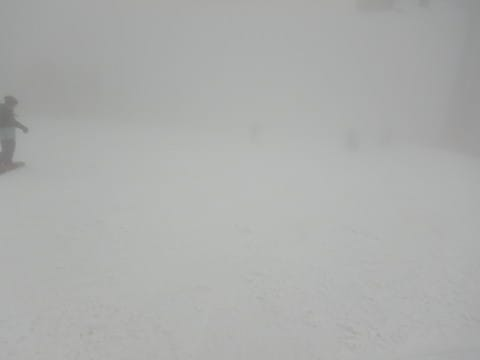

実際，ガスが消えるのは一瞬だけ．

ほとんどの時間はこんな感じで

真っ白で全く見えない中，

人がいっぱいいて，

コースが狭くて，

それもあらゆるところに

土が出ている

という，4重苦状態

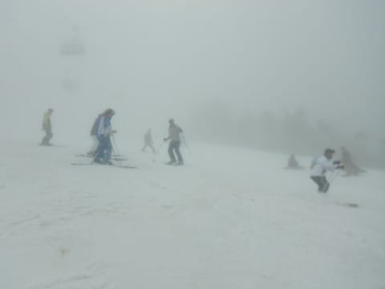

もう，雪面がどんな凸凹なのか

見えないし．

人も数mに近づかないといるかどうか

分からない状況で，

見えていればこのくらいの人口密度の

ゲレンデを，人と石を避けて下りて

いくのに精いっぱい…

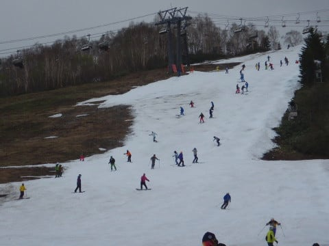

ってなことで．

今日はリフトストップまで，

見えない中で人と石をよけながら，

ひたすらリフト乗り場に移動し続けた

という感じの一日でした…←それでもリフトストップまで滑ったんかい！

いや…

これでかぐらも終わりで．

来週から滑れないとなると．

やっぱり，もう1本…

まだ帰れない…

まだあと1本…

と．

ついついゲレンデから離れるのが

名残惜しくて，ラストまで残って

しまったSkier_Sだったのでした…

また明日，詳細レポート予定！

## 💬 コメント一覧

### 💬 コメント by (2.0GT-Sお仲間)
**タイトル**: 月山行かないの!?
**投稿日**: 2021-05-24 08:51:30

お久しぶりです。

試しにGWの5/4に月山行ってみて、雪たっぷり、でもラインコブ3本くらい。空いているし、感染対策も頑張ってくれている。これで気を良くして、お仲間はかぐらに行っているのに、強風でかぐら休業だった5/16も、そして5/22と月山に行きました。

まだ雪はたっぷりあるけど、この18日間にかなりとけた感じがします。ラインコブはかなり増えました。亀裂も出てきました。

5/22はほぼ首都圏だけ高速使って、残りは一般道路で、16.15km/リットル走ってくれました。私のルートでは山形県には信号6個しかありません。

### 💬 コメント by (ikkun)
**タイトル**: Unknown
**投稿日**: 2021-05-24 14:59:59

あらあら(泣)  ゲレンデ下の建物管理者と話しましたがやはり3月のあの雨ですよね「もしあれが雪だったら……」なんて あの温かさでは無理ではありますね？ しかしさすが横手山さんだなあと呟いてしまいます。  てかもっとすごいのは毎週末志賀高原に来られた貴方様です( *´艸｀)

### 💬 コメント by (Skier_S)
**タイトル**: 残るは渋峠と月山
**投稿日**: 2021-05-25 02:22:27

＞2.0GT-Sお仲間さま

お久しぶりです！

今シーズンは滑れたのでしょうか…？

月山も行きたいのですが，やはり行き帰りが大変で…

6月には一度行くと思います…

しかし，16.15km/lはかなりの好記録ですね！

＞ikkunさま

3月，全ての週末で雨だったという悪夢の3月でしたから…

ちなみに私は，今シーズンはトップシーズンの１，２月はコロナのせいで

ほとんど志賀に行けてないので，「毎週」とは言えないです(涙）

