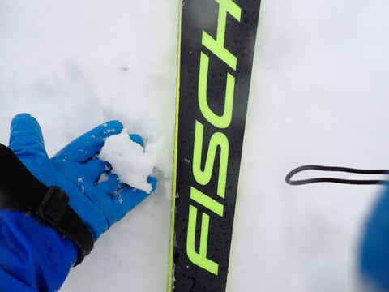
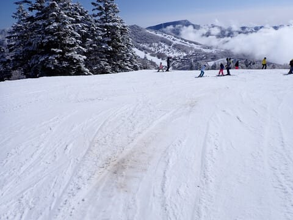

# 2024シーズンのスキー場の天気と積雪量を振り返ってみた，その2…1月中旬に全面オープンになったけど，雨＆高温の2月にやられ2月末に複数コースクローズ（泣）

📅 投稿日時: 2024-06-06 04:20:29

🏷️ カテゴリ: [スキー雑談](c1f9d2cb7478308da16419928ea3945e9.md)

ってなことで．

2024シーズンの天気と積雪量を振り返る企画．

第2回目です！！

[前回](e5406763d1f613c9234b8d2ab0233d4de.md)は，大みそかまでの悲惨な状況を

書きましたが…

もう，年末年始休みはダメか…

と思ったところ．

なんと，1月1日の朝に積雪40cm！

このおかげで，1日にGSコース，

2日に白樺コースオープン！

オリンピックコースやSGSコースは

オープンしなかったけど，

とりあえず一息…

でも，その後積雪がなく，

ところどころブッシュが出てきて．

志賀高原の全面オープンどころか，

1月1日の雪のストックが尽きかけ，

白樺コースは正月休み明けに

再びクローズするなど，

オープンしたコースもヤバい状況に（泣）

1月7，8，9の成人の日3連休も

ヤバかったところ…

3連休中日の1月8日にドカ雪では

なかったものの積雪があり，

ようやく白樺コース再オープン！！

何とか第3高速も動き出し…

イーストやミドルも運転開始！！

…しかし，1月3連休まで第3高速が

営業できなかったのは記録ですね…

ただ，まだオリンピック・SGS・ブナは

オープンできず．

そのほか，一ノ瀬パーフェクター，

東舘オリンピックコースや

丸池Aコースなども滑れず．

1月中旬に差し掛かろうとしているのに，

まだ志賀高原が全面オープンしていない

という，

「40年ぶりの雪不足」と言われた

2016年の記録を越える最悪のシーズンと

なったところ…

何とか，1月13日に丸一日降り続けて

30～40cmほど積もってくれたおかげで，

ようやくオリンピックコースやSGS

コースがオープンして…

1月中旬になって，何とかヤケビ全コース

オープンという，歴史上もっとも遅い，

ヤケビ全面オープンの年となったのでした…

それでも，一日で積もったのはこのくらいで．

まだまだ積雪が全然足りない感じ（涙）

その後，ドサドサとは積もらなかったけど，

ぼちぼちと雪が積もって．

ブッシュエリアも減っていき．

ようやっとトップシーズンが来た！！

と思ったのに．

1月21日に雨（激泣）

週末を狙ったように雨．

朝から強風で全リフト運休，

1月なのに，トップシーズンの雪で

全面オープンのゲレンデを滑れない

呪われた年で．

このままシーズンが終わるのか？？

と，心配が尽きない1月だったのでした…（泣）

ただ．

その後，1月25日ごろから冷え込み，

そこそこ雪も降り．

2月12日までは，そこそこ冷えて

まぁ，トップシーズンらしい状況が

続いたものの…

ドサドサ新雪はなく，パウダーを

楽しめた週末はなかったし．

降っても意外と重めの雪で．

いつもの志賀に比べ，圧倒的に

積雪が少ない2月となり．

ヤバいなぁ…

でも，2月だから普通は1-2回

くらいはどっさり積もる日があるよね？？

と信じて待っていたけど．

一か月で数回しか雪が降らなかったと

いう，史上最悪の2月．

雪が降るどころか，2月15日ごろに

雨が降り（激泣）

翌日以降，バーンがコロコロだらけに

なったかと思えば…

その後も高温が続いて．

2月17，18日の週末なんて．

土日とも山頂で気温が+5℃以上の

春のザブザブ雪になったんですが？？

これ，ホントに2月？？4月の間違い

では？？

そして，雪が薄くて一部ブッシュも

出てくるという，とても2月とは思えない

ひどいゲレンデ状況になったと思ったら…

2月19日夜から22日にかけて，

丸2日間以上高温の雨が降り続けると

いう，激しい追い打ちをかけられ…

オリンピックコースがかなり

危険な状況になったんですが！？？

え？？

まだ2月ですよ！？？

1月中旬に何とかオリンピックコースが

オープンしてから，1か月も経ってませんよ！？

と思ったら．

あえなく，2月24日にオリンピックコースは

クローズ（涙）

さらにブナコースもかなりのブッシュで，

このまま積雪がないとやばい状況で．

普通のコースでも，雪が薄いところが

そこかしこに現れてくるという…

いや…2月ですよ！！？？

まだ2月なのに，雪不足で土が見えて

きてるって…

そして，もうトップシーズンは終わりで，

これから雪が融ける3月になるんですが？？

…焼額スキー場もこの状態に危機感を感じ．

すでにクローズされたオリンピック

コース以外にも，

・白樺・ブナコース…2月27日で営業終了

・SGSコース・イーストコース・ミドルコース

　ミドル連絡コース…3月3日で営業終了

として，クローズコースから雪だしして

残りコースの延命を図るという

決断をせざるを得ないほどで…

（[焼額山Facebook](https://www.facebook.com/yakebitaiyama/posts/pfbid0mYncF4LSeRDnuAY7CoZ1vxzJFrzNZVYP5xEVpTEz4jkthWgD9ihrreG2DwAmPSdPl)より）

とりあえず，これだけの対策を打っても，

ヤケビの古参スタッフをして．

「4月まで営業できる自信がない．

　3月中に終わるかも？？」

という恐ろしいセリフが出るほどの，

とても2月と思えない雪質．

コンディションで終わった，史上最悪の

2月だったのでした…

（2月の志賀の雪質じゃないよ…）

…いや．

でも，私も2月のこのころは，

ホントに3月中に営業が終わるんじゃないか…

と本気で思っていたし．

まさかGWまで雪がもってくれるとは，

全く1ミクロンも想像してなかったのでした．

（続く）

## 💬 コメント一覧

### 💬 コメント by (ねも)
**タイトル**: Unknown
**投稿日**: 2024-06-06 05:47:05

Ｓさん　手を折っても滑ったとは見上げたスキーヤー魂です👍

今季は珍しく志賀高原には２回行きましたよ。楽しかった(^^*)

２月20日前後の異常な暖かさや雨、こちらを読んで思い出しました。驚きでした(ﾟ-ﾟ)

２月17日・18日は斑尾高原で、展望最高の春スキーみたい(-_-;)(笑)

### 💬 コメント by (Skier_S)
**タイトル**: ＞ねもさま
**投稿日**: 2024-06-07 02:35:03

あら…志賀高原にいらしてたんですか．

最近全然お会いしてないので…

とりあえず，手なら骨折しても滑れますよ～！

ただ，プレートを埋め込んだところを再度ぶつけて骨折したら死ぬほど痛いだけじゃなく，

一生障害が残るよ，と脅されましたが（笑）

