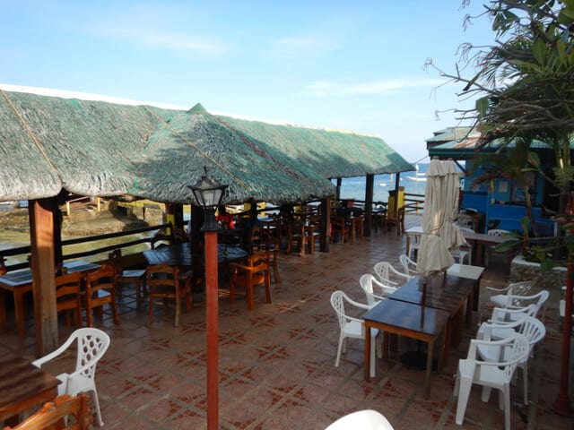

# 2024年8月，5度目の子連れモアルボアル，コロナ後初の海外へ！その5…かなり変わったCABANAホテル．レストラン前もかなり変わったよ．

📅 投稿日時: 2024-10-11 01:26:28

えー．

いろいろあって明日は出張に出かけるのですが．

飛行機で行こうか新幹線で行こうか微妙な

ところに日帰り出張で．

それも現地滞在は会議の2時間だけでとんぼ返り

というかなりの弾丸出張です…（明日の夕方までに

オフィスに戻って会議に出なくてはいけないので…）

新幹線を使っても往復9時間かかるのに，

現地滞在2時間ってなに…（涙）

せっかく〇〇まで行くんだから、普通なら

いろいろ寄って行きたいところなのに…

それでもいつも通りBlog更新！

今日もモアルボアルダイビング旅行記です～！

ーーー

（[前回はこちら](ea52fee8909461fdee188b9de91734555.md)）

で．

朝，日が昇ってから見たホテルの部屋の前の

景色の変わりように愕然としたけど．

部屋の周りだけじゃなく，

ホテルの敷地内からも，デッキチェアがある

砂地と海が見えていたけど…

（2019年の写真）

ここに壁が作られて，ビーチフロントの

部屋の前を除く，ホテル敷地内からは海が

見えなくなってたし…

そして．

朝ごはんのレストランに行ってみると…

以前あった，この右側に移っている

屋根があった海沿のレストランスペースが…

（2018年の写真）

きれいさっぱりなくなっているんですけど！！

こんな感じで，屋根の下で海を眺めて

食事ができるスペースだったのに…

（2018年の写真）

完全なオープンスペースにかわってました…（涙）

以前はこんな感じのリゾート感があったものが…

（2019年の写真）

海は見えるものの，ちょっと寂しい感じに

なっちゃいましたね（泣）

そして，このレストランの一角にあった

プール．

以前はこんな感じで，これもまたリゾート感が

ある感じでしたが…

（2019年の写真）

プール自体は残っていたので，ちょっとほっと

しましたが．

手前の階段スペースが削られ，プールサイドも

その分ちょっと狭くなっていて．

以前はこんな感じで，プールサイドにデッキチェアも

置ける，余裕のある感じだったのが…

（2019年の写真）

ちょっとスペースに余裕がなくなり，

なんとなくリゾート感が失われた感じ…（涙）

まぁ，でも．

プールが残ってくれているだけよかったかな…

という感じで．

かなり変わってしまったCABANAホテルですが…

こうなった理由を後でダイビングショップで

聞いてみたところ．

台風でやられた影響もあるけど．

フィリピンの法律で，海岸線はみんなの共有物で，

勝手に占有したり工事したりしてはいけない…

というのをこのホテルが違反していて，

海岸線の不法占有をやめさせられた…

というのが理由のようです．

しかし，ホテルゲストとしては，

同じ値段を払ってもこの景色が見られ

なくなったのは，ちょっと寂しい感じ…

料金安くなってないんですよね…

ってなことで．

朝起きて部屋の周りを散策して，CABANAホテルの

変わりっぷりにかなり衝撃を受けたけど…

とりあえず．

モアルボアル滞在1日目が始まったので．

家族とともに，朝7時には朝ごはんを食べに

レストランへむかったのでした…

（[続く](eaf1efea840f20fa4676d43a1093200b7.md)）
