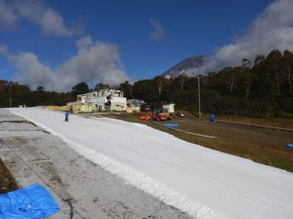
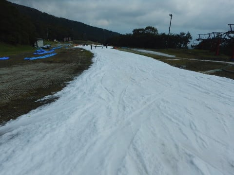
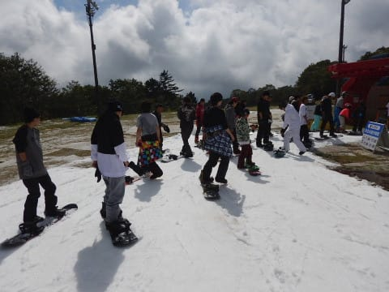
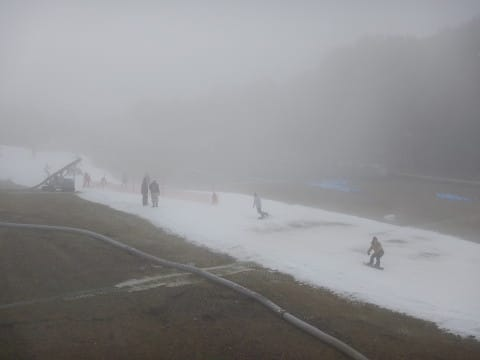
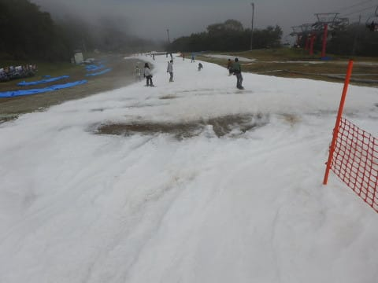
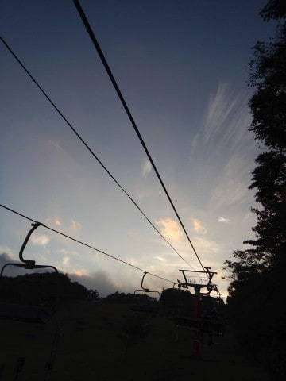
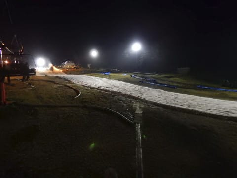
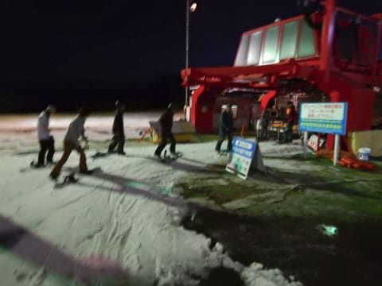

# 10月9日（月），3連休最終日は2018シーズン2度目のイエティへ…速報モード＆コース状況動画

📅 投稿日時: 2017-10-10 00:39:05

ということで．

3連休最終日の本日．

また，Yetiへ行ってきましたよ～！！←いろいろ終わってますね

ということで．

本日も，ちと遅めの帰宅だったので，

速報モードにて…

最後にイエティ定例のコース状況動画もあります．

で．

3連休最終日の本日…

朝のゲレンデオープン時は，すっきり晴天っ！！

土曜は見えなかった富士山が見えるよ！！

…しかし．

9時ごろには雲が太陽を隠し始め，

曇り空になってきましたが…

まぁ，この時期晴れると雪が解けすぎるので，

このくらいの天気がいいかな．

このコース写真を見てもわかる通り．

3連休というのに，ありえないくらいゲレンデの人が少なく．

リフト待ちは，朝10時ごろまでほぼ待ちなし．

ピークでもこの程度と，結構空いてましたよ～！

で…

昼過ぎまでは気温は高めで，

曇り，時折日も射す…

という程度の天気だったのですが．

…ですが．

今日も誰か日ごろの行いが悪い人が

いたのか？？←だから，それはあなたでしょ

午後2時ごろには，

下界はすっきり晴天にもかかわらず．

なぜか，山の上のイエティには結構ガスが

出てきて…

さらに，気温が高めだったので，

コースにところどころ穴が開き始め…（涙）．

ちょいと滑りにくい状況に…

あうーーん．

シーズンオープンから2日連続，

ガスに見舞われるとは…

ただ．

ナイタースタート時には，

ガスも上がってくれて．

そして，コースの穴は埋めきれず，

16時からの圧雪後も，結構コースは

凸凹してたものの．

リフト待ちがほとんどなく．

コース上も人が少ないという，

普段のイエティのナイターでは

ありえない状況に…

だもんで．

今日は早く帰ろうと思っていた，

一緒に滑っていたメンバー全員．

なかなか帰れずに，ついつい遅くまで

滑ってしまったのでした…

＃いや，ナイター終了までは滑ってませんから．

＃ちゃんと，ちょっと早めに帰りましたから…

ということで．

明日詳細レポートしますが←いつもながら，これだけでも結構詳細だから

いつものコース動画を載せておきます…

これは，午後2時過ぎ，ガスが出始めてきたころですね．

かなり雪が薄くなり，ところどころ

土が出てきたのが分かるかと…

## 💬 コメント一覧

### 💬 コメント by (ひーちゃん)
**タイトル**: 御礼
**投稿日**: 2017-10-10 01:05:46

本日は、素晴らしいシーズインとなりました☺︎。ナイター七時上がり大人の決断でしたね。ありがとうございました。

### 💬 コメント by (komu)
**タイトル**: お世話になりました
**投稿日**: 2017-10-10 06:03:28

昨日はご一緒ありがとうございました。

ヤマちゃんさん、チケットありがとうございました。

東名も混んでましたが動いていたのでスムーズに帰れましたよ。

今シーズンも宜しくお願いします。

### 💬 コメント by (yama)
**タイトル**: シーズンイン
**投稿日**: 2017-10-10 07:09:52

昨日は一日ご一緒させていただきありがとうございました。今日は雲１つない天気でのスタートになりそうです。今シーズンもよろしくお願いします。ps柚子コショウ味見して感想を教えて下さい。今後の参考にさせて下さい。

### 💬 コメント by (Skier_S)
**タイトル**: 楽しいイエティでした
**投稿日**: 2017-10-11 02:20:34

＞ひーちゃんさま

月曜は一緒に滑ってくれてありがとうございます．

シーズンインから濃かったですね（笑）

ナイターかっ飛ばし集団は目立ってたかも

しれませんね（＾＾；

また今シーズンも，よろしくお願いします～！

＞komuさま

昨日はおせわになりました～！

久々にご一緒できて，楽しかったです．

昨日の東名は，渋滞30km超えでしたけど，

意外とすんなり帰れたのですね…

私は下道で帰宅しました．

またYetiでお会いしましょう！

＞yamaさま

月曜はありがとうございました．

今日のYetiはいかがでしたでしょうか…

さらに雪が薄くなって，厳しい感じに

なっちゃってませんでしたか？

また教えてください．

柚子胡椒は，木曜以降に味見させていただきますね！

