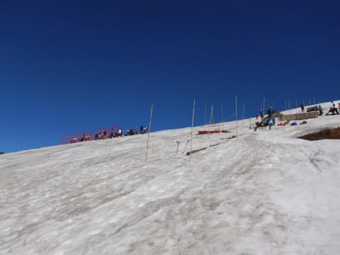
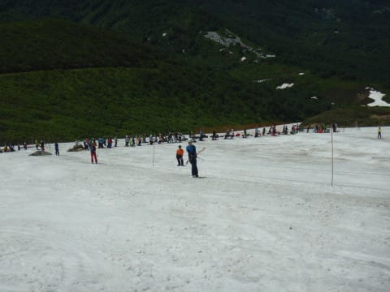

# 2020/6/21(日)の月山スキー場，詳細レポート！…滑れるエリアは狭くて混んだけど，終日晴天の絶好スキー日和！

📅 投稿日時: 2020-06-24 03:26:36

ということで．

本日は…

昨晩，死んだように寝てしまったために

書きそびれた日曜の月山詳細レポートを

お送りします～！

まず．

朝，月山の駐車場まで上がってきますが…

駐車場は満車ではないものの，

昨日より車が多いですね～…

うーん．

今日の天気予報は終日晴れ．

天気がいいから，今日は混みそうですね…

ちなみに，登山シーズンが始まったので．

スキーシーズンの駐車場500円の徴収はなくなり，

このプレハブ小屋で一人当たり200円を払って

入山します…

で．

昨日に引き続き，

大斜面＆沢コースが滑れないので．

滑れるのはリフトで登った上の

Tバーリフト周辺のみ．

滑れるエリアまでリフトで往復で，

リフトは滑って降りれません…（涙）

ってなことで．

朝イチのリフトで上に上がるわけですが…

8時の営業開始時には，登山の人を含め，

かなりの人がリフトに並んでました…

まぁ，こんないい天気ですから．

スキーヤーも登山客もいっぱい来ますわな…

うーん．

今日は混むだろうなぁ…

リフトで山頂に着きますが．

この時期恒例，リフトを降りてから

この矢印に沿って足場の悪い中を

歩いていき，雪のあるところまで

出ます…

さらに，雪のあるところを矢印に沿って歩き，

これでやっとTバーにたどり着けるという．

普通のスキー場で滑ったことしかない

人にとっては，

「なぜそこまでして滑る…」

という感じの，滑る場所にたどり着くまでに

体力を消耗する，苦行コース．

そうすると．

やっと山頂のTバーがかかっている

エリアに到着です…！

線に沿って，2本のTバーがかかってます．

ってなことで．

まず，雪のあるエリアまで歩き．

さらに，こんな感じの雪の積もった坂道を…

やっとTバーの麓まで上がってきました…

そして，Tバーの営業開始（9時前）まで待って．

営業開始のTバーに一番乗り！

いやーーー．

天気がいいですね～！！

てなことで．

あさイチのコースのてっぺんに出ますが…

昨日も書きましたが，コースはこの程度の長さ．

これで，Tバー1回200円．

11回回数券2000円（Tバー2本共通）

一日券3000円（どちらかのTバーのみ）

となります…

この，100m程度の長さで1本200円は’，

ちと高く感じる…

コースは圧雪がかかっているわけでないので．

あさイチは，誰にも踏まれておらず．

むしろコースは一番荒れてます(涙）

これから，人に踏まれて滑りやすく

なっていく感じなので．

あさイチシマシマフラットバーンの気持ちよさは

ありませんが…

でも，こんなきれいな景色の中で

滑れるのは最高っ！！！

昨日帰らなくて良かった．

今日滑れて，良かったっ！！

…けど．

さすが晴天の日曜日．

Tバーはすぐに混雑しはじめ…

9時半には10分待ち（涙）

人が増えてきたので，コース上も

にぎやかになってきて．

何本かあったコブラインもだんだん深く

なっていきます…

Tバーの列は，だんだん長くなっていきますが…

でも，Tバーの輸送力はそんなに高いわけでないので，

コース上はそんなにすごい人であふれるわけで

無く．クリアなコースを滑れます…

とはいえ．

10時近くになると…

もう，すごい列．

赤矢印の二つのTバー乗り場に向かって，

赤く囲った2本の列が伸びてますが…

Tバーは輸送力が低いので，

これで15分くらい待っちゃいます（涙）

だもんで．

列が長くなってくると，ハイクアップする人も

多数…

(この手前のRossignolの来シーズンモデルを履いているのは，某女性デモでは！？？）

まぁ，列がこれだけ伸びると．

ハイクアップした方が，よっぽど早く

上に到着しますね（涙０

結局晴天の日曜だったこの日は．

午後3時のTバーストップ直前，

午後2時半近くまでは，10分以上の

待ち時間が続きましたが．

でも．

この時期にいい感じで晴れたのに，

気温はそれほど上がらず．

ちょうどいい快適な気温だったし．

景色も良かったし．

あまり幅広くなかったけど，フラットな

バーンと

コブ斜面の両方が楽しめるし．

…もう，今シーズンは滑れないと

思っていたのに．

これだけ滑れれば，楽しいじゃ

ないか！！←たぶん，5月末までかぐらクワッドを滑り倒した普通のシーズンだったら，

この状況は楽しいと思えない．基準が狂っている)

ってなことで．

途中，景色が良い山頂に登って．

いい景色を眺めながらの，

最高のお昼ご飯を挟みつつ…

(コンビニおにぎりだけど）

午後も長いTバーの列に並んで．

月山から家までは遠いから，

早めに帰ろう，早めに帰ろうと

思いながら…

結局，Tバー営業ラストの

3時まで滑ってしまったのでした…

いやー．

でも．

ホントに今シーズンはもう滑れないと思ったのに．

なんとかシーズン中に，

また雪の上に復活することができて

よかった…

無事，シーズン終了の儀式を執り行うことが

出来ました…

混んでたけど．

Tバーはむちゃくちゃ待って，

滑るのはほんのちょっとだけだったけど．

日曜はいい天気でだったし．

この時期に滑れたってことで，

十分満足しました…

ってなことで．

私にとっての2020シーズン．

これにて終了です！

## 💬 コメント一覧

### 💬 コメント by (naoちゃんねる)
**タイトル**: Unknown
**投稿日**: 2020-06-24 19:45:29

9時半には10分待ち…の記事の所の写真、小学生位の女の子がいますね～

娘に「小学生滑ってるよ！行く？」と聞いた所、「絶対やだ！」とフラれてしまいました(笑)

シーズン終了お疲れさまでした！

最高の天気で良かったですね😄

### 💬 コメント by (yumi)
**タイトル**: Unknown
**投稿日**: 2020-06-24 23:02:02

Ｓさぁ～ん🎉🎵🎇 & naoちゃんねるさぁ～ん🎀😍✨

私も あの ちっちゃい子👧に 目が行きました✨

こんなちっちゃい子でも 上がって来るんだぁ〰️ーーー✌️

凄いなぁ～👍 エライなぁ～⤴️って💪

軟弱なワタシには・・・ムリ😢🆖⤵️

### 💬 コメント by (Skier_S)
**タイトル**: 月山は子供が楽しめる場所ではない気が…
**投稿日**: 2020-06-25 00:19:59

＞naoちゃんねるさま

いや，レーサーの小学校高学年くらいの子は何人かいましたが．

家族連れで，小学校低学年っぽいのはこの子一人だけで，かなり目立ってました…

普通の子供は，リフト降りてからTバーまでの移動に耐えられないと思いますので，

あまりお勧めしません…

でも，この女の子，かなり上手かったですよ！！

＞yumiさま

やっぱり，目立ちますか…

すごい上手い子で，コブとかもすいすい滑ってました．

しかし，滑りそのものより，あの状況でTバーまで

登ってきたのも

偉いし，

あれだけの待ち時間待てるのもすごいと思いました…

### 💬 コメント by (西館)
**タイトル**: なんだか一緒に終了の儀式を終えた気持ちになりました
**投稿日**: 2020-06-25 00:20:20

Sさんは荒れた時用の板は使わないのですか？それとも青三郎くん？

ところで昨日の続きなのですが、長板（大回り用板）は人が少ないゲレンデを高速でまさに大回りして滑降する時に履くんですよね？（何を今更･･･）

あまり使えないから長持ちしそうですね。

となると長板は良いの買って、短板は買い換えの覚悟を決めて選べば良いかなと思ったり。

まだ悩んでいるんですよねぇCURV BOOSTERをそれぞれ付けるかどうするかなんですけど。

3本お買い上げはほぼ決定で太板はLINEベーコンしょーてぃにするつもり。体重重いのが心配だけど安いから。

長板は165cm、短板は155cmまでは決めました。

相棒くんと滑り始めてから20年弱で、ほとんど何も買っていないのに２シーズン前から靴、ウェア、メット、手袋、そして板4.5本！めちゃくちゃスキー業界に貢献しまくってるよ我が家、大丈夫か、正気の沙汰かご乱心かやけくそか？、そろそろやばいのか

昨日つぶやいた「重い･･･」についてですが、15年前履いていた板は先ほど測ってみたところビンディング込み両足で5.5kgだったので、何を買ってもそれよりかは軽かろうと思いました。

いやぁ前代の板(思い出用板)を履いていた２シーズン前までは、リフトに乗っていると足首がどんどん痛くなったものですが、20000ｍの時には痛くならなかったなぁと思い出し、あっ、原因は板の重さではなくて靴かと。

昔の買い方は足のサイズ＋10mmだったのですが、昨シーズン買い換えるまで15年間履き続けたためソールがへたってぶかぶかでしたから。バックル締めたまま履けちゃったりして。あはははは。リフトの上で脱げなくて良かったなぁ。

滑り出しちゃえば重さなんて関係無いかな～なんて甘いですかねぇ。

### 💬 コメント by (ikkun)
**タイトル**: Unknown
**投稿日**: 2020-06-25 12:30:59

お疲れ様でした二(笑)  真なるスキー大好きな方々………頭が上がりません(^^)  「グリーンseasonは？」と云われたら「リフトがなきゃ山には上がらないんですよ？」と しかし素晴らしいなぁ❤️

### 💬 コメント by (Skier_S)
**タイトル**: >西館さま
**投稿日**: 2020-06-25 23:39:42

荒れた雪は，SXがあれば乗り切れます…

大回り板は，朝イチ焼額でしか履きません．

ゲレンデの人が増えてくると大回り板では危険なので，

小回り板のSXに履き替えます(笑)．

板が重いと疲れるので，一日滑りたいなら軽い板をおススメします．

The Curvなら，Booster付きよりDTXがいいかと．

リフトに乗ったときとかも重い板は辛いし，

荒れた雪ではかなり脚力に来ますよ…！！

### 💬 コメント by (Skier_S)
**タイトル**: ＞ikkunさま
**投稿日**: 2020-06-25 23:40:19

無事シーズン終了しました(笑)

