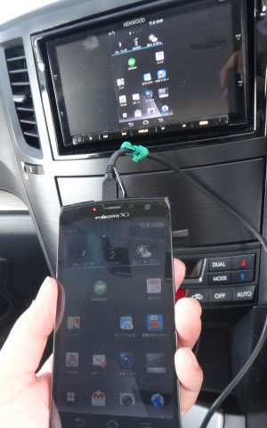
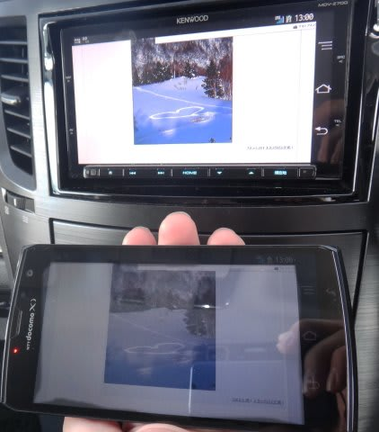
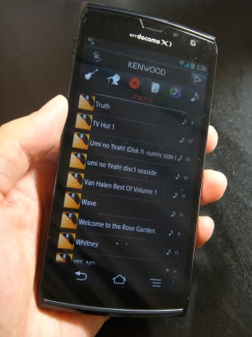
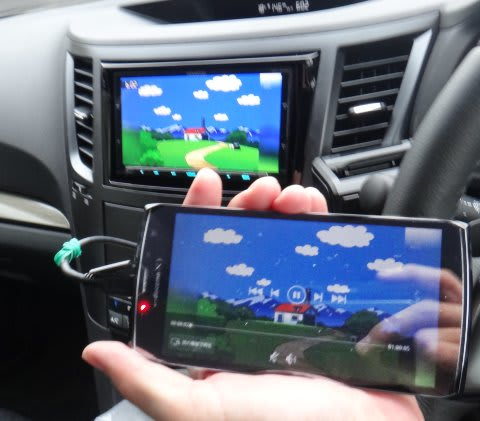
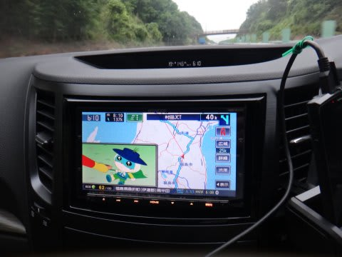

# プロジェクトX第2章…最終話，ナビのMHL接続機能は便利だよ～．

📅 投稿日時: 2013-07-12 00:48:38

🏷️ カテゴリ: [車](cba0e8330b3f2ded7c1addfacc75d4547.md)

えー．

なんだか，私のYoutubeの設定がまずくて．

昨日あたりから，Blogに貼り付けてあった動画が見れなくなってたみたいですが…．

もう，直っています．

すいません．

ってことで本題．

昨日はナビのAV機能について説明しましたが…

今日は，ナビのMHL接続の便利さを語るのだ．

…MHL接続，便利なのだ．

MHLケーブルをスマホにつなげば．

スマホを充電しながら，スマホ画面をそのままナビに表示できちゃうのだ！

ブラウザ画面だろうが動画プレーヤーだろうが何だろうが，

スマホ画面に映っているものをそのまま表示できるのだ！

当然，スマホの音楽プレイヤーの画面をナビで見ることもOK.

＃操作はスマホ側ですることになりますが…

Kenwoodのナビ対応音楽再生ソフトをスマホにインストールすれば．

ナビのタッチパネルで，MHLで繋いだスマホの再生ソフトを完全に

制御できるようになるのだ…！

こーゆー感じのソフトと同じ画面がナビに表示され，

スマホ画面と全く同様に，ナビのタッチパネルで操作できます

＃ただしこのKenwoodの音楽再生ソフト，操作コマンド制御用に

＃Bluetoothを使うので，厳密に言うとMHL+Bluetooth接続．

で．

もちろん，メイン目的の．

[スマホにコピーした，持ち出しテレビ録画番組](e038bad1799d46b330a28f38da3a2d5d4.md)を

見ることもできますし．

ピクチャーinピクチャーで，ナビ画面の脇に動画を映すことも

できますし．

…これで，子供を長時間乗せるときの，強力な武器ができたのだ！

＃ながきに渡ったプロジェクトX第2章も，とりあえずこれにて終了…

## 💬 コメント一覧

### 💬 コメント by (ほっそん)
**タイトル**: こんにちは
**投稿日**: 2013-10-14 11:16:20

初めてコメントします。レガシィ検索で辿り着き、おもしろくてプロジェクトX全部見させて頂きました！

僕もレガシィ検討していて非常に参考になりました。

まだ独り身なので家族を説得しなければ・・・ってことはないですが、一層レガシィほしくなりました（＾＾）

### 💬 コメント by (Skier_S)
**タイトル**: ほっそんさま
**投稿日**: 2013-10-15 02:25:32

ようこそ，わが駄文置き場へ…(笑）．

こんな駄文でも，いくばくかの参考になったのなら

良かったです…

ほっそんさんは，スキーしたり雪道走ったりする

方ですか？

4WD必須な生活しているなら，他者の4WDと比較すると

かなりお買い得で，よくできた車だと思いますよ～！

＃他社のFFと比べると普通だけど，

＃4WDと比べるとオトク！

ぜひご検討を！

