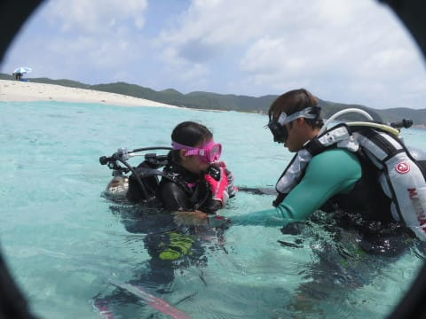
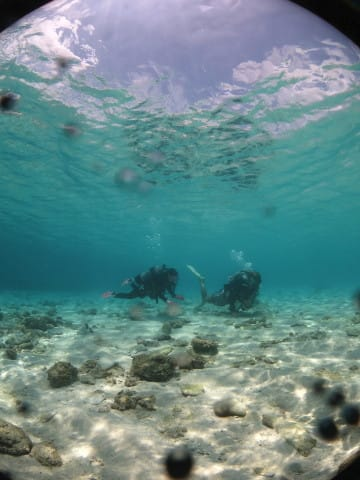
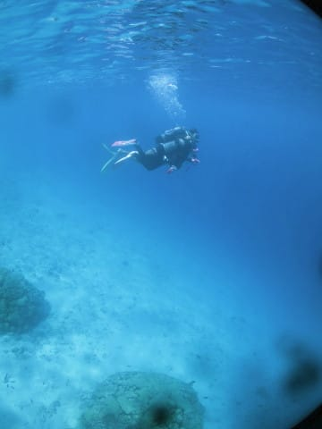
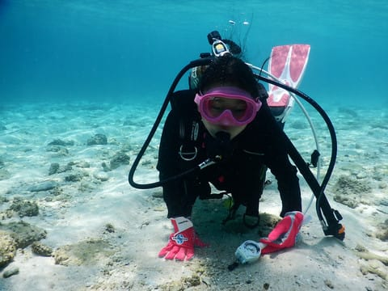
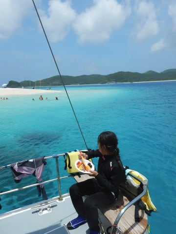
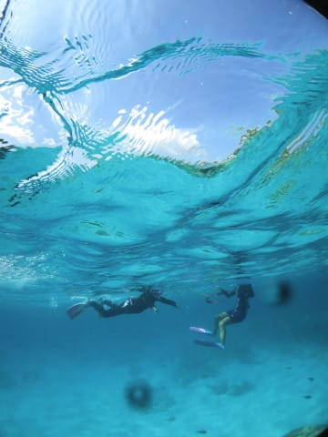
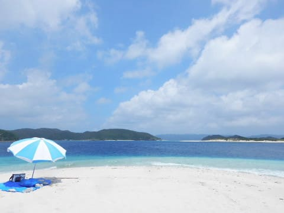
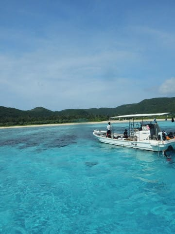
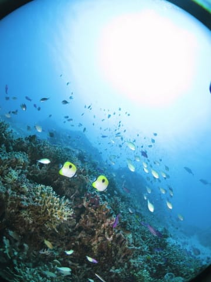
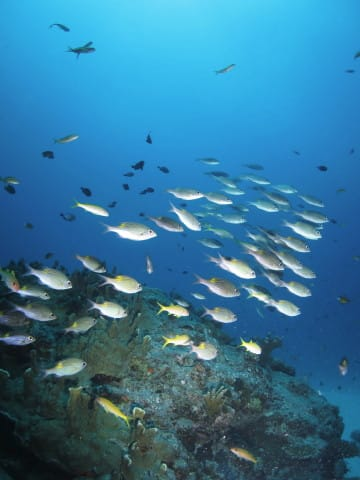

# 2017年8月，小学生の子連れで座間味でダイビング…エピローグ

📅 投稿日時: 2018-08-11 00:18:42

🏷️ カテゴリ: [ダイビング日記](ce3a7a8d424d112fce83ee85c81a0e344.md)

なんだか．

車ネタとダイビングネタが入り乱れてますが．

今日はダイビングネタです．

では，どうぞ～！

---

1歳のころから[ダイビング旅行に連れて行かれ](ed1a0981df33d8e447e4cb50a3f342544.md)．

[2歳](e71f0faf0d2dbf98590a16bb7abe5a502.md)，[3歳と2年続けてダイビングクルーズ船に
乗る](ed51443fc2a47ba9d20653f96ae4a0c2d.md)…といった感じで．

物心つく前から，ダイビング旅行に連れて行かれ

まくっている，わが娘．

「自分も早くダイビングをやりたい～！！

　いつになったらできるの？」

…と．

幼稚園の頃から，ダイビングをずっと

やりたがっていたのですが．

Cカードは10歳にならないと取れないけど．

体験ダイビングなら，10歳になってなくても

できるよね．

「娘にダイビング適合性があるか，Cカードを

　取らせる前に，一回潜らせてみよう…」

と，思ったわけで．

いや，

「10歳になったから，Cカード取らせよう！」

と，娘をいきなりダイビング講習に放り込んだ場合．

実際ダイビングをやらせてみると，

娘の想像と違って，実際のダイビングは怖く感じて，

結果的に，途中で嫌がってリタイヤ…

とかいうパターンも考えられるので．

…そうなったら，娘に嫌な思いをさせるだけだし，

なによりかにより，講習費用がもったいない．

とりあえず．

娘にダイビング適合性があるのか？

ってところを，講習を受けさせる前に

確認しておこう！

…という目的で，今回体験ダイビングを

やらせてみたわけですが．

わが娘．

驚くべき適合力．

さすが，潜りたくて潜りたくて仕方なかった

だけのことはある…

マスククリアのトレーニングなんかも

難なくこなし．

水中を全く怖がることもなく．

…水中での動き，変な初心者ダイバーより，

よっぽど落ち着いてるよ…！

で．

終わって一言．

「面白かった～！！！！！！

　また潜りたい！！！！」

…この言葉を聞いた瞬間．

決めたのだった．

10歳になる来年は，娘にジュニアオープン

ウォーターダイバーのCカードを取らせよう

と…

家族3人．

同じ趣味で楽しめるなんて．

素晴らしいことじゃないですか…

「よし．

　来年は，家族3人で．

　…一緒に潜ろうか！」

娘がダイビングを好きになってくれたことに．

感謝！

　

　

　

## 💬 コメント一覧

### 💬 コメント by (yama)
**タイトル**: 志賀高原情報
**投稿日**: 2018-08-11 08:42:33

夏休みで志賀高原に来ています。昨日は大沼池に行って来ました。そこで一の瀬３高速下の蕎麦屋のおじさんに会いました｡サンバレーの２本とブナ平のリフトの３本が、撤去されるようです。ここまでは想定内でしたが、一の瀬荘が取り壊しに入ったと言われ見に来ました。残念ながらブルドーザーが、入って一部が壊されていました。雨が止みそうにないので一旦帰ります。

### 💬 コメント by (ほっぽ)
**タイトル**: 夏休み
**投稿日**: 2018-08-11 09:19:26

yamaさん

夏休みに志賀高原で避暑、いいですね。

こちらは連日の酷暑、この時期は暦通りなのでややお疲れモードです。

サンバシングルとペア、ブナのクワッドが撤去ですか。

そして一の瀬ファミリーに面した一の瀬荘も取り壊しですか。

負の連鎖が止まりませんね。(T_T)

今シーズンも出来る限り通って、少しでもお金を落としたいと思います。

### 💬 コメント by (yama)
**タイトル**: 夏休み
**投稿日**: 2018-08-11 16:49:10

夏休みはわりと取りやすいと思います。ただし、必ず土日祝日が休めるとは限りません。７月の３連休は全て出動でした。８月中に代休は取り切れません。夏休みを２月まで取れないのも疲れが溜まりそうですね。その代わりスキーには良いですね。

　中野まで下りたら晴れてきたので再び志賀高原まで上がってヤケビ山頂の稚児池まで行きました。明日は岩菅山の予定です。スキーに向けてのトレーニングです。イエティまでには体力を回復してmaeさん、Hguchiさん、コンスケさんに置いて行かれないようにしたいと思います。

　S様、掲示板代わりに使ってすみませんでした。

### 💬 コメント by (Skier_S)
**タイトル**: 志賀高原への忠誠心が高いですね…
**投稿日**: 2018-08-12 11:15:49

＞yamaさま

うーむ．

ついにブナ平クワッド撤去ですか…

そしてサンバレーも…

発哺クワッドが残ってくれても，

最後の急斜面があんなジグザグコースに

なったままだったら，誰もあそこは滑らない

だろうから…

発哺クワッドもヤバいかもしれませんね．

さらに，一の瀬荘も取り壊しですか！

もったいない…

志賀高原も海外資本を入れないとじり貧

のような気もしますね．

和合会は許さないでしょうけど…

＞ほっぽさま

ぜひ志賀高原にお金を落としてください．

シーズン券をもっていて，お昼を持ち込んで

ゴンドラで食べちゃう私は，あんまり志賀の

売り上げに貢献してない気がします(笑)

