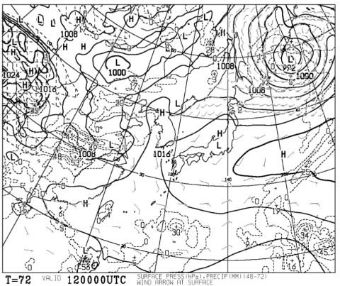
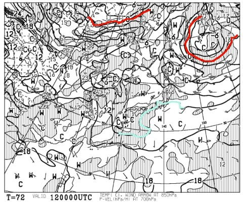
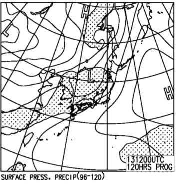
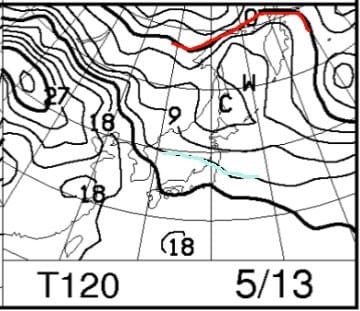
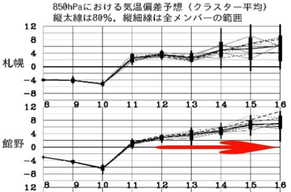

# 5月12，13日の週末のかぐらスキー場の天気は…土曜は晴れ，日曜は曇りかな．どちらも暑いよ（涙）

📅 投稿日時: 2018-05-10 01:34:00

🏷️ カテゴリ: [スキー天気予想](c6554f5c3c106093b511a8daae23757e8.md)

えー．

そろそろ，スキー場の天気を気にする人も

極めて少なくなってきていると思うのですが．

…ええ．少なくなっていると思うのですが．

でも．

まだ，かぐらスキー場は営業しているのだ！

まだスキーシーズンなのだ！

…ってなわけで．

今週末も，水曜深夜恒例のスキー場天気予想．

今回からは，かぐら編です…

えー．

まず．土曜12日の地上天気図を見ると．

あー．

高気圧の勢力下なので，晴れそうですね．

そして．

この時期，あまり見ても意味のない850hpa気温を

一応見ておくと．

うむ．赤い0℃線はもうはるか北．

もう，絶対雪が降るような気温には下がりません．

水色の+12℃線が近づくほどなので．

朝から+10℃近く．

昼間は暑いくらいに気温が上がるでしょう…

次に，日曜の地上天気図ですが．

うーむ．

網掛けの降水域が新潟近くまで

延びてますが．

まぁ，リフト営業終了までは降らずにもつでしょう…

そして．

こちらもいまさら見てもどうしようもない感がある

850hpa図ですが．

もう，赤い0℃線はどこに行ったのやら…という感じで．

この日も，+12℃線がかぐらより北に行っています．

気温が上がりそうですね…（涙）

とりあえず．

まとめると．

土曜：朝から晴れ．終日晴れ．

　暖かい…というより，暑い一日．

　朝から雪はザブザブ．滑らない雪．

日曜：朝から雲が多め．午後は完全曇り．

　もしかすると，午後はガスも出てくるかも？

　気温は朝から高め．+15度くらいまで上がるかな．

　でも，午後は日が射さないので暑くは

　感じない．

　この日も雪質に期待してはいけません

という感じでしょうか…

そもそも．

木曜の10日まで，結構冷えた日が続きますが．

11日から，またかなり気温が上がりそうな気配…

12，13日は平年比+2～4℃，14日以降は

それ以上の高温になりそうです…（泣）

あぁ…

かぐら，予定通り5月最終週まで営業できるんだろうか…
