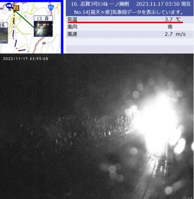
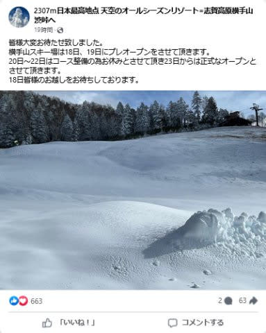
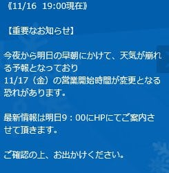
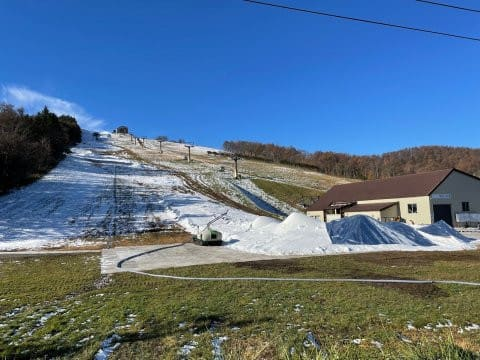

# 17日朝4時現在，志賀高原では雨(涙)．でも横手山18，19日はオープン予定！？？イエティは17日の朝9時に営業開始時間判断

📅 投稿日時: 2023-11-17 04:30:02

今日も一日バタバタしていて…

気づくとこんな時間．

もう朝4時だよ…(泣)

明日も都内出張なんですが？

3時間しか寝られないんですが？？

今週もヘビーな日が続いてます(涙)

今週末も滑りに行かなくてはならず．←義務じゃないから

死なないようにしないといけないので．

Blogは手短に書いて寝ます…

で．

本日17日朝4時の段階では．

志賀高原も気温は+3℃を越えており，

すでに雨が降り始めてます…(涙)

この雨は，17日の夕方近くまで降り続け，

一時的に強く降ります…(泣)

（[北信建設事務所道路気象状況カメラ](http://hokushin.pref-nagano-roadcamera.jp/)より)

だのに．

こんな天気なのに．

横手山は17，18日に営業するとアナウンスが

ありました…！！

([横手山Facebook](https://www.facebook.com/yokoteyama2307/?ref=embed_page)より）

ただ．

18，19日の2日限定プレオープンで，

20日〜22日はコース整備の為クローズ

みたいなので…

たぶんぎりぎりオープンできるかも？という

判断ですね…

むしろ18日に雪が降る予報なので，

19日から安泰になるはずのところ，

20日に再クローズする予定というのは，

ホントに際どいんだろうなぁ…

でも．

今日の雨を乗り切れるのかな…？

一方．

本日の雨＆風の悪天候を見越して．

イエティは朝9時に本日の営業判断すると

言ってます…

（[イエティホームページ](https://www.yeti-resort.com/)より）

うーん．

おそらく結構な雨と風だし…

今日は営業しないで，コース保護に努めた

ほうがいい気がする…

何とか今日の雨を乗り切ってほしい…

で．

本来なら今から1か月近く前にオープン

していたはずの菅平．

今日，最新の写真が菅平のFacebookに

載ってましたが．

…まだまだコースがつながってませんね…

これ，オープンまであと1-2週間はかかる

のでは？

（[菅平高原スノーリゾートFacebook](https://www.facebook.com/sugadairasnowresort/posts/pfbid0NpnLFkUkaZk99FvW19NGvFRjwiTs3ngZ6ogJoJJpTqRPGNBtJ5EGFuPtxjsiv1VLl?ref=embed_page)より）

12月オープンになると，アイスクラッシュじゃなく

普通の人工降雪でのオープンとそれほど

変わらない気が…

とりあえず．

熊の湯も18日オープンはとても無理っぽいし．

そのあとは，23日まで気温が高くて人工降雪機が

動かせなさそうな天気が続くとなると…

横手山，23日再オープンって言ってるけど，

実際は厳しそうだし．

早くても25日ごろのオープンになりそうな予感…

うーん．

今シーズンも，雪不足のスタートなのか…（激涙）

## 💬 コメント一覧

### 💬 コメント by (真美子)
**タイトル**: Unknown
**投稿日**: 2023-11-17 08:11:56

朝7時。

軽井沢も、冷たい雨が降っています。

### 💬 コメント by (Skier_S)
**タイトル**: ＞真美子さま
**投稿日**: 2023-11-18 00:50:58

軽井沢も雨ですか…（涙）

でも，土曜から冷えます！軽井沢は土日は降らなさそうですが，日曜夜から月曜朝は

雪が降るかも…！

そろそろスキー場には雪が積もってほしいところです…

