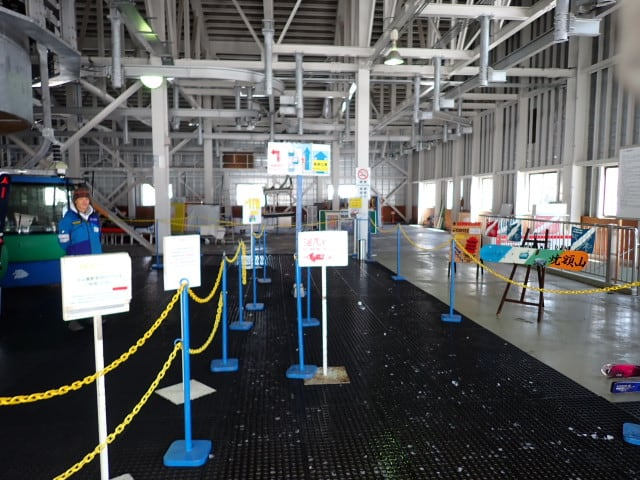

# 2025/3/22(土)の志賀高原焼額山スキー場は…終日晴天！でも高温で雪は緩んで一部ストップ雪(泣)

📅 投稿日時: 2025-03-23 00:09:44

🏷️ カテゴリ: [2025スキー滑走日記](cacd3fbf84d4a679ee61a5894c3f95e14.md)

ということで．

木曜に志賀高原で滑り，金曜家に戻って

一日仕事して…今日また志賀高原へ舞い戻って

来ました～！！

…でも．

なんだか．

木曜日から中1日過ぎただけなのに

志賀高原の景色と雪質は，冬から春へと

一気に変わっちゃってたんですが…（泣）

木曜は除雪車が走っていたのに，

2日後の今日はもう，ゲレンデそばまで

路面に雪が全然ないんですけど？

（トンネル内や一部凍結してるのでスタッドレスは履いてきてね！）

で．

駐車場に到着すると，朝なのにもう気温は

プラスで，強い日差しもあって暑いくらい

なんですが…（泣）

とはいえ，天気がいいからか朝イチのゴンドラ

待ちの列は長めですね．

でも，祭日の木曜より列は短いですが…

そして，朝8:30営業開始のゴンドラで

山頂へ向かうと…

朝イチの山頂で，気温が0℃ですか（泣）

予想通りとはいえ，実際にこの気温を見ると

ショック大…

2日前から8℃も気温が上がるとは！（涙）

天気はすっきり晴れていていいんですが…

朝から暑いよ（泣）

でも，朝イチの雪は…

ガチガチに凍ったわけではない，

夜のうちにしっかり締まった感じの

エッジが効くのにスピードが出る

気持ちいいシマシマっ！！！

今日はGS板でしょ！！

という感じで，思いっきり気持ちいい

大回りでかっ飛ばせる快楽バーン！！

いや…

朝イチはいいよ！！！

…と，3－4本は気持ちよく滑れたけど．

やっぱり気温が高く，3月下旬の強い

日差しが降り注ぐので…

山頂付近はいい雪質が結構続いたけど．

日が当たるバーンや，コースの下のほうは

10時近くにはもう雪がボソボソし始めて

きて…

さらに容赦なく春の日差しが降り注ぎ

続けたので…

ボソボソを通り越して，11時近くには

日差しの強い唐松やブナ，オリンピックなどは

バーンがしっとりしてきちゃいました（泣）

ブナコースや唐松コース，2ゴンから1ゴンへ戻る

連絡コースなど，ちょっとブレーキがかかる

雪になってきちゃって…（泣）

GSコースとかはブレーキ雪にならなかったけど．

昼頃になると，重いモサモサ雪が溜まった

部分が出てきて，バーンが結構荒れて

来ちゃいました（泣）

ああ…違うよ…

先週と違い過ぎるよ…（涙）

とはいえ，

今日はリフトも最長でせいぜいこのくらいの

待ちで．

リフトは朝イチ一瞬待っただけで，

それ以外はほぼ待ちなしだし…

雪が悪くなって，昼にはみんな帰っちゃった

のか，ゴンドラも午後はびっくりするくらいの

ガラガラ具合！

だもんで．

春の雪がそれほど嫌いでなければ，

ゲレンデもガラガラだし，

楽しめないわけではないんだけど…

午後になると，気温はやはり予想通り

+8℃まで上がってしまい．

…これ，GWでも，暖かい日並みの

5月中旬レベルの気温なんですが…（激烈涙）

その強烈な高温のおかげで，GSコースは

結構荒れて来ちゃったし…

オリンピックコースは日差しで雪が

ボソボソのすごい状態になっちゃって

来ました（激涙）

唐松コースはしっとりして，妖怪板つかみが

出始めてきてたし…

天気は良くて，ガラガラでいいんだけど．

バーン状況は荒れて残念な感じに…

あぁ…木曜日と違い過ぎる（泣）

夕方近くになると，スキー場全域が春の

雪のボコボコで残念な感じに…（激泣）

あぁ…

2日前は天国だったのに．

わずか中1日挟んだだけでこんなに

なっちゃうとは…

まぁ．

とはいえ．

今日は終日天気は良く．

ゲレンデはガラガラだったので．

柔らかい春の雪が嫌いじゃない人は，

楽しめたんじゃないかな…

私は2日前ほどは楽しめず残念では

あったけど．

でも，春スキーと考えれば天気も良く

穏やかな天気で．

ゲレンデもリフトも混まずガラガラで，

ストップ雪になったのはごく一部だけで

板はわりと走ったし．

春スキーと考えれば，そこそこ楽しめた

一日だったので．

気が付いたら，日が傾く時間になっていて…

いつも通りの営業終了までしっかり

滑り倒したのでした…

まぁ，雨が降ったり視界が悪かったりも

なかったし．

板も滑ってくれる雪だったので，

春スキーとしては悪くなかったんだけど…

2日前とはあまりにも違い過ぎて．

季節がわずか中1日で，冬の冷え冷え

ゲレンデから春のゲレンデに変わって

しまったことにショックを受けたけど．

3月下旬だ，と考えれば．

一昨日が異常に良過ぎたんだろうなぁ…

まぁ，明日も天気が良くて，気温も上がり

そうだけど．

今日ほどは気温が上がらないだろうから…

今日よりはマシかな？

## 💬 コメント一覧

### 💬 コメント by (ねも)
**タイトル**: Unknown
**投稿日**: 2025-03-23 05:35:00

お久しぶり！

野沢温泉に来ています。こちらも似たような、いやもっと暖かく、私はランチで撤退😅

同行者はＳさんのように、その後も滑ってました。スキー愛が凄いぞ！(笑)

今日は、昨日よりはマシでは？　期待しましょう✌️

### 💬 コメント by (レインボー77)
**タイトル**: Unknown
**投稿日**: 2025-03-23 16:18:56

日曜日の志賀高原情報

朝の蓮池+6℃。昨日よりさらなる強風。渋リフトに一番乗りするも、運転見合せ。試運転はしてくれていたのですが仕方ないよね。あとは第二リフト回しなんだけど、硬くて疲れるうえに、ここしかないのでリフト待ちが発生。根性なしは10時で終了しました。明日があるさ。

### 💬 コメント by (モイストシルバー)
**タイトル**: Unknown
**投稿日**: 2025-03-23 23:46:12

この土日は焼額山参戦しました。

なかなかの春雪でしたね。

柔らかいのがまだ救いでしたが、今日は妖怪が出て、14時でギブアップでした。この雪で営業終了まで滑れるのは凄いです。。。

### 💬 コメント by (Skier_S)
**タイトル**: 春ですねぇ…
**投稿日**: 2025-03-24 01:35:37

＞ねもさま

野沢は志賀より標高が低い分，春の雪の状態は志賀よりすごいことになりますよね…

志賀は，日曜も土曜とほぼ変わらない感じでした（涙）

＞レインボー77さま

あら．横手は雪が硬かったんですか…焼額は朝から緩めの雪でした（涙）

焼額は朝は第2ゴンドラが強風で止まってましたが，10時過ぎには第2ゴンドラ動き出しましたよ！

＞モイストシルバーさま

いやーーー．

焼額は完全に春でしたね…

木曜まで冬だったのに，一気に春になってしまって，季節の変化についていけません（泣）

でも，今日もラストまで滑りました～！

