# 2016年8月　子連れで再訪！モアルボアル旅行記その13…2日目の2本目も，潜りに行けるの！？？

📅 投稿日時: 2017-09-11 01:43:36

🏷️ カテゴリ: [ダイビング日記](ce3a7a8d424d112fce83ee85c81a0e344.md)

ということで．

このBlog．

スキーネタだけじゃなく，車ネタでも

そこそこの訪問者があるので．

ダイビング日記のみが圧倒的な不人気と分かった

今日この頃．

みなさまいかがお過ごしでしょうか．

ということで．

今日もいつもの不人気ダイビング日記です～！！←自棄になってないか？？

---

ってな感じで，癒しの海といった感じの，

1本目のダイビングが終わり．

2本目のダイビングポイントへ移動するわけですが…

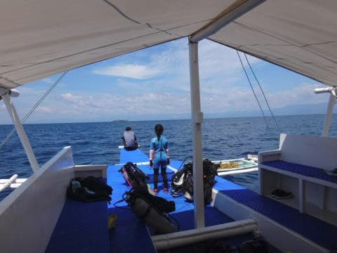

ボートは沿岸から離れ，沖に向かいますね～．

…そうです．

今日の2本目のポイントは．

モアルボアルの沖合に浮かぶ，

ぺスカドール島！

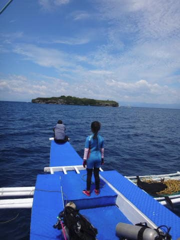

モアルボアルからボートで20分ほどの，

大きさ100mほどの小さな島で．

その周り全体がサンゴのスロープで囲まれた，

モアルボアルで一番のダイビングポイント．

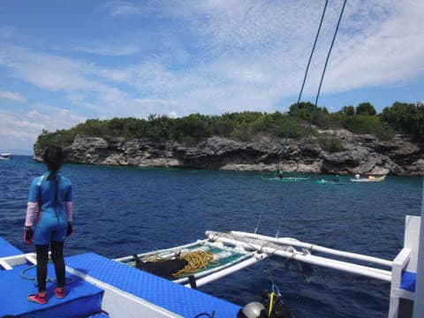

ってか．モアルボアルと言えば．

ぺスカドール島とイワシですね．

普通のダイビングショップだと，ぺスカドール島に

潜りに行くときは，遠征料金が取られたりしますが．

今回利用しているエメラルドグリーンダイビングセンターでは，

遠征料金なしでぺスカドールで潜れるのが，嬉しいところ！

ってことで．

ぺスカドール島に着きますが…

本日一緒に同船している，シュノーケリング

参加のお姉さん．

すごく優しい人で，娘と一緒に遊んでくれてます…

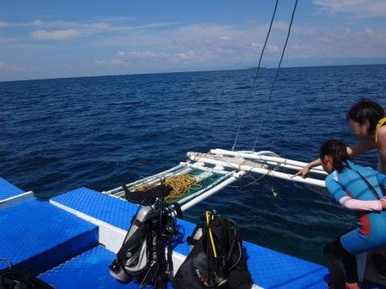

ダイビング1本目の間，シュノーケリングしている

ときも，娘と一緒に泳いでくれたようで…

ぺスカドール島に着いてからのシュノーケリングタイムでも，

一緒に泳いでくれてますね～…

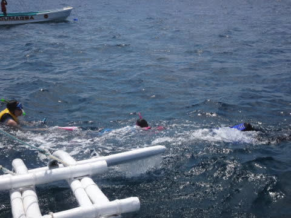

そろそろ，ダイビング組は2本目の

ダイビングへ向かう時間なんですが．

…本来なら，今度は私が娘とお留守番なんだけど．

…これなら，行けるか？？

私「娘～，お姉さんと一緒に泳いでるの，楽しい？」

娘「楽しい！」

私「お姉さんとガイドさんがいれば，私は一緒に泳がなくても

　大丈夫だよね…

　…

　…

　二人そろって潜りに行っていい？？」

娘「大丈夫！」

うおおおお！

ありがとう，娘！

そして優しいお姉さん！

2本目，おねえさんとボートスタッフに

娘をお願いして．

夫婦そろって，潜りに行けることに！

では，2本目のぺスカドール島へ．

夫婦そろって，潜りに行きますか～！

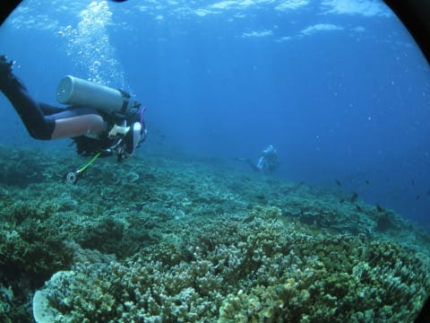

さすが，ぺスカドール島！

エントリー直後から，お魚ごっちゃり！

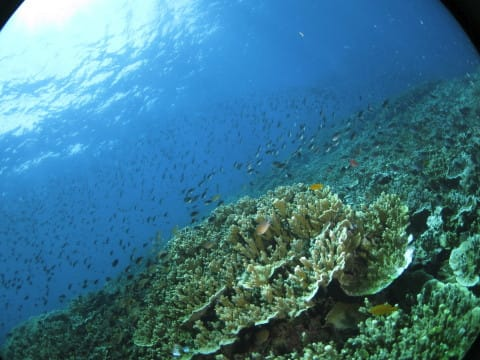

うほー！

なんだ，このお魚密度はっ！？？？

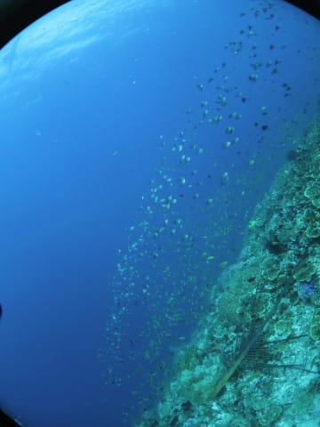

さすが，ぺスカドール島！

1本目のポイントもきれいだと思ったけど…

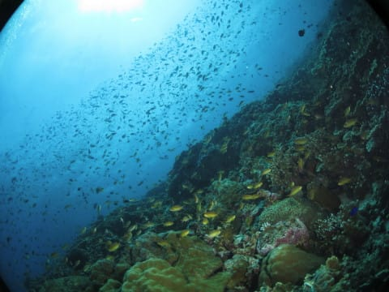

やっぱり，ぺスカドール島は．

純粋にきれい！

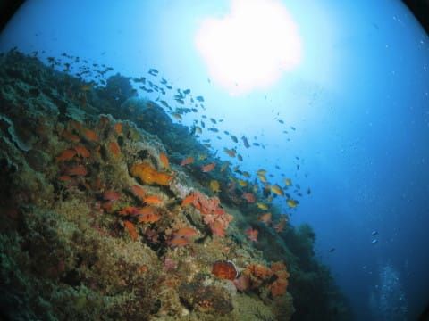

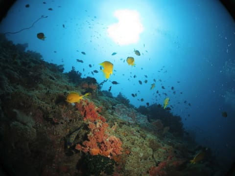

こんな景色を，ゆっくり眺めながら．

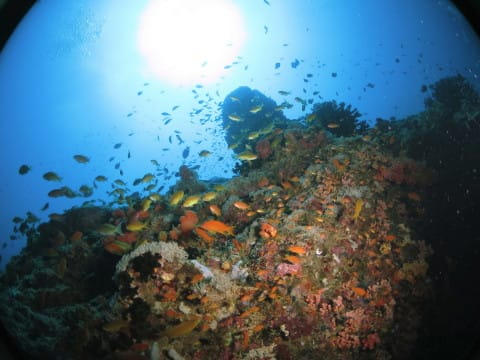

流れの無い島の周りを，ゆったりと漂います…

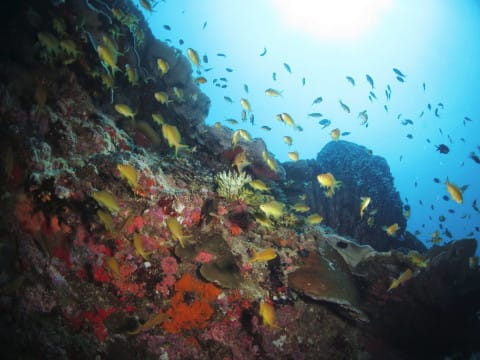

どこを見ても，すごい魚密度だ…

そして，サンゴの中にはいくつかのマクロものもいて．

ハダカハオコゼや…

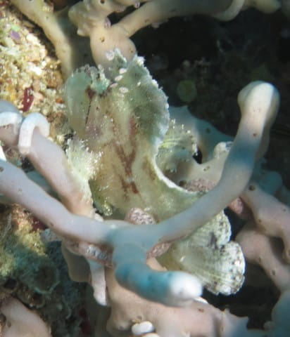

（サンゴの間にいて撮りにくい…）

ちょっと大きくてかわいくない，

オオモンカエルアンコウとか…

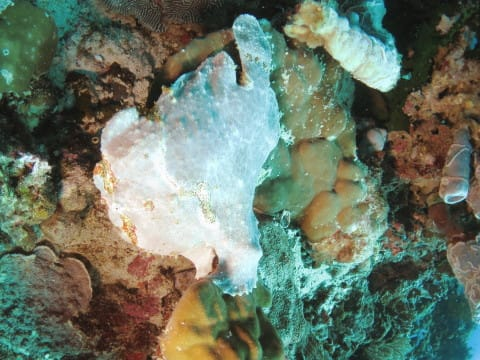

フィリピンブレニー

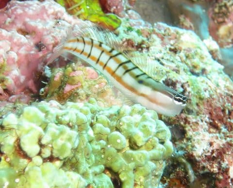

…そして，これは初めて見た．

ラジアルファイルフィッシュ．

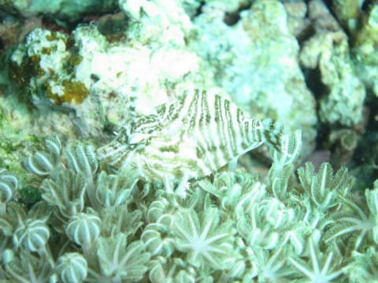

上手く擬態していて，小さかったので，

かなり写真に撮りにくかった…

ってことで．

マクロものも．

サンゴ＆高密度の魚も楽しめた，

ぺスカドール島のダイビング．

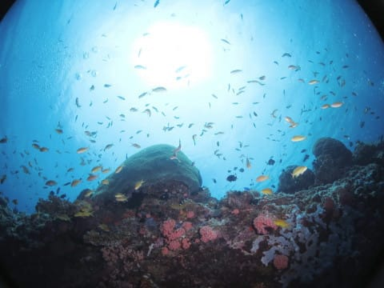

娘が二人で潜りに行かせてくれたおかげで，

楽しむことができたよ～！

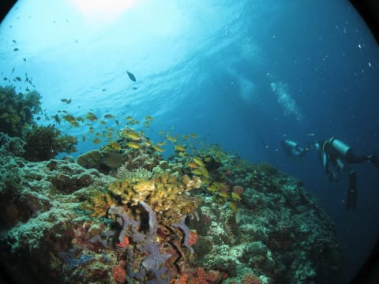

と，娘に感謝しながらの，

2本目のダイビング終了です…

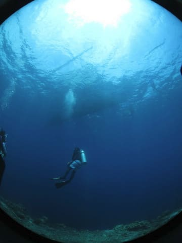
