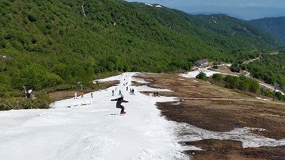

# 明日，ファイナルかぐらへGo！

📅 投稿日時: 2015-05-31 00:05:12

🏷️ カテゴリ: [日記](cc4b5682fb7b8b144980957a978653fb0.md)

ということで．

明日，明け方にかけて，雨が降るかもしれないけど．

リフト営業時には止んでいるはず！

基本的には曇り，時々晴れ間もあるかな？

って感じの天気の日曜日…．

ついにやってきた．

今シーズンのかぐら，営業最終日です．

…でも．

なんだか．

すごい雪が溶けましたね…（涙）．

メインバーンもこんな感じで，廊下になりつつあるようです…

（かぐらBlogより）

まぁ，まだクワッドを動かしているのが

すごいところ．

ってことで．

ロープウェー～ゴンドラ乗り場まではバス移動．

ゴンドラコースも滑って下山は無理…

さらに，かぐらはなんとか滑れるものの，廊下状態…

という状況ではありますが．

とりあえず．

あした，日曜．

かぐらの営業最終日，行ってきます～！
