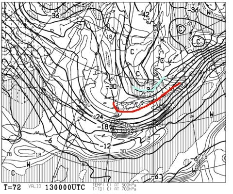

# 1月13，14日の週末の志賀高原スキー場の天気は…13日は曇り～雪，14日は晴れそう．冷え冷えの週末

📅 投稿日時: 2018-01-11 04:33:20

この年末年始，12日で10日間スキーをするという

シアワセな期間を過ごしてしまったおかげで．

社会復帰に苦労しているSkier_Sです．

…でも．

あと2日働けば，また週末なのだ！

ということで．

水曜深夜定番の，この週末の天気予想をば…

えー．

TVなんかでは，ものすごい寒気がやってきて

大雪になるようなニュースをやってますが．

ダメです．

志賀高原には雪が降らない西風です．

11日も，それほど積もらなさそうです…（涙）

金曜日，12日の地上天気図を見ても．

天気図はきれいな縦縞ではなく．

西風になってしまう天気図で．

日本海に伸びる水色の降水域が，

矢印のように西から東に流れているのが

見てとれます…

ダメです（涙）．

このパターンだと，志賀高原はそれほど積もりません（泣）．

雪はパラパラ降るかもしれませんが，

それほど積もらず．

時折日が射す程度の天気だと思います…

8～9日の雨で固まった下地が隠れきらず．

人が滑る急斜面は，アイスバーンっぽい下地が

出てきそうな感じ…

で．

13日の土曜日の地上天気図を見ると．

この日も天気図はきれいな縦縞ではなく．

雪雲は西から東にたなびいているように見えます…

日本付近を拡大すると．

赤く塗った北アルプスにブロックされて．

雪雲はそれより東へ伸びてません…

志賀高原へは雪雲が届いてません…

だもんで．

「大雪」

ってニュースやってますが．

志賀高原はそれほど積もらず．

うーん．

8-9日の雨で固まった雪が，

それほど隠れてくれなさそう…（泣）．

で．13日の850hpa気温は．

赤く塗った0℃線は日本のはるか南だし．

水色で塗った-9℃線が志賀高原に

近づいているくらいなので．

朝は-10度以下，-12℃くらいまで冷えそう…

うん．気温は冷えそうなんだよな…

500hpa気温図を見ると．

そこそこの雪の目安，赤色で塗った-30℃線が

日本の南にまで下がるので．

ものすごい冷え．

大雪の目安，水色で塗った-36℃線が

志賀に近づいているくらいなので．

うーむ．

根性がある雪雲が，北アルプスを越えてくるかも…

まぁ，13日は終日雪がちらついて，

曇ったり時折日が射したりと，

目まぐるしく天気が変わる一日かな．

で．

日曜14日ですが．

850hpa図を見ると…

この日も赤い0℃線ははるか南．

水色の-6℃線が志賀に掛かっているので．

朝の気温は-10℃近くまで冷えて．

昼間も-5℃程度でしょうか．

まぁ，そこそこの冷え具合．

そして，日曜の地上天気図を見ると…

うむ．

高気圧に覆われて，すっきり晴れそうですね．

朝は締まったハイスピード圧雪バーンに

なるかな～．

午後はまた固い下地が出てきそうですが…

ってことで．

まとめると．

金曜：曇り時々小雪がぱらつく．

　時折日も射す．結構な冷え込み．

　積雪はそれほどなく，午後になると

　急斜面は下地のアイスバーンが出てくるか…

土曜：曇り時々小雪．

　雪雲の切れ目では日も射すような，

　目まぐるしく変わる天気．

　朝の気温は-12度程度と激冷え．昼も-10℃近い．

　朝はうっすら積もった雪が圧雪されて，

　滑り良いバーン．

　昼ごろになってくると，急斜面では下地の固いのが

　出てきて．

　午後はちょっと荒れ気味斜面，硬い下地の上に

　こぶができてるようなバーンになっていくか…

日曜：朝から晴れ．

　気温は-10℃近くまで冷え込み，朝イチは

　締まった圧雪バーン．

　でも，じきにバーンのところどころに固い

　下地が出てくる状況になっていくか…

　昼間も晴れるのに，-5℃程度までしか上がらず．

　ところどころ下地が固い以外は，

　快適なスキー日和か…

という感じで．

一部リクエストがあったので，

今回は金曜の予想もしてみましたが…

で．

うむ？

なんだ，これは？

うむむむ？

週末以降の16，17日．

0℃線が，志賀の北まで上がっちゃってますよ！？？？

週末以降，気温が上がりそう…

そして．

17日は，降水域の網掛けが…

17日は降りそう…

でも．

このままなら，ギリギリ志賀は重い雪程度で

留まってくれそうかな…

標高の低いスキー場はヤバそう…

平日スキーを狙っている人は，17日は避けた方が

良さそうな感じ．

うーむ．

12月は冷え冷えで恵まれていたけど．

1月は，なんだか時々高温に襲われるなぁ…．

また雨になって，アイスバーンにならなきゃ

いいけど…（泣）．

## 💬 コメント一覧

### 💬 コメント by (かず)
**タイトル**: Unknown
**投稿日**: 2018-01-11 05:54:34

中野あたりから降り始め　今下の７です　気温-3℃重そうな雪結構降ってます　今日のアイスバーンの状況僕のブログにあげておきますよー

### 💬 コメント by (yumi)
**タイトル**: 悲しい😢💦バーン
**投稿日**: 2018-01-11 07:37:21

Ｓさぁ～ん💧

悲しい😢💦お知らせが・・・

Ｓさんの予想通り、立派なアイスバーンに仕上ってます。

火曜日はザクザクの下地に、お湿り雪⛄️さんが乗って、朝一は  ＋３℃で 妖怪足掴み（まうちゅうさん命名）が出て来そうな感じでした。

その後、気温がどんどん下がり、ガタガタのままカチカチに💧💧💧

即！撤退！！

水曜日は立派なアイスバーンにしあがってました。

おくしーは悲しいキャタピラー後の間から 殺人コロコロ（Ｓさん命名）が出て来て、白樺くんへ逃げました。

ここも立派なアイスバーンでしたが、優しい斜面と、極小コロコロだったので何とか滑りました。

今日は、少し積もりました。

では、行ってきま～す🎵

### 💬 コメント by (まいる)
**タイトル**: 今月の予定
**投稿日**: 2018-01-11 12:40:48

Sさん、お疲れ様です。

恒例？ の天気予報ありがとうございます。

今週末は近場で滑る予定ですので、私のところはそこそこ降るのかなと思っています。

1/20-21で志賀高原を予定してます。今シーズンは一緒に滑れるとよいですね。

### 💬 コメント by (タカ)
**タイトル**: 金曜の天気・・・
**投稿日**: 2018-01-11 18:30:18

金曜の予報ありがとうございます❗リフトは止まることはなさそうなので一安心です。が、アイスバーンか。この時期に存在するんですね。頑張って滑ります❗

### 💬 コメント by (いか)
**タイトル**: Unknown
**投稿日**: 2018-01-12 00:19:43

天気図予報は見ておりましたが、やはり来週は雨ですか、、、

土曜日はお昼に東京で用事がありますので、ナイターから出かけようと思っているところですが、きれいな圧雪中斜面を滑るには、志賀だと一の瀬ダイヤモンドかサンバレーでしょうか？(日曜日はいつもの通り白馬に戻る予定にしておりますが、、、)

### 💬 コメント by (Skier_S)
**タイトル**: やっぱりアイスバーンですか…
**投稿日**: 2018-01-12 02:11:07

＞かずさま

あー．

やっぱりアイスバーンの上の新雪だったんですね．

新雪の下が凍ったコブって，辛いですよね…

今週末までに何とか雪が積もってアイスバーン

隠れてくれると嬉しいんですが…

やっぱり週末まで，ドサドサ積雪は期待できなさそうです．

＞yumiさま

月曜から火曜の雨攻撃はかなりバーンコンディションに

効いたようですね…（涙）

やっぱりアイスバーン＆殺人コロコロですか（泣）．

予想していたとはいえ，実際にそうなるとショック大です…

今日から週末まで，ちょっとずつ積る雪で

バーンコンディションが改善してくれると

嬉しいのですが…

＞まいるさま

今シーズンは全然お会いしていませんね．

20～21日は，私も子連れで滑ってると

思います．

土曜は1ゴングルグルしている予定です！

日曜はいろいろ遠征しているかも…

＞タカさま

志賀高原の予想なので，良かったのかどうか…

この時期のアイスバーンはちょっとショック大ですが，

がんばって滑ってください！

＞いかさま

来週，標高が高いところはぎりぎり雪になって

くれるかも…

と思っています．

志賀はぎりぎりみぞれっぽい雪で留まる

ような気温かな～…

というのが現時点での予想です．

きれいな圧雪斜面，ナイターだとすると…

一の瀬ダイヤモンドか焼額でしょうか．

サンバレーはコースが長くていいんですが，

ちょっと圧雪は荒めです．

ダイヤナイターは18:30～21:00＠2000円，

焼額ナイターは18:00～20:00＠2000円，

サンバレーナイターは19:00～21:00＠1600円

です．

