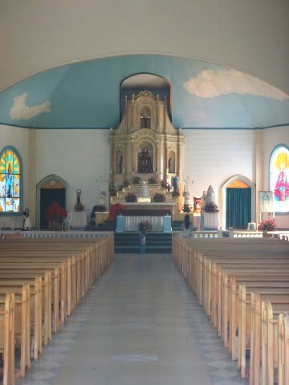

# 2014年8月　オスロブagain…再び，子連れでジンベエザメと泳ぐぞ！　その22

📅 投稿日時: 2014-10-04 01:33:42

🏷️ カテゴリ: [ダイビング日記](ce3a7a8d424d112fce83ee85c81a0e344.md)

という感じで．

満足のジンベエ＆スミロンツアーの一日を終えて，

午後2時半ごろ，ホテルへ帰還！

ボートで1時間半のバリカサグとかに遠征したら，

ホテルへ戻ってくるのは4時近いですが．

スミロン島まではホテル前から20分と近いので，

ホテルに戻ってくる時間も早いですね～．

…どうでもいいのですが，上2枚の写真．

この旅行中に，[水没で死亡したTX30](e74a90d02680d75a3da9ee6c6ffdea8cd.md)で撮った写真なんですけど．

この時点ですでに，カメラ内に水分が侵入していた

ようで．

…写真の中心部分に，レンズ内側で水分が結露している，

白い曇りが出ているのが見える…っ！

＃この翌日，完全に死亡（チーン）

で．

お部屋でシャワーを浴びたら，

また，レストランでログづけタイムなんですけど…．

うーむ．

なんだか．

午後のスミロン，日本人ガイドでなかったので．

ホワイトボードに書かれている魚の名前．

「ザメ」

とか，

「ンラスズメダイ」

といった，なんだか微妙な名前の魚を

見たことになっちゃってますね…（^^;）．

＃…でも，日本語ネイティブじゃないのに，

＃これだけ日本語で魚の名前が書ければすごいと思う…

で．

今日は，早めに戻ってこれたので．

ログづけも早めに切り上げて．

昨日の宿題になっていた．

サンタンダーの街に観光に行くのだ！

ホテル前の，

「この道歩いて，ホントに街に出れるの？」

という感じの道を歩いて…

途中でこんな景色を眺めつつ…

10分ほど登っていくと．

一本道の登り坂を登りきったところで，

街の入り口に到着です．

ホテルに向かう一本道の入り口には，

こんな感じでホテルの看板が立ってます．

で．

街に入ったすぐあたりに．

立派な教会がありますな～．

ちと，覗かせてもらいますか．

中へも自由に入ることができて，

いや，結構大きな教会ですね．

…今日は日が暮れるまで，まだまだ時間があるので．

これからたっぷり街中観光できそうです．
