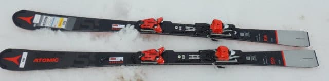
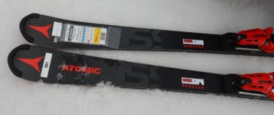
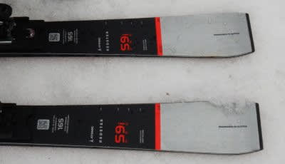
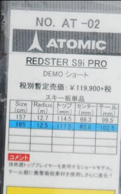
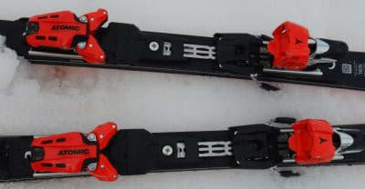

# 2022シーズンモデルのスキー板，試乗レポートその10…ATOMIC Redster S9i PRO

📅 投稿日時: 2021-06-19 03:23:04

えー．

今日も昨日に引き続き，2022シーズン

モデルのスキーの試乗レポートですが．

前回までは3月7日のエキップさん試乗会

で試乗した板でしたが．

本日から，4月3日の熊の湯で試乗した

板のレポートになります…！

試乗した日は[こんな感じ](e6c5d531ad95e92eb42a115ccfa3f9910.md)で，3月7日と同様

朝から気温が高く，昼前には雨も降る

あまり良くないコンディション(涙)

雪は結構重めのザブザブ雪で，あまり

試乗に適した状況じゃなかったですが…

でも，ストップ雪に比べれば，まだ

板の性能は見極められたかな．

ということで．

2022シーズンモデルのスキー試乗

レポート後半戦，

今日はアトミック編です．

では，どうぞ～！

○ATOMIC REDSTER S9i PRO 165cm

基礎小回り

基本的に競技用SL FISモデルと同じ板で，

心材だけを軽量カルバウッドコアに

替えてる板です．

昨シーズンモデルと見た目は変わら

ないですが，どうやらSL FIS自体が

去年とそれほど大きく変わっておらず．

サイドカーブは2021シーズンと全く

同じです…

普通のS9iとの違いは，

S9iにはつく「Revo Shock」がS9iには

付かず．

ビンディングもS9iのTLビンディングと違い，

足元がしっかりと強くなる，X12 VAR

ビンディングが着きます．

ってなことで．

滑ってみると…

うむ．板自体のしっかりした張りは

感じますが．

板を抑えていければ，春先の

ザブザブ雪でもたわみが出せて，

谷回りから板全体がしっかり捉えて

動いてくれる感じ．

[2021シーズンモデルを履いた時](e47e006967b1922aad0d6e82f807ade58.md)は，

もう少し谷回りでまっすぐ進むように

感じ，谷回りで自分で動いてたわませに

行かないと板が回り始めない感じを

受けたんですが，

来シーズンモデルはもう少し谷回りで

板が捉えて回り始めるように感じました…

でも，これは，板が変わったのか，

私のブーツが変わって谷回りの捉えが

早くなったことによる効果なのか…

うーん．

どっちだろう？？

谷回りでとらえ始めると，小回り板っぽい

小さめの半径で回り始めますが．

山回りでテール側に荷重がかかっていった

時に，切れ上がりすぎるほどの回転力と

切替でスポンと吹っ飛ぶばね感を感じる

我が愛機SXと比べると，

山回りの切れ上がりとばね感は抑えめで，

比較的スムースに次のターンへ繋がって

行きます．

山回りから切り替えは穏やかなスムースな

切り替えなので，左右にグイグイ引っ張る

SXのような深い小回りより，比較的

スピードを出していき，落差をとった

小回りが気持ちいい感じ．

スピードを出して行ったときは，

いい感じで気持ちいいたわみが出て，

強いグリップと旋回力で板が回っていき．

ターンの仕上げでは，板の返りのバネ感

というよりも，いい感じで板がすっと

抜けて走りが出る感じ．

求めるスピード域は結構高め．

我が愛機の2017モデルのBluester SXなら，

結構な低速から板をたわませてばね感で

深いターンができるけど．

この板は，低速ではたわませにくいけど，

スピードを出して行った時にいい感じの

たわみが出て，そのスピード域でも

過剰な返りが来ず，すっと抜けていく感じで．

スピードはいいから弧を深くしたくなる

SXと比べると，がんがんスピードを

上げていきたくなる板．

小回り板だけど，ハイスピード耐性は強い！

それでいて，谷回りからガッツリ板なりに

捉えすぎる板ではなく，板を動かす

自由度もあるので，板を動かしてたわみを

出して，弧を小さくしていくことも可能です．

ただ，板の張りが強くて重いので．

コブとかは厳しいかな～．

あ，低速でずらして滑っても，これっぽちも

面白くありません．

スピードを出して楽しむ板です．

昨シーズンは，たわみにくいし谷回りも

自分で動いて行かなきゃ捉えてくれないし，

結構手ごわい板かも…？

と思ってたけど．

しっかり踏めて，早い谷回りの捉えができる

ブーツを履いた今シーズンは．

いい感じで谷回りからたわむじゃないか…！

スピード出すと面白いじゃないか…！

と，改めて見直しました．

でも．

かなりしっかりしたブーツと体力と

スピードを必要とする板なのは

間違いない…．

## 💬 コメント一覧

### 💬 コメント by (ikkun)
**タイトル**: Unknown
**投稿日**: 2021-06-19 14:00:02

お疲れ様です  今日はポロシャツではサムイ新潟です❗ラーメンが有難い🎵さてブーツを買った店では先月にatomic予約者何人かあったので多分評価高いんでしょう❗  ちなみに私しフォルクルSL-Dが……と(笑)ま新しいのではなく( *´艸｀)しかしatomic元々評価高いですよね？

### 💬 コメント by (Skier_S)
**タイトル**: ＞ikkunさま
**投稿日**: 2021-06-20 03:38:51

やはりATOMICは売れるみたいですね…

特に今年は大幅モデルチェンジがあったので新しいモノ好きは

買っちゃうんじゃないですかね…

私はSXの印象が強すぎて，それ以降のATOMICってそんなに惹かれないんですよね…

### 💬 コメント by (炎の北海道民)
**タイトル**: Unknown
**投稿日**: 2021-06-20 21:13:29

こんばんは。

今度、KEI -SKIの試乗と感想もお願いします！

### 💬 コメント by (Skier_S)
**タイトル**: ＞炎の北海道民さま
**投稿日**: 2021-06-21 00:56:35

昔は私もKEI-SKIオーナーだったんですけど，最近はたしかに履いてませんね．

あんまり試乗会もやってないので，ここ10年くらい履いてない気が…

履く機会があれば履きたいと思ってます！

